

<main class="site-main"><section class="page-intro">
Article · Evidence and belief
<h1>Bayesian Modeling for Psychologists, Part 1</h1>
Published11 Feb 2024
</section><article class="prose real-post"><section id="setup" class="level1">
<h1>Setup</h1>

Loading some packages that will be used for demonstrations and analysis:

<pre class="sourceCode r code-with-copy"><code class="sourceCode r">library(tidyverse)      # Data wrangling and plotting
library(ggdist)         # Easy and aesthetic plotting of distributions
library(ggExtra)        # Adding marginal distributions for 2d plots
library(tidybayes)      # Tidy processing of Bayesian models and extraction of MCMC chains
library(brms)           # Bayesian modeling and posterior estimation with MCMC using Stan
library(distributional) # Plotting of theoretical distributions (for likelihood functions plots)</code><button title="Copy to Clipboard" class="code-copy-button"><i class="bi"></i></button></pre>

</section>
<section id="motivation" class="level1">
<h1>Motivation</h1>

You ran your experiment, collected the data, figured out how to download it in a normal form, and even cleaned and pre-processed it! All this for one simple linear regression model? In the current post I introduce the Bayesian approach for statistical modeling and inference, that can enrich your paper or thesis, and tell new stories using you data. The current post is by no means a full technical/theoretical/mathematical summary of Bayesian statistics and modeling. It’s main purpose is to make things as simple and smooth for students who want to learn some new statistical analysis methods.

</section>
<section id="introduction" class="level1 page-columns page-full">
<h1>Introduction</h1>

Dependent on the stage you are in your academic career in Psychology, you are probably quite familiar with what I will refer to as <em>Frequentist</em> inferential statistics. The underlying assumption of these models is that <em>probability is relative frequency at infinity</em>. Every statistical test is conducted under the assumption of a particular world (the Null-Hypothesis). 
In my opinion, this way of inference is intuitive to us only because we are so used to it. I argue that in the real world we update our knowledge in a different way. We assign <em>degrees of belief</em> to different possible hypotheses (worlds) - some worlds are more probable than others. When data is observed, it is used to <em>update</em> our beliefs, and make some possible worlds more probable, and others less probable.

The Bayesian interpretation of probability as degree of belief stands at the foundation of Bayesian statistical modeling (duh). We first assign probability to all possible worlds, than we observe the data, combining them together and update our beliefs.

<section id="bayes-theorem" class="level2 page-columns page-full">
<h2 class="anchored" data-anchor-id="bayes-theorem">Bayes theorem</h2>
<section id="discrete-events" class="level3">
<h3 class="anchored" data-anchor-id="discrete-events">Discrete events</h3>

So what is <em>Bayesian</em> about Bayesian statistics? going back to <em>Intro to statistics</em> in your BA, you learned to derive the Bayes theorem in probability: \[
P(A|B)=\frac{P(B|A) \cdot P(A)}{P(B)}
\]

In plain words: the probability of \(A\) conditional on \(B\) is equal to the product of the probability of \(B\) conditional on \(A\) and the prior probability of \(A\), divided by the probability of \(B\). The Bayes theorem gives a rigorous and mathematically defined way of updating beliefs in face of observed data. Sounds familiar? it should! this is exactly what you are doing (or at least want to do) in your thesis/research! you observe some <em>Data</em> and try to learn from it about the <em>World</em>. In your case, World = some statistical model = some set of parameters.<a href="#fn1" class="footnote-ref" id="fnref1" role="doc-noteref">1</a>

</section>
<section id="probability-distributions" class="level3">
<h3 class="anchored" data-anchor-id="probability-distributions">Probability Distributions</h3>

So what is the probability of your hypothesized set of parameters given the data you observed? Replacing \(A\) with your set of parameters, and \(B\) with the observed data we get:

\[
P(Parameters|Data)=\frac{P(Data|Parameters) \cdot P(Parameters)}{P(Data)}
\]

One thing that we need to remember is almost all<a href="#fn2" class="footnote-ref" id="fnref2" role="doc-noteref">2</a> of the terms above are no longer single probability values, but continuous probability <em>distributions</em>. For example, the term \(P(Parameters)\) is a probability density distribution in which each possible combination of values of your parameters is assigned a probability.

Each of the terms above has an important role in the world of Bayesian modeling.

</section>
<section id="likelihood" class="level3">
<h3 class="anchored" data-anchor-id="likelihood">Likelihood</h3>

The term \(P(Data|Parameters)\) describes the <em>likelihood</em> of the observed data under different sets of parameter values. In order to keep things simple I will not delve deeper into the theoretical aspects of likelihood (see Etz (<a href="#ref-etz_introduction_2018" role="doc-biblioref">2018</a>), Pawitan (<a href="#ref-pawitan_all_2001" role="doc-biblioref">2001</a>)). The main things that are important to know as researchers about the likelihood function is that you are responsible to choosing it! For example, if I suspect that my dependent variable comes from a normal distribution (where you otherwise would fit some sort of linear model), I will use the normal likelihood function<a href="#fn3" class="footnote-ref" id="fnref3" role="doc-noteref">3</a>:

ggplot code

<pre class="sourceCode r code-with-copy"><code class="sourceCode r">ggplot(data = data.frame(x = c(-4, 4)), aes(x)) +
  stat_function(fun = dnorm, n = 101, args = list(mean = 0, sd = 1), linewidth = 1, color = "#fca903") +
  ylab(expression(L(theta,x))) +
  xlab(expression(theta)) +
  scale_y_continuous(breaks = NULL) +
  scale_x_continuous(breaks = seq(-4, 4, 1), labels = NULL) +
  theme_classic() +
  theme(axis.title = element_text(size = 13),
        plot.background = element_rect(fill = "#E3E2DF"),
        panel.background = element_rect(fill = "#E3E2DF"))</code><button title="Copy to Clipboard" class="code-copy-button"><i class="bi"></i></button></pre>

<figure class="figure">

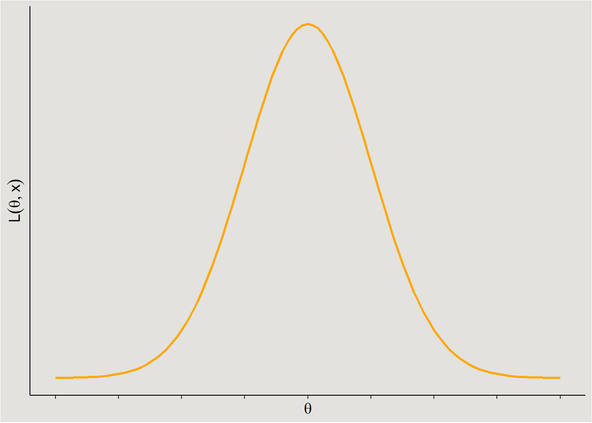

</figure>

If, on the other hand, I suspect that my dependent variable comes from a Poisson distribution (e.g.&nbsp;number of times a participant scratched their nose), I will use the Poisson likelihood function:

ggplot code

<pre class="sourceCode r code-with-copy"><code class="sourceCode r">ggplot(data = data.frame(x = seq(0, 16, 1)), aes(x)) +
  geom_line(aes(y = dpois(x, 6)), linewidth = 1, color = "#fca903") +
  ylab(expression(L(theta,x))) +
  xlab(expression(theta)) +
  scale_y_continuous(breaks = NULL) +
  scale_x_continuous(breaks = seq(0, 16, 1), labels = NULL) +
  theme_classic() +
  theme(axis.title = element_text(size = 13),
        plot.background = element_rect(fill = "#E3E2DF"),
        panel.background = element_rect(fill = "#E3E2DF"))</code><button title="Copy to Clipboard" class="code-copy-button"><i class="bi"></i></button></pre>

<figure class="figure">

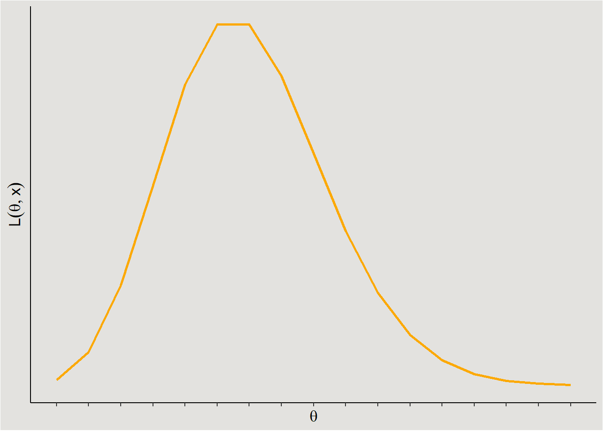

</figure>

In general, you need to define the <em>Data Generating Process (DGP)</em> - How were your observations generated? 
This choice is analogous to the choice of statistical model/test in the frequentist paradigm. A linear model (t-test, ANOVA, linear regression) assumes a normal DGP, a Generalized linear model assumes some other DGP like a Binomial, Poisson, Inverse Gaussian etc.

</section>
<section id="prior" class="level3 page-columns page-full">
<h3 class="anchored" data-anchor-id="prior">Prior</h3>

The next term - \(P(Parameters)\) is called the <em>Prior</em> probability distribution. This term represents the prior knowledge about the parameters in your model. Choosing a prior, a process that is sometime called <em>prior elicitation</em>, is difficult. How can one take into account all prior knowledge about something and neatly represent it with one probability distribution?? For this reason I will refer to 2 relatively-easy-to-define aspects of prior elicitation: 

<ul>
<li><em>Range of possible/probable parameter values</em> - Some parameters can only take certain values, creating a-priori hard limits for their value. For example, a normal distribution’s variance \(\sigma^2\) can only take positive values. Softer limits can also exist, for example: in a new/old recognition task, it is reasonable to predict that new items will be identified as new, more than old items - the regression coefficient should be positive. In the first case, a prior with hard boundary will be appropriate:</li>
</ul>

ggplot code

<pre class="sourceCode r code-with-copy"><code class="sourceCode r">ggplot(data = data.frame(x = c(0, 13)), aes(x)) +
  stat_function(fun = dexp, n = 101, args = list(rate = 1), linewidth = 1, fill = "#a4c8f5", color = "#0373fc", geom = "area", outline.type = "upper") +
  ylab(expression(density(theta))) +
  xlab(expression(theta)) +
  scale_y_continuous(breaks = NULL) +
  scale_x_continuous(breaks = seq(0, 13, 1)) +
  labs(title = expression(Exp(1)), subtitle = "Values below 0 are assigned a probability of 0") +
  theme_classic() +
  theme(plot.title = element_text(size = 17, family = "serif", hjust = 0.5),
        plot.subtitle = element_text(size = 13, family = "serif", hjust = 0.5),
        axis.title = element_text(size = 13),
        plot.background = element_rect(fill = "#E3E2DF"),
        panel.background = element_rect(fill = "#E3E2DF"))</code><button title="Copy to Clipboard" class="code-copy-button"><i class="bi"></i></button></pre>

<figure class="figure">

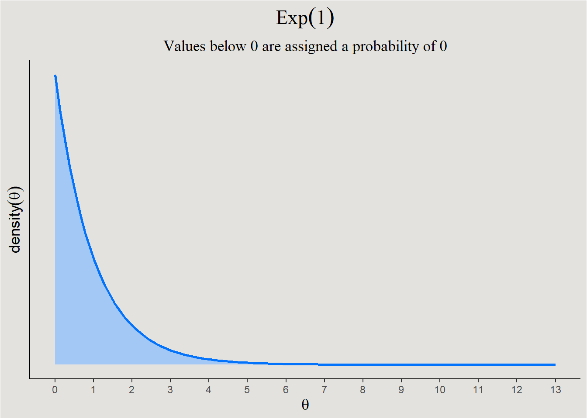

</figure>

While in the second case, a prior like this would be better:

ggplot code

<pre class="sourceCode r code-with-copy"><code class="sourceCode r">ggplot(data = data.frame(x = c(-5, 9)), aes(x)) +
  stat_function(fun = dnorm, n = 101, args = list(mean = 2, sd = 1.5), linewidth = 1, fill = "#a4c8f5", color = "#0373fc", geom = "area", outline.type = "upper") +
  geom_vline(xintercept = 0, linetype = "dashed", linewidth = 0.5) +
  ylab(expression(density(theta))) +
  xlab(expression(theta)) +
  scale_y_continuous(breaks = NULL) +
  scale_x_continuous(breaks = seq(-5, 9, 1)) +
  labs(title = expression(N(2, 1.5^2)), subtitle = "Negative values are possible, yet less probable than positive values") +
  theme_classic() +
  theme(plot.title = element_text(size = 17, family = "serif", hjust = 0.5),
        plot.subtitle = element_text(size = 13, family = "serif", hjust = 0.5),
        axis.title = element_text(size = 13),
        plot.background = element_rect(fill = "#E3E2DF"),
        panel.background = element_rect(fill = "#E3E2DF"))</code><button title="Copy to Clipboard" class="code-copy-button"><i class="bi"></i></button></pre>

<figure class="figure">

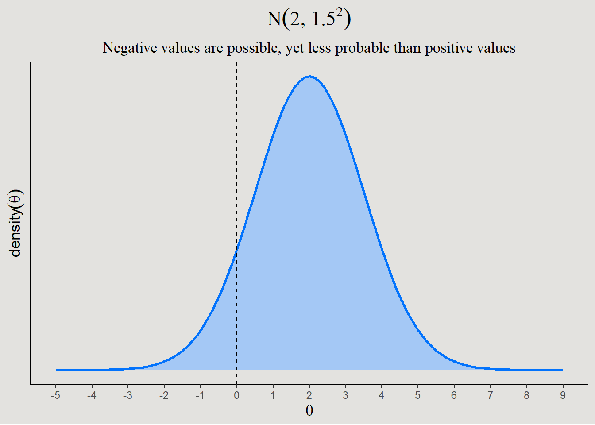

</figure>

<ul>
<li>
<em>Degree of informativeness</em> - Priors also differ from each other in their impact on the model. A prior can be weak or strong in this aspect.

<ul>
<li><em>Weak Priors</em> - These priors are typically wide and cover a large range of possible values.</li>
<li><em>Strong Priors</em> - These priors are narrower and leaves few parameter values probable.</li>
</ul></li>
</ul>

ggplot code

<pre class="sourceCode r code-with-copy"><code class="sourceCode r">ggplot(data = data.frame(x = c(-28, 28)), aes(x)) +
  stat_function(fun = dnorm, n = 101, args = list(mean = 0, sd = 8), linewidth = 1, fill = "#a4c8f5", color = "#0373fc", geom = "area", outline.type = "upper") +
  ylab(expression(density(theta))) +
  xlab(expression(theta)) +
  scale_y_continuous(breaks = NULL) +
  scale_x_continuous(breaks = seq(-28, 28, 2)) +
  labs(title = expression(N(0, 8^2))) +
  theme_classic() +
  theme(plot.title = element_text(size = 17, family = "serif", hjust = 0.5),
        axis.title = element_text(size = 13),
        plot.background = element_rect(fill = "#E3E2DF"),
        panel.background = element_rect(fill = "#E3E2DF"))
ggplot(data = data.frame(x = c(-28, 28)), aes(x)) +
  stat_function(fun = dt, args = list(df = 10), linewidth = 1, fill = "#a4c8f5", color = "#0373fc", geom = "area", outline.type = "upper") +
  ylab(expression(density(theta))) +
  xlab(expression(theta)) +
  scale_y_continuous(breaks = NULL) +
  scale_x_continuous(breaks = seq(-28, 28, 2)) +
  labs(title = expression(students_t(df = 10))) +
  theme_classic() +
  theme(plot.title = element_text(size = 17, family = "serif", hjust = 0.5),
        axis.title = element_text(size = 13),
        plot.background = element_rect(fill = "#E3E2DF"),
        panel.background = element_rect(fill = "#E3E2DF"))</code><button title="Copy to Clipboard" class="code-copy-button"><i class="bi"></i></button></pre>

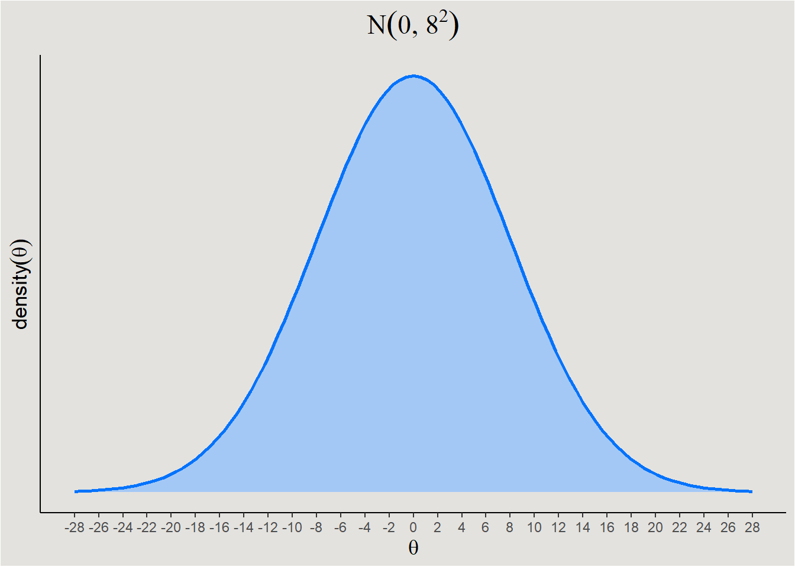

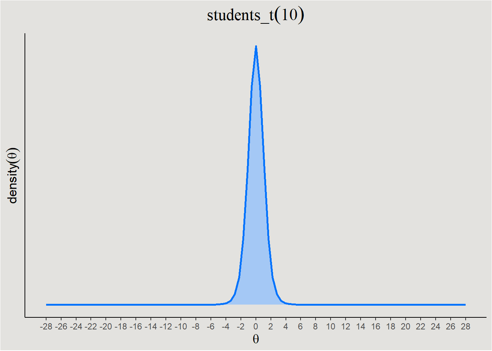

</section>
<section id="evidence" class="level3">
<h3 class="anchored" data-anchor-id="evidence">Evidence</h3>

The denominator in Bayes’ theorem - \(P(Data)\) is called the evidence. It’s important role is to act as the <em>standardizing</em> term to the numerator (\(Likelihood \cdot Prior\)). Recall that the likelihood is not a probability distribution, so in order for it’s product with the Prior - a probability distribution - to be equal to the Posterior - another probability distribution - a standardizing term is needed. This term is often impossible to calculate analytically, and therefore fancy numeric estimations are used.<a href="#fn4" class="footnote-ref" id="fnref4" role="doc-noteref">4</a>

</section>
<section id="posterior" class="level3">
<h3 class="anchored" data-anchor-id="posterior">Posterior</h3>

The posterior probability of your model - \(P(Parameters|Data)\) - is the ultimate goal of your analysis. This probability distribution tells you what values of your parameters are probable and what values not so much. This is a shift of perspective from the usual frequentist logic - instead of resulting in one number as estimate for your parameter, you end up with a whole distribution! 

ggplot code

<pre class="sourceCode r code-with-copy"><code class="sourceCode r">set.seed(14)

means &lt;- rnorm(10000, -2, 1.5)
freq_estimate &lt;- mean(means)

ggplot(data.frame(y = means), aes(x = y)) +
  geom_density(fill = "#2ea64e", color = "#145726", linewidth = 1) +
  geom_point(data = data.frame(x = freq_estimate, y = 0), aes(x = x, y = y), size = 3) +
  scale_x_continuous(limits = c(-7, 3), breaks = seq(-7, 3, 1), labels = seq(-7, 3, 1)) +
  theme_classic() +
  labs(title = "Posterior probability distribution", subtitle = "The black dot represent the frequentist point estimate of the parameter", x = expression(theta)) +
  theme(axis.title.y = element_blank(),
        axis.text.y = element_blank(),
        axis.ticks.y = element_blank(),
        plot.title = element_text(size = 17, family = "serif", hjust = .5),
        plot.subtitle = element_text(size = 13, family = "serif", hjust = .5),
        axis.title.x = element_text(size = 13),
        plot.background = element_rect(fill = "#E3E2DF"),
        panel.background = element_rect(fill = "#E3E2DF"))</code><button title="Copy to Clipboard" class="code-copy-button"><i class="bi"></i></button></pre>

<figure class="figure">

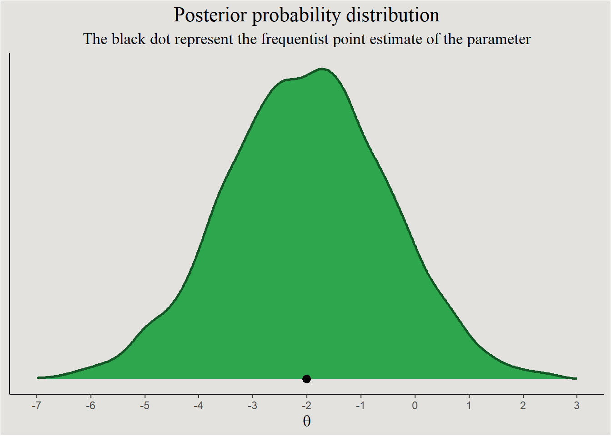

</figure>

I think that Getting a posterior from the Likelihood and the prior makes more sense visually (make sure to also play with Kristoffer Magnusson’s wonderful interactive <a href="https://rpsychologist.com/d3/bayes/">visualization</a>):

simulated parameters

<pre class="sourceCode r code-with-copy"><code class="sourceCode r">set.seed(14)

actual_lambda &lt;- 44
n &lt;- 24
data &lt;- rpois(n, actual_lambda)
prior_alpha &lt;- 122.5
prior_beta &lt;- 3.5

posterior_alpha &lt;- prior_alpha + sum(data)
posterior_beta &lt;- prior_beta + n</code><button title="Copy to Clipboard" class="code-copy-button"><i class="bi"></i></button></pre>

ggplot code

<pre class="sourceCode r code-with-copy"><code class="sourceCode r">pois_likelihood &lt;- function(theta, data, scale = 1) {
  sapply(theta, function(.theta) {
    scale * exp(sum(dpois(data, lambda = .theta, log = T)))
  })
}

dists &lt;- data.frame(dist = c("Prior", "Posterior"),
                    Alpha = c(prior_alpha, posterior_alpha),
                    Beta = c(prior_beta, posterior_beta)) |&gt;
  mutate(xdist = dist_gamma(shape = Alpha, rate = Beta))

ggplot(dists) +
  geom_rug(aes(x = data, color = "Likelihood", fill = "Likelihood"), data = data.frame(), linewidth = 2) +
  stat_slab(aes(xdist = xdist, fill = dist), normalize = "none", alpha = 0.6) +
  stat_function(aes(color = "Likelihood"), fun = pois_likelihood,
                args = list(data = data, scale = 7e33),
                geom = "line", linewidth = 1) + 
  scale_fill_manual(breaks = c("Prior", "Likelihood", "Posterior"), 
                    values = c("#a4c8f5", "#fca903", "#2ea64e")) +
  scale_color_manual(breaks = c("Prior", "Likelihood", "Posterior"), 
                    values = c("black", "#fca903", "black"),
                    aesthetics = "color") +
  coord_cartesian(ylim = c(0, 0.45), xlim = c(20, 70)) +
  guides(colour = "none", fill = guide_legend(title = "")) +
  theme_classic() +
  labs(title = "Posterior as a compromise between likelihood and prior",
       subtitle = "Orange dots represent observed data") +
  theme(axis.title = element_blank(),
        axis.text = element_blank(),
        axis.ticks.y = element_blank(),
        plot.title = element_text(size = 17, family = "serif", hjust = .5),
        plot.subtitle = element_text(size = 13, family = "serif", hjust = .5),
        plot.background = element_rect(fill = "#E3E2DF"),
        panel.background = element_rect(fill = "#E3E2DF"),
        legend.background = element_rect(fill = "#E3E2DF"))</code><button title="Copy to Clipboard" class="code-copy-button"><i class="bi"></i></button></pre>

<figure class="figure">

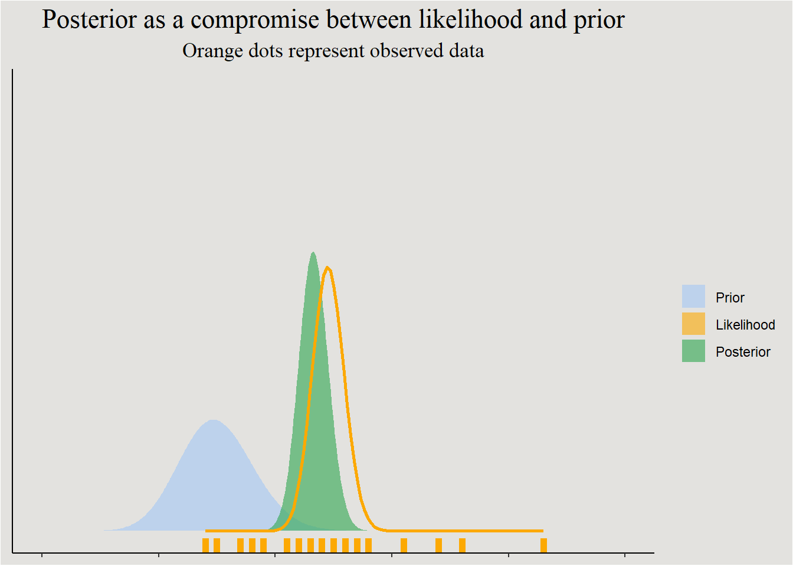

</figure>

<i class="callout-icon no-icon"></i>

A note on higher dimesions

All of the examples above refer to estimation of one parameter. Often, your models will include several parameters (100’s if you include random effects). So how does it work? 
without getting into detail, know that the simple one-parameter case scales quite nicely into <em>n</em>-parameter models. For example, instead of the \(P(\theta)\) prior from before, you can have \(P(\theta_0, \theta_1,...,\theta_n)\) prior. A prior of an intercept and a slope for a simple regression model could look like this:

2d ggplot code

<pre class="sourceCode r code-with-copy"><code class="sourceCode r">set.seed(14)

mu0 &lt;- -2
mu1 &lt;- 2.5
sd0 &lt;- 1.5
sd1 &lt;- 2
r &lt;- -0.54

data &lt;- MASS::mvrnorm(n = 10000, mu = c(mu0, mu1), Sigma = matrix(c(sd0^2, sd0*sd1*r, sd0*sd1*r, sd1^2), nrow = 2)) |&gt;
  data.frame() |&gt;
  rename(b0 = X1, b1 = X2) |&gt;
  mutate(b0 = b0 + runif(1, -4, 4)^2,
         b1 = b1 + runif(1, -1, 1)^2)

p &lt;- data |&gt;
  ggplot(aes(x = b0, y = b1)) +
    geom_point() +
    stat_density_2d(aes(fill = after_stat(density)), geom = "raster", contour = F) +
    theme_classic() +
    labs(x = expression(beta[0]), y = expression(beta[1])) +
    scale_x_continuous(expand = c(0, 0), limits = c(-6, 12), breaks = seq(-6, 12, 2)) +
    scale_y_continuous(expand = c(0, 0), limits = c(-6, 12), breaks = seq(-6, 12, 2)) +
    scale_fill_fermenter(palette = "Blues", direction = 1) +
    theme(legend.position = "none",
          axis.title = element_text(size = 13))

ggMarginal(p, type = "density",
           xparams = list(fill = "#a4c8f5", colour = "black"),
           yparams = list(fill = "#a4c8f5", colour = "black"))</code><button title="Copy to Clipboard" class="code-copy-button"><i class="bi"></i></button></pre>

<figure class="figure">

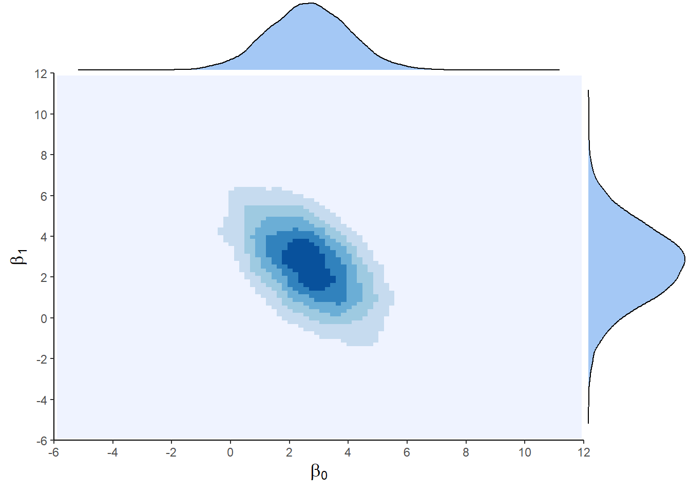

</figure>

In general, we will denote \(\theta\) to be the set of <em>m</em> parameters \([\theta_0, \theta_1,...,\theta_m]\), and \(X\) as the set of <em>n</em> data points \([x_1, x_2,...,x_n]\).

</section>
</section>
</section>
<section id="bayesian-modeling---how-to-do-it" class="level1">
<h1>Bayesian Modeling - How to do it?</h1>

How to actually estimate the posterior probability of our parameters? As we seen before, we will need to define a prior for all parameters, we will need to choose the likelihood function, and we will need to calculate that annoying evidence in the denominator. 

All of this made easy with the amazing <code>brms</code> package (Bürkner (<a href="#ref-burkner_brms_2017" role="doc-biblioref">2017</a>)).

<section id="brms-setup" class="level2">
<h2 class="anchored" data-anchor-id="brms-setup">brms setup</h2>

<pre class="sourceCode r code-with-copy"><code class="sourceCode r"># install.packages("brms")
library(brms)</code><button title="Copy to Clipboard" class="code-copy-button"><i class="bi"></i></button></pre>

<i class="callout-icon"></i>

Important

<code>brms</code> is actually translating your <code>R</code> code into <em>Stan</em> (Stan Development Team (<a href="#ref-stan_development_team_stan_2018" role="doc-biblioref">2018</a>)), a programming language that is specialized in estimating posterior distributions. Therefore, you will also need to install some sort of <em>backend</em>. Using <code>cmdstanr</code> is probably optimal, but because it’s installation can be tricky, <code>Rstan</code> is another option.

</section>
<section id="simple-linear-regression" class="level2">
<h2 class="anchored" data-anchor-id="simple-linear-regression">Simple linear regression</h2>

Let’s start with the most simple example. Consider the sex differences in cats’ body weight:

<pre class="sourceCode r code-with-copy"><code class="sourceCode r">data &lt;- MASS::cats

head(data)</code><button title="Copy to Clipboard" class="code-copy-button"><i class="bi"></i></button></pre>

<pre><code>  Sex Bwt Hwt
1   F 2.0 7.0
2   F 2.0 7.4
3   F 2.0 9.5
4   F 2.1 7.2
5   F 2.1 7.3
6   F 2.1 7.6</code></pre>

Fitting a linear regression model:

<pre class="sourceCode r code-with-copy"><code class="sourceCode r">lm_cats &lt;- lm(Bwt ~ Sex,
              data = data)

parameters::model_parameters(lm_cats) |&gt; insight::print_html()</code><button title="Copy to Clipboard" class="code-copy-button"><i class="bi"></i></button></pre>

<table class="gt_table caption-top table table-sm table-striped small" data-quarto-postprocess="true" data-quarto-disable-processing="false" data-quarto-bootstrap="false">
<thead>
<tr class="header gt_col_headings">
<th id="Parameter" class="gt_col_heading gt_columns_bottom_border gt_left" data-quarto-table-cell-role="th" scope="col">Parameter</th>
<th id="Coefficient" class="gt_col_heading gt_columns_bottom_border gt_center" data-quarto-table-cell-role="th" scope="col">Coefficient</th>
<th id="SE" class="gt_col_heading gt_columns_bottom_border gt_center" data-quarto-table-cell-role="th" scope="col">SE</th>
<th id="95% CI" class="gt_col_heading gt_columns_bottom_border gt_center" data-quarto-table-cell-role="th" scope="col">95% CI</th>
<th id="t(142)" class="gt_col_heading gt_columns_bottom_border gt_center" data-quarto-table-cell-role="th" scope="col">t(142)</th>
<th id="p" class="gt_col_heading gt_columns_bottom_border gt_center" data-quarto-table-cell-role="th" scope="col">p</th>
</tr>
</thead>
<tbody class="gt_table_body">
<tr class="odd">
<td class="gt_row gt_left" headers="Parameter" style="border-right-width: 1px; border-right-style: solid; border-right-color: #d3d3d3">(Intercept)</td>
<td class="gt_row gt_center" headers="Coefficient">2.36</td>
<td class="gt_row gt_center" headers="SE">0.06</td>
<td class="gt_row gt_center" headers="95% CI">(2.24, 2.48)</td>
<td class="gt_row gt_center" headers="t(142)">39.00</td>
<td class="gt_row gt_center" headers="p">&lt; .001</td>
</tr>
<tr class="even">
<td class="gt_row gt_left" headers="Parameter" style="border-right-width: 1px; border-right-style: solid; border-right-color: #d3d3d3">Sex (M)</td>
<td class="gt_row gt_center" headers="Coefficient">0.54</td>
<td class="gt_row gt_center" headers="SE">0.07</td>
<td class="gt_row gt_center" headers="95% CI">(0.39, 0.69)</td>
<td class="gt_row gt_center" headers="t(142)">7.33</td>
<td class="gt_row gt_center" headers="p">&lt; .001</td>
</tr>
</tbody><tfoot class="gt_sourcenotes">
<tr class="odd">
<td colspan="6" class="gt_sourcenote"></td>
</tr>
</tfoot>

</table>

Male cats weigh \(0.54\) Kg more than female cats, and this difference is statistically significant.

</section>
</section>
<section id="bayesian-modeling---doing-it" class="level1 page-columns page-full">
<h1>Bayesian Modeling - Doing it!</h1>
<section id="prior-elicitation" class="level2">
<h2 class="anchored" data-anchor-id="prior-elicitation">Prior elicitation</h2>

How many parameters are there? 
1. Intercept - Representing the value of <code>Bwt</code> when the IV is \(0\). Meaning it is the estimated mean weight of female cats. 
2. Slope of \(SexMale\) - Estimated difference in body weight between male and female cats. 
3. Sigma - The variance of the residuals (variance of the conditional-mean normal distribution of <code>Bwt</code>). 

What prior knowledge can we incorporate into each parameter? 
1. average weight of female cats should probably be ~2Kg-3Kg. 
2. Male cats should probably weight more than female cats. 
3. The sigma is not so interesting, so I will just define a wide prior. 

<pre class="sourceCode r code-with-copy"><code class="sourceCode r">prior &lt;- set_prior("normal(2.5, 2)", class = "Intercept") +
  set_prior("normal(1, 2)", coef = "SexM") +
  set_prior("exponential(0.01)", class = "sigma")</code><button title="Copy to Clipboard" class="code-copy-button"><i class="bi"></i></button></pre>

</section>

<section id="tip" class="level2">
<h2 class="anchored" data-anchor-id="tip">Tip</h2>

If you are not sure what are the parameters of your model, use the <code>brms::get_prior()</code> function to get your model’s parameters and their default <code>brms</code> priors.

</section>
<section id="posterior-estimation" class="level4">
<h4 class="anchored" data-anchor-id="posterior-estimation">Posterior estimation</h4>

In case you missed it, we already defined our likelihood function to be the normal likelihood function. This is implicit in our choice of the ordinary linear regression model.

<i class="callout-icon"></i>

Convergence Measures

Recall that because of the annoying Bayes’ denominator (<em>Evidence</em> - \(P(Data)\)) estimating the posterior is usually quite tricky. For that reason it is done with an algorithm called MCMC sampling (Monte Carlo Markov Chain), that samples numbers from the posterior distribution. The posterior estimated is therefore just a list of numbers (a Markov Chain) sampled from the posterior. <em>Diagnostics</em> - MCMC samples tend to be auto-correlated (further read Kruschke (<a href="#ref-kruschke_markov_2014" role="doc-biblioref">2014</a>), chapter 7), and therefore convey less information about the distribution than an independent sample. The actual sample size of the MCMC algorithm ‘is worth’ less than an independent sample size.

<ul>
<li><em>Effective Sample Size (ESS)</em> represents the independent sample size roughly equivalent to your MCMC sample size, and is calculated as:</li>
</ul>

\[
ESS=\frac{N}{\hat{\tau}}
\] Where \(\hat{\tau}\) is a measure of chain auto-correlation (with a minimum value of \(1\)). It is recommended to get at least \(ESS&gt;1000\).

<ul>
<li><em>Chain mixing (R-hat)</em> - when sampling more than two chains or more (most of the times), we will want to check if all of them converge to the same distribution. This is measured with the \(\hat{R}\) measure (Vehtari et al. (<a href="#ref-vehtari_rank-normalization_2021" role="doc-biblioref">2021</a>)) which equals to \(1\) when convergence is maximal. Values above \(1.01\) are not good.</li>
</ul>

tidybayes &amp; ggplot code

<pre class="sourceCode r code-with-copy"><code class="sourceCode r">p &lt;- spread_draws(posterior, b_Intercept) |&gt;
  ggplot(aes(x = .iteration, y = b_Intercept)) +
    geom_line(aes(color = factor(.chain))) +
    scale_color_manual(values = c("#8338E3", "#A25ED6", "#C183C8", "#E0A9BB")) +
    theme_classic() +
    labs(color = "Chain", x = "Sample's index", title = "Good between-chain convergence looks like a fuzzy caterpillar!") +
    theme(strip.background = element_blank(),
          strip.text.x = element_blank(),
          axis.title.y = element_blank(),
          axis.title = element_text(size = 13, family = "serif"),
          plot.title = element_text(size = 17, family = "serif", hjust = 0.5),
          plot.background = element_rect(fill = "#E3E2DF"),
          panel.background = element_rect(fill = "#E3E2DF"),
          legend.background = element_rect(fill = "#E3E2DF"))

p</code><button title="Copy to Clipboard" class="code-copy-button"><i class="bi"></i></button></pre>

<figure class="figure">

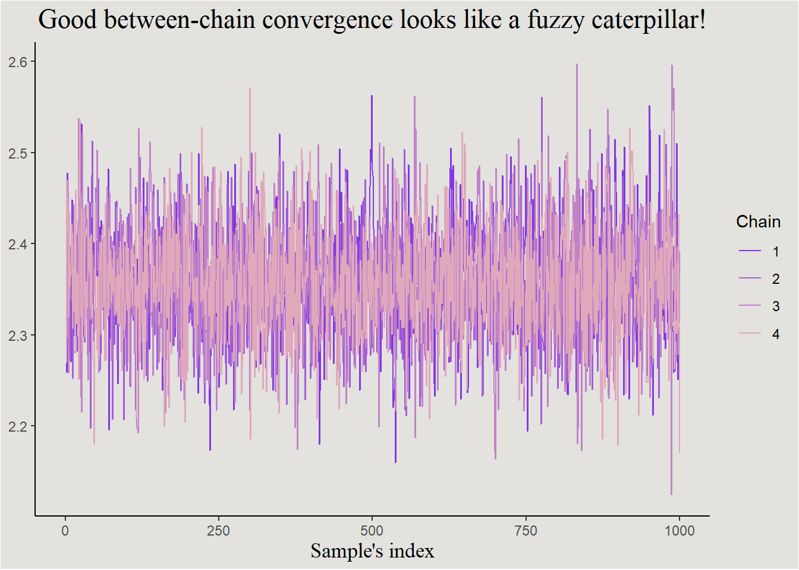

</figure>

One last thing before fitting the model, this is code snippet is necessary when using the <code>cmdstanr</code> backend for <code>brms</code>.

<pre class="sourceCode r code-with-copy"><code class="sourceCode r">cmdstanr::set_cmdstan_path(path = "your_path_to_cmdstanr_directory")</code><button title="Copy to Clipboard" class="code-copy-button"><i class="bi"></i></button></pre>

Now for posterior estimation!

<pre class="sourceCode r code-with-copy"><code class="sourceCode r">posterior &lt;- brm(formula = Bwt ~ Sex,
                 data = data,
                 prior = prior,
                 backend = "cmdstanr", # this is where the backend is defined
                 seed = 14) # setting a seed for the random MCMC sampling algorithm</code><button title="Copy to Clipboard" class="code-copy-button"><i class="bi"></i></button></pre>

After compiling the Stan code and running the algorithm, we get our posterior distribution:

<pre class="sourceCode r code-with-copy"><code class="sourceCode r">plot(posterior)</code><button title="Copy to Clipboard" class="code-copy-button"><i class="bi"></i></button></pre>

<figure class="figure">

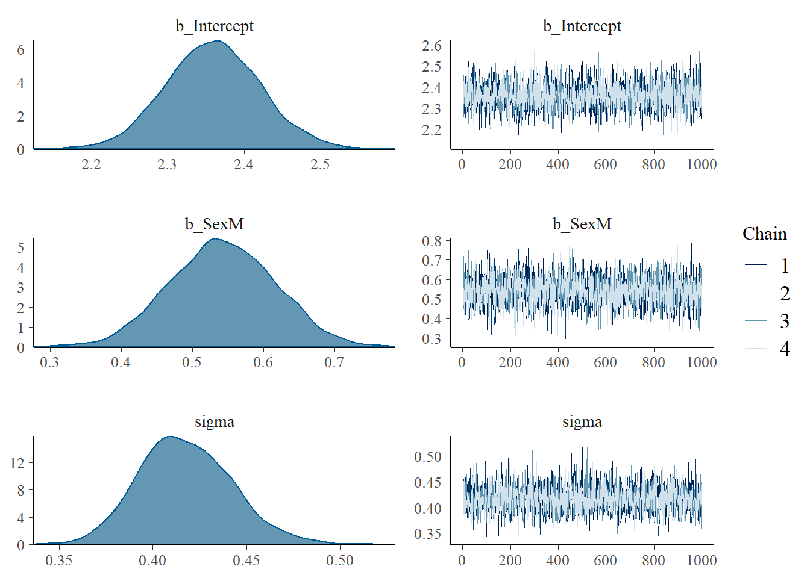

</figure>

On the right we can see the Markov Chains and their (good) convergence, and on the left we can see the marginal posterior distribution of every parameter. Let’s inspect the <em>R-hat</em> and <em>ESS</em> convergence measures (aiming at \(\hat{R} \le 1.01\) and \(ESS \ge 1000\)):

<pre class="sourceCode r code-with-copy"><code class="sourceCode r">brms::rhat(posterior)[1:2]</code><button title="Copy to Clipboard" class="code-copy-button"><i class="bi"></i></button></pre>

<pre><code>b_Intercept      b_SexM
   1.000458    1.000181 </code></pre>

<pre class="sourceCode r code-with-copy"><code class="sourceCode r">bayestestR::effective_sample(posterior) |&gt; insight::print_html()</code><button title="Copy to Clipboard" class="code-copy-button"><i class="bi"></i></button></pre>

<table class="gt_table caption-top table table-sm table-striped small" data-quarto-postprocess="true" data-quarto-disable-processing="false" data-quarto-bootstrap="false">
<thead>
<tr class="header gt_col_headings">
<th id="Parameter" class="gt_col_heading gt_columns_bottom_border gt_left" data-quarto-table-cell-role="th" scope="col">Parameter</th>
<th id="ESS" class="gt_col_heading gt_columns_bottom_border gt_center" data-quarto-table-cell-role="th" scope="col">ESS</th>
</tr>
</thead>
<tbody class="gt_table_body">
<tr class="odd">
<td class="gt_row gt_left" headers="Parameter">b_Intercept</td>
<td class="gt_row gt_center" headers="ESS">3946</td>
</tr>
<tr class="even">
<td class="gt_row gt_left" headers="Parameter">b_SexM</td>
<td class="gt_row gt_center" headers="ESS">4140</td>
</tr>
</tbody><tfoot class="gt_sourcenotes">
<tr class="odd">
<td colspan="2" class="gt_sourcenote"></td>
</tr>
</tfoot>

</table>

These measures also appear in the <code>parameters::model_parameters()</code> summary, so no need to actually calculate them separately.

If we omit the annoying sigma parameter, we can visualize the 2D posterior of the Intercept and Slope:

tidybayes &amp; ggplot code

<pre class="sourceCode r code-with-copy"><code class="sourceCode r">draws &lt;- spread_draws(posterior, b_Intercept, b_SexM)

p &lt;- draws |&gt;
  ggplot(aes(x = b_Intercept, y = b_SexM)) +
  geom_point() +
    stat_density_2d(aes(fill = after_stat(density)), geom = "raster", contour = F) +
    theme_classic() +
    labs(x = "Intercept", y = "Sex[Male]") +
    scale_x_continuous(expand = c(0, 0)) +
    scale_y_continuous(expand = c(0, 0)) +
    scale_fill_fermenter(palette = "Greens", direction = 1) +
    theme(legend.position = "none",
          axis.title = element_text(size = 13))

ggMarginal(p, type = "density",
           xparams = list(fill = "#2ea64e", colour = "black"),
           yparams = list(fill = "#2ea64e", colour = "black"))</code><button title="Copy to Clipboard" class="code-copy-button"><i class="bi"></i></button></pre>

<figure class="figure">

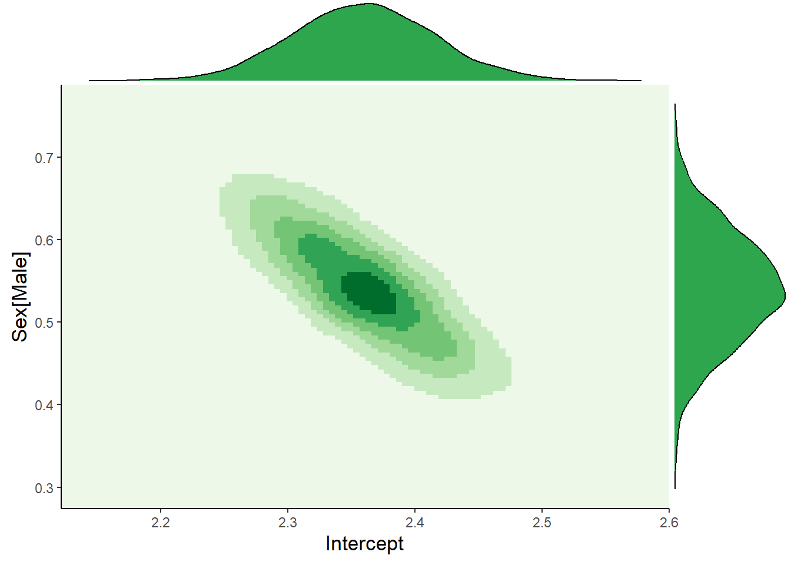

</figure>

We can also inspect the posterior of the <code>SexM</code> coefficient alone (sex difference in weight) - also called a <em>marginal posterior</em>:

ggplot code

<pre class="sourceCode r code-with-copy"><code class="sourceCode r">p &lt;- draws |&gt;
  ggplot(aes(x = b_SexM)) + 
  stat_density(fill = "#2ea64e", color = "#145726", linewidth = 1) +
  theme_classic() +
  scale_x_continuous(limits = c(-0.2, 1), breaks = seq(-0.2, 1, 0.1)) +
  theme(axis.text.y = element_blank(),
        axis.ticks.y = element_blank(),
        plot.background = element_rect(fill = "#E3E2DF"),
        panel.background = element_rect(fill = "#E3E2DF"),
        legend.background = element_rect(fill = "#E3E2DF"))

p</code><button title="Copy to Clipboard" class="code-copy-button"><i class="bi"></i></button></pre>

<figure class="figure">

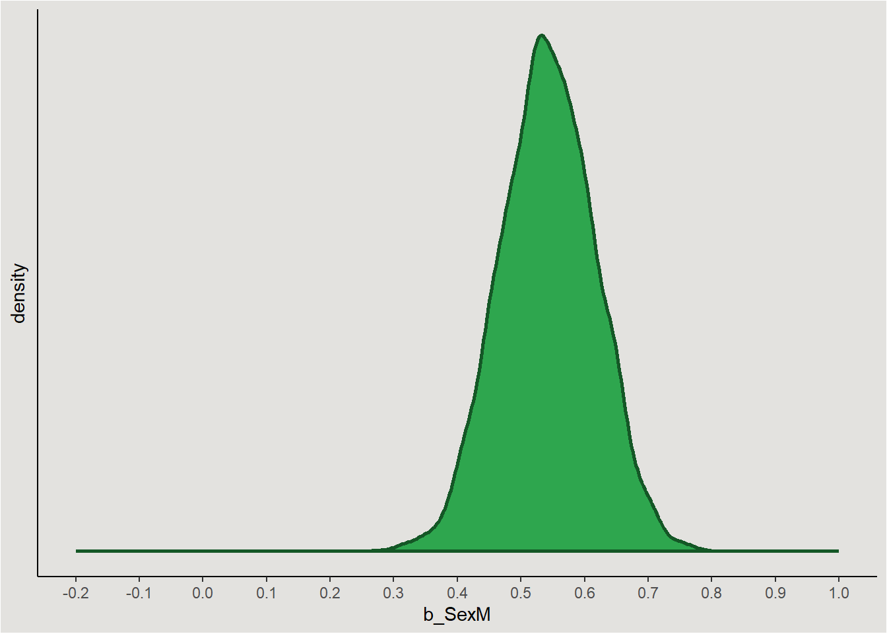

</figure>

Notice the values most probable in the posterior are in the range of our hypothesis, and also in the range of the frequentist model. Some calculations that can be done on the posterior include:

<section id="probability-of-direction" class="level5">
<h5 class="anchored" data-anchor-id="probability-of-direction">Probability of direction</h5>

How much of the posterior is negative/positive? The answer to this question gives the probability that the parameter is different from zero:

ggplot code

<pre class="sourceCode r code-with-copy"><code class="sourceCode r">p &lt;- draws |&gt;
  ggplot(aes(x = b_SexM)) + 
  stat_density(fill = "#2ea64e", color = "#145726", linewidth = 1) +
  geom_vline(xintercept = 0, linetype = "dashed", linewidth = 0.8) +
  theme_classic() +
  scale_x_continuous(limits = c(-0.2, 1), breaks = seq(-0.2, 1, 0.1)) +
  theme(axis.text.y = element_blank(),
        axis.ticks.y = element_blank(),
        plot.background = element_rect(fill = "#E3E2DF"),
        panel.background = element_rect(fill = "#E3E2DF"),
        legend.background = element_rect(fill = "#E3E2DF"))

p</code><button title="Copy to Clipboard" class="code-copy-button"><i class="bi"></i></button></pre>

<figure class="figure">

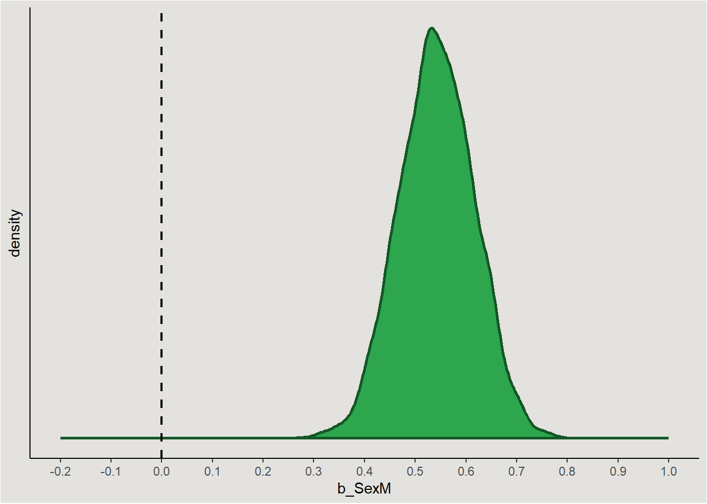

</figure>

The posterior is entirely positive, yielding a 100% probability that the parameter is positive.

Can also be done with <code>bayestestR</code> wonderful functions.

<pre class="sourceCode r code-with-copy"><code class="sourceCode r">bayestestR::p_direction(posterior, parameters = "b_SexM")</code><button title="Copy to Clipboard" class="code-copy-button"><i class="bi"></i></button></pre>

<pre><code>Probability of Direction

Parameter |   pd
----------------
SexM      | 100%</code></pre>

<pre class="sourceCode r code-with-copy"><code class="sourceCode r">plot(bayestestR::p_direction(posterior, parameters = "b_SexM")) +
  scale_fill_manual(values = "#2ea64e") +
  theme(plot.background = element_rect(fill = "#E3E2DF"),
        panel.background = element_rect(fill = "#E3E2DF"),
        legend.background = element_rect(fill = "#E3E2DF"))</code><button title="Copy to Clipboard" class="code-copy-button"><i class="bi"></i></button></pre>

<figure class="figure">

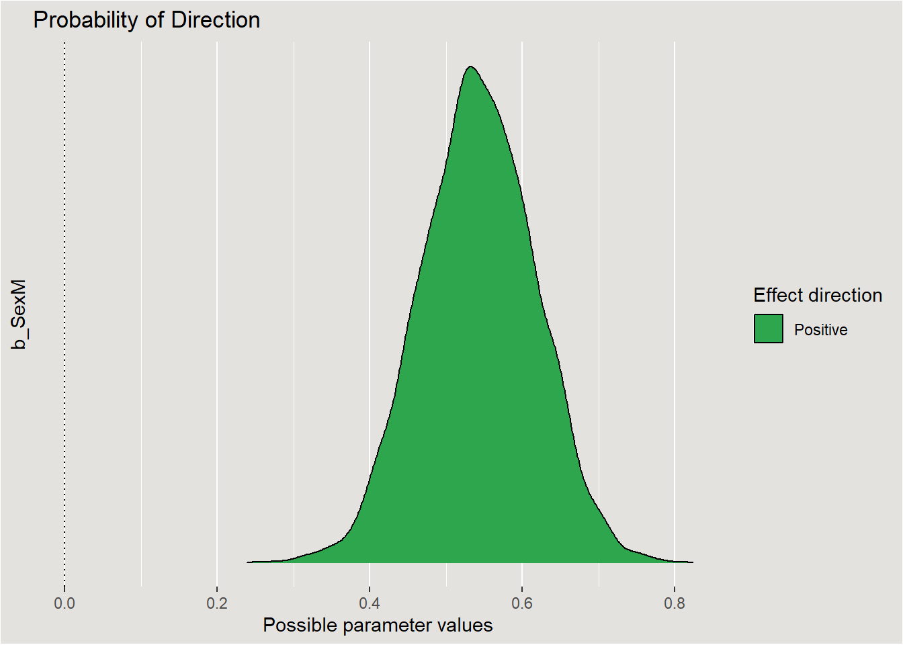

</figure>

</section>
<section id="highest-density-interval-hdi" class="level5">
<h5 class="anchored" data-anchor-id="highest-density-interval-hdi">Highest Density Interval (HDI)</h5>

A common misconception of the frequentist’s confidence interval (with 95% credibility) is that it has a 95% probability of containing the true value of the parameter. The Bayesian Highest Density Interval however gives exactly this. The main 95% of the posterior have a 95% probability of containing the real value of the parameter. 95% are obviously arbitrary, and can be defined to anything else:

plotting the HDI

<pre class="sourceCode r code-with-copy"><code class="sourceCode r">p &lt;- bayestestR::hdi(posterior, parameters = "b_SexM", ci = 0.89) |&gt;
  plot() +
    theme_classic() +
    scale_fill_manual(values = c("#145726", "#2ea64e")) +
    scale_x_continuous(limits = c(0.25, 0.85), breaks = seq(0.25, 0.85, 0.1)) +
    labs(x = "Sex [Male]", title = "Highest Density Interval", subtitle = "The shaded area has a 89% probability of containing the real value of the parameter", y = "") +
    theme(legend.position = "none",
          axis.title.x = element_text(size = 13, family = "serif"),
          plot.title = element_text(size = 17, family = "serif", hjust = 0.5),
          plot.subtitle = element_text(size = 13, family = "serif", hjust = 0.5),
          plot.background = element_rect(fill = "#E3E2DF"),
          panel.background = element_rect(fill = "#E3E2DF"),
          legend.background = element_rect(fill = "#E3E2DF"))

p</code><button title="Copy to Clipboard" class="code-copy-button"><i class="bi"></i></button></pre>

<figure class="figure">

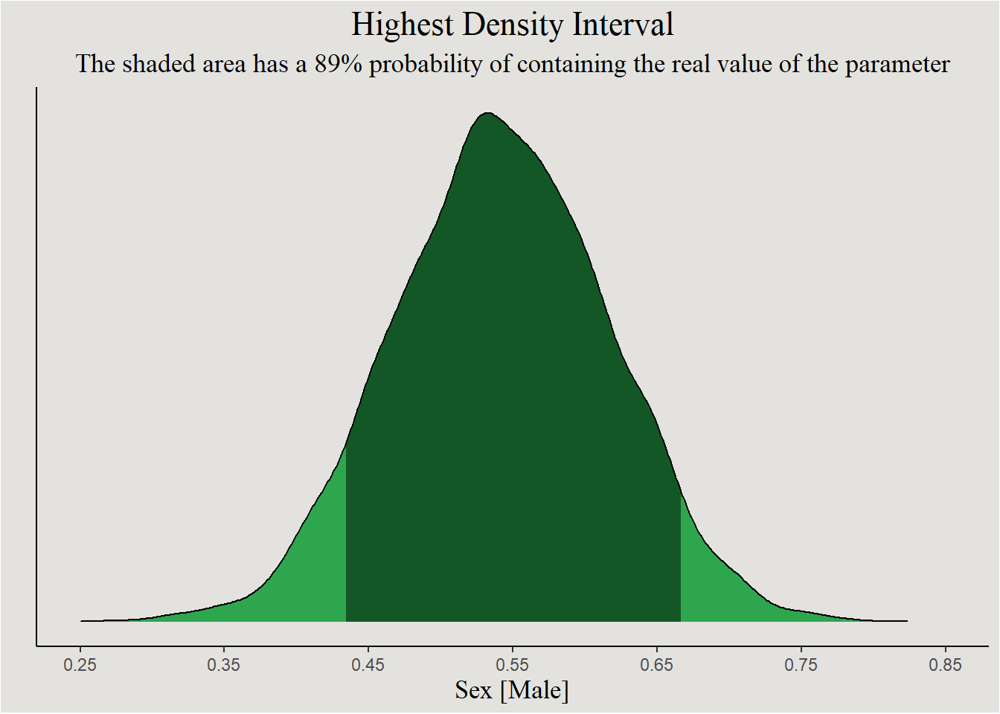

</figure>

</section>
<section id="point-estimates" class="level5">
<h5 class="anchored" data-anchor-id="point-estimates">Point estimates</h5>

It is also possible to summarize the posterior distribution with point estimates like the mean, median and mode (Maximum A-posteriori Point - MAP). This is done easily with the <code>model_parameters()</code> function from the <code>parameters</code> package:

<pre class="sourceCode r code-with-copy"><code class="sourceCode r">parameters::model_parameters(posterior, centrality = "all") |&gt; insight::print_html()</code><button title="Copy to Clipboard" class="code-copy-button"><i class="bi"></i></button></pre>

<table class="gt_table caption-top table table-sm table-striped small" data-quarto-postprocess="true" data-quarto-disable-processing="false" data-quarto-bootstrap="false">
<thead>
<tr class="header gt_heading">
<th colspan="8" class="gt_heading gt_title gt_font_normal gt_bottom_border">Model Summary</th>
</tr>
<tr class="odd gt_col_headings">
<th id="Parameter" class="gt_col_heading gt_columns_bottom_border gt_left" data-quarto-table-cell-role="th" scope="col">Parameter</th>
<th id="Median" class="gt_col_heading gt_columns_bottom_border gt_center" data-quarto-table-cell-role="th" scope="col">Median</th>
<th id="Mean" class="gt_col_heading gt_columns_bottom_border gt_center" data-quarto-table-cell-role="th" scope="col">Mean</th>
<th id="MAP" class="gt_col_heading gt_columns_bottom_border gt_center" data-quarto-table-cell-role="th" scope="col">MAP</th>
<th id="95% CI" class="gt_col_heading gt_columns_bottom_border gt_center" data-quarto-table-cell-role="th" scope="col">95% CI</th>
<th id="pd" class="gt_col_heading gt_columns_bottom_border gt_center" data-quarto-table-cell-role="th" scope="col">pd</th>
<th id="Rhat" class="gt_col_heading gt_columns_bottom_border gt_center" data-quarto-table-cell-role="th" scope="col">Rhat</th>
<th id="ESS" class="gt_col_heading gt_columns_bottom_border gt_center" data-quarto-table-cell-role="th" scope="col">ESS</th>
</tr>
</thead>
<tbody class="gt_table_body">
<tr class="odd gt_group_heading_row">
<td colspan="8" id="Fixed Effects " class="gt_group_heading" data-quarto-table-cell-role="th" scope="colgroup">Fixed Effects</td>
</tr>
<tr class="even gt_row_group_first">
<td class="gt_row gt_left" headers="Fixed Effects   Parameter" style="border-right-width: 1px; border-right-style: solid; border-right-color: #d3d3d3">(Intercept)</td>
<td class="gt_row gt_center" headers="Fixed Effects   Median">2.36</td>
<td class="gt_row gt_center" headers="Fixed Effects   Mean">2.36</td>
<td class="gt_row gt_center" headers="Fixed Effects   MAP">2.36</td>
<td class="gt_row gt_center" headers="Fixed Effects   95% CI">(2.24, 2.48)</td>
<td class="gt_row gt_center" headers="Fixed Effects   pd">100%</td>
<td class="gt_row gt_center" headers="Fixed Effects   Rhat">1.000</td>
<td class="gt_row gt_center" headers="Fixed Effects   ESS">3946.00</td>
</tr>
<tr class="odd">
<td class="gt_row gt_left" headers="Fixed Effects   Parameter" style="border-right-width: 1px; border-right-style: solid; border-right-color: #d3d3d3">SexM</td>
<td class="gt_row gt_center" headers="Fixed Effects   Median">0.54</td>
<td class="gt_row gt_center" headers="Fixed Effects   Mean">0.54</td>
<td class="gt_row gt_center" headers="Fixed Effects   MAP">0.53</td>
<td class="gt_row gt_center" headers="Fixed Effects   95% CI">(0.40, 0.69)</td>
<td class="gt_row gt_center" headers="Fixed Effects   pd">100%</td>
<td class="gt_row gt_center" headers="Fixed Effects   Rhat">1.000</td>
<td class="gt_row gt_center" headers="Fixed Effects   ESS">4140.00</td>
</tr>
<tr class="even gt_group_heading_row">
<td colspan="8" id="Sigma " class="gt_group_heading" data-quarto-table-cell-role="th" scope="colgroup">Sigma</td>
</tr>
<tr class="odd gt_row_group_first">
<td class="gt_row gt_left" headers="Sigma   Parameter" style="border-right-width: 1px; border-right-style: solid; border-right-color: #d3d3d3">sigma</td>
<td class="gt_row gt_center" headers="Sigma   Median">0.42</td>
<td class="gt_row gt_center" headers="Sigma   Mean">0.42</td>
<td class="gt_row gt_center" headers="Sigma   MAP">0.41</td>
<td class="gt_row gt_center" headers="Sigma   95% CI">(0.37, 0.47)</td>
<td class="gt_row gt_center" headers="Sigma   pd">100%</td>
<td class="gt_row gt_center" headers="Sigma   Rhat">1.000</td>
<td class="gt_row gt_center" headers="Sigma   ESS">3277.00</td>
</tr>
</tbody><tfoot class="gt_sourcenotes">
<tr class="odd">
<td colspan="8" class="gt_sourcenote"></td>
</tr>
</tfoot>

</table>

</section>
</section>
</section>
<section id="conclusion" class="level1">
<h1>Conclusion</h1>

This post is just a brief introduction of Bayesian statistical modeling. For those psychology students who want to enrich their statistical analyses, it should provide the basic tools and intuition. This post will be followed up with a deeper dive in to more complex models (multiple linear models, mixed-effects linear models, generalized linear models, ordinal regression models…).

</section>

<section class="quarto-appendix-contents" role="doc-bibliography" id="quarto-bibliography"><h2 class="anchored quarto-appendix-heading">References</h2>

Bürkner, Paul-Christian. 2017. “Brms: An r Package for Bayesian Multilevel Models Using Stan.” <em>Journal of Statistical Software</em> 80 (1): 1–28. <a href="https://doi.org/10.18637/jss.v080.i01">https://doi.org/10.18637/jss.v080.i01</a>.

Etz, Alexander. 2018. “Introduction to the Concept of Likelihood and Its Applications.” <em>Advances in Methods and Practices in Psychological Science</em> 1 (1): 60–69. <a href="https://doi.org/10.1177/2515245917744314">https://doi.org/10.1177/2515245917744314</a>.

Kruschke, John. 2014. “Markov Chain Monte Carlo.” In <em>Doing Bayesian Data Analysis: A Tutorial with r, JAGS, and Stan</em>, 2nd ed. <a href="https://nyu-cdsc.github.io/learningr/assets/kruschke_bayesian_in_R.pdf">https://nyu-cdsc.github.io/learningr/assets/kruschke_bayesian_in_R.pdf</a>.

Pawitan, Yudi. 2001. <em>In All Likelihood: Statistical Modelling and Inference Using Likelihood</em>. Oxford University Press.

Stan Development Team. 2018. “The Stan Core Library.” <a href="http://mc-stan.org/ 17">http://mc-stan.org/ 17</a>.

Vehtari, Aki, Andrew Gelman, Daniel Simpson, Bob Carpenter, and Paul-Christian Bürkner. 2021. “Rank-Normalization, Folding, and Localization: An Improved \widehatR for Assessing Convergence of MCMC (with Discussion).” <em>Bayesian Analysis</em> 16 (2): 667–718. <a href="https://doi.org/10.1214/20-BA1221">https://doi.org/10.1214/20-BA1221</a>.

</section><section id="footnotes" class="footnotes footnotes-end-of-document" role="doc-endnotes"><h2 class="anchored quarto-appendix-heading">Footnotes</h2>

<ol>
<li id="fn1">
For example, consider the hypothesis that people in condition A are faster in a certain task than people in condition B. Your formal hypothesis look something like this: Reaction time follows a normal distribution with \(\mu=\beta_0+\beta_1condition\) and \(\sigma^2\). This model has 3 total parameters (\(\beta_0\), \(\beta_1\) and \(\sigma^2\)).<a href="#fnref1" class="footnote-back" role="doc-backlink">↩︎</a>
</li>
<li id="fn2">
The term \(P(Data|Parameters)\) is not a probability distribution, but a special function called a <em>Likelihood</em> function and should be denoted by \(L(Parameters|Data)\).<a href="#fnref2" class="footnote-back" role="doc-backlink">↩︎</a>
</li>
<li id="fn3">
Which is identical to the normal density function.<a href="#fnref3" class="footnote-back" role="doc-backlink">↩︎</a>
</li>
<li id="fn4">
For the math nerds, the evidence is defined as this integral: \(\int_{\theta}P(X|\theta)P(\theta)d\theta\).<a href="#fnref4" class="footnote-back" role="doc-backlink">↩︎</a>
</li>
</ol>
</section>
</article>



</main>


