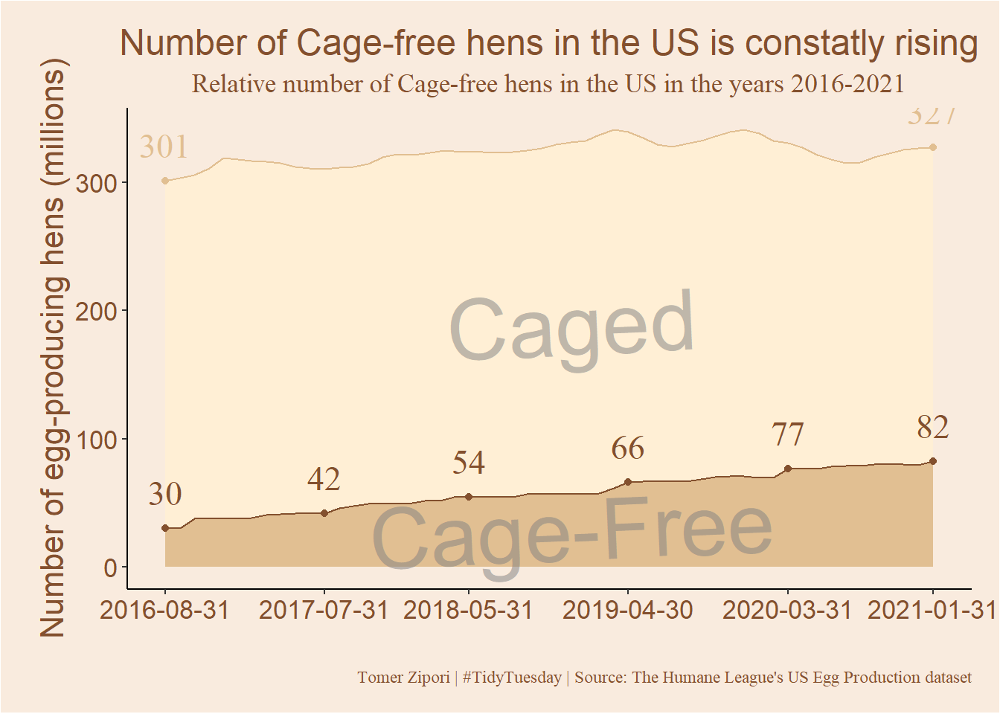

<header class="site-header" aria-label="Main navigation"><a class="wordmark" href="../../">Tomer Zipori.</a><nav class="primary-nav" id="primary-navigation"><a href="../../questions/">Questions</a><a href="../../notes/">Notes</a><a href="../../experiments/">Experiments</a><a href="../../writing/">Writing</a><a href="../../about/">About</a></nav>
<a href="https://github.com/tomerzipori">GitHub</a><a href="../../writing/index.xml">RSS</a>
<button class="menu-toggle" type="button" data-menu-toggle aria-expanded="false" aria-controls="primary-navigation">Menu</button></header>
<main class="site-main"><section class="page-intro">
Article · Data and strange claims
<h1>Cage-free vs. caged hens in the US</h1>
in bloom12 Apr 2023
</section><article class="prose real-post"><section id="background" class="level1">
<h1>Background</h1>

Some time ago, when the fall semester began I’ve enrolled on a course called <em>Data science lab</em> as part of the ‘Data Science for the Social Sciences’ program. One of the assignments was to make some <code>TidyTuesday</code> contribution and present it in class. So this is my submission and what I consider as my first respectable attempts at visualizing data.

</section>
<section id="the-data" class="level1">
<h1>The Data</h1>
<section id="from-the-github-repo" class="level5">
<h5 class="anchored" data-anchor-id="from-the-github-repo">From the Github <a href="https://github.com/tomerzipori/tidytuesday/tree/master/data/2023/2023-04-11">repo</a>:</h5>

<em>The data this week comes from <a href="https://thehumaneleague.org/article/E008R01-us-egg-production-data">The Humane League’s US Egg Production* *dataset</a> by <a href="https://samaramendez.github.io/">Samara Mendez</a>. Dataset and code is available for this project on OSF at <a href="https://osf.io/z2gxn/">US Egg Production Data Set</a>.</em>

<em>This dataset tracks the supply of cage-free eggs in the United States from December 2007 to February 2021. For TidyTuesday we’ve used data through February 2021, but the full dataset, with data through the present, is available in the <a href="https://osf.io/z2gxn/">OSF project</a>.</em>

Let’s start!

</section>
</section>
<section id="setup" class="level1">
<h1>Setup</h1>
<section id="libraries" class="level2">
<h2 class="anchored" data-anchor-id="libraries">Libraries</h2>

<pre class="sourceCode r code-with-copy"><code class="sourceCode r">library(tidytuesdayR) # for easy data loading
library(tidyverse)    # for data pre-processing and wrangling
library(lubridate)    # makes dealing with date format much easier
library(showtext)     # fonts</code><button title="Copy to Clipboard" class="code-copy-button"><i class="bi"></i></button></pre>

</section>
<section id="loading-fonts" class="level2">
<h2 class="anchored" data-anchor-id="loading-fonts">Loading fonts</h2>

<code>showtext</code> is an awesome package that allows to load installed fonts into <code>R</code> and use it in <code>ggplot2</code> plots (for example). For a really helpful video that I used see this <a href="https://www.youtube.com/watch?v=kyOCNPuQzog&amp;t=1010s">video</a> from the Riffomonas Project.

<pre class="sourceCode r code-with-copy"><code class="sourceCode r">font_add(family = "Stencil", regular = "STENCIL.TTF")
showtext_auto()</code><button title="Copy to Clipboard" class="code-copy-button"><i class="bi"></i></button></pre>

</section>
</section>
<section id="loading-data" class="level1">
<h1>Loading data</h1>

<pre class="sourceCode r code-with-copy"><code class="sourceCode r">eggproduction  &lt;- readr::read_csv('https://raw.githubusercontent.com/rfordatascience/tidytuesday/master/data/2023/2023-04-11/egg-production.csv')

cagefreepercentages &lt;- readr::read_csv('https://raw.githubusercontent.com/rfordatascience/tidytuesday/master/data/2023/2023-04-11/cage-free-percentages.csv')</code><button title="Copy to Clipboard" class="code-copy-button"><i class="bi"></i></button></pre>

<section id="taking-a-peak" class="level2">
<h2 class="anchored" data-anchor-id="taking-a-peak">Taking a peak</h2>

<pre class="sourceCode r code-with-copy"><code class="sourceCode r">head(eggproduction)</code><button title="Copy to Clipboard" class="code-copy-button"><i class="bi"></i></button></pre>

<pre><code># A tibble: 6 × 6
  observed_month prod_type     prod_process   n_hens     n_eggs source
  &lt;date&gt;         &lt;chr&gt;         &lt;chr&gt;           &lt;dbl&gt;      &lt;dbl&gt; &lt;chr&gt;
1 2016-07-31     hatching eggs all          57975000 1147000000 ChicEggs-09-23-…
2 2016-08-31     hatching eggs all          57595000 1142700000 ChicEggs-10-21-…
3 2016-09-30     hatching eggs all          57161000 1093300000 ChicEggs-11-22-…
4 2016-10-31     hatching eggs all          56857000 1126700000 ChicEggs-12-23-…
5 2016-11-30     hatching eggs all          57116000 1096600000 ChicEggs-01-24-…
6 2016-12-31     hatching eggs all          57750000 1132900000 ChicEggs-02-28-…</code></pre>

<code>eggproduction</code> holds monthly data about number of hens and produced eggs in the US. <code>prod_type</code> specifies the type of egg produced, it has 2 levels:

<pre class="sourceCode r code-with-copy"><code class="sourceCode r">unique(eggproduction$prod_type)</code><button title="Copy to Clipboard" class="code-copy-button"><i class="bi"></i></button></pre>

<pre><code>[1] "hatching eggs" "table eggs"   </code></pre>

For the current mini-project, I’ll stay with “table eggs” only.

The variable <code>prod_process</code> specifies the type of housing of the egg-producing hens. It has 3 levels:

<pre class="sourceCode r code-with-copy"><code class="sourceCode r">unique(eggproduction$prod_process)</code><button title="Copy to Clipboard" class="code-copy-button"><i class="bi"></i></button></pre>

<pre><code>[1] "all"                     "cage-free (non-organic)"
[3] "cage-free (organic)"    </code></pre>

I’ll leave data of <code>all</code> hens for now.

<section id="pre-processing-1" class="level3">
<h3 class="anchored" data-anchor-id="pre-processing-1">Pre-processing 1</h3>

Filtering out irrelevant data and renaming some variables.

<pre class="sourceCode r code-with-copy"><code class="sourceCode r">egg_clean &lt;- eggproduction %&gt;%
  filter(prod_type != "hatching eggs" &amp; prod_process == "all") %&gt;% # Leave only eggs meant for eating and general data
  select(-source, -prod_type, -prod_process, n_hens_all = n_hens, n_eggs_all = n_eggs) # Irrelevant columns</code><button title="Copy to Clipboard" class="code-copy-button"><i class="bi"></i></button></pre>

</section>
<section id="taking-a-peak-2" class="level3">
<h3 class="anchored" data-anchor-id="taking-a-peak-2">Taking a peak 2</h3>

<pre class="sourceCode r code-with-copy"><code class="sourceCode r">head(cagefreepercentages)</code><button title="Copy to Clipboard" class="code-copy-button"><i class="bi"></i></button></pre>

<pre><code># A tibble: 6 × 4
  observed_month percent_hens percent_eggs source
  &lt;date&gt;                &lt;dbl&gt;        &lt;dbl&gt; &lt;chr&gt;
1 2007-12-31              3.2           NA Egg-Markets-Overview-2019-10-19.pdf
2 2008-12-31              3.5           NA Egg-Markets-Overview-2019-10-19.pdf
3 2009-12-31              3.6           NA Egg-Markets-Overview-2019-10-19.pdf
4 2010-12-31              4.4           NA Egg-Markets-Overview-2019-10-19.pdf
5 2011-12-31              5.4           NA Egg-Markets-Overview-2019-10-19.pdf
6 2012-12-31              6             NA Egg-Markets-Overview-2019-10-19.pdf</code></pre>

This data-frame also holds monthly data. The variable <code>percent_hens</code> specifies <em>observed or computed percentage of cage-free hens relative to all table-egg-laying hens</em> (from the Github repo). We’ll select these variables and use them to merge with the first data-frame.

<pre class="sourceCode r code-with-copy"><code class="sourceCode r">egg_clean2 &lt;- cagefreepercentages %&gt;%
  drop_na(percent_eggs) %&gt;%                                                # droping rows with missing percent_eggs data
  select(-source, -percent_eggs, cagefree_percent_hens = percent_hens) %&gt;% # Irrelevant\to many NA's columns + renaming
  inner_join(egg_clean, by = "observed_month", multiple = "all") %&gt;%       # joining with the first data-frame
  mutate(Cagefree = (cagefree_percent_hens * n_hens_all) / 100) %&gt;%        # calculating number of cage-free hens
  mutate(Traditional = n_hens_all - Cagefree) %&gt;%                          # calculating number of traditional housing hens
  select(observed_month, Cagefree, Traditional) %&gt;%
  pivot_longer(cols = c("Cagefree", "Traditional"), names_to = "housing", values_to = "n_hens")</code><button title="Copy to Clipboard" class="code-copy-button"><i class="bi"></i></button></pre>

</section>
</section>
</section>
<section id="plotting" class="level1">
<h1>Plotting</h1>
<section id="gameplan" class="level2">
<h2 class="anchored" data-anchor-id="gameplan">Gameplan</h2>

Few hours deep, I’ve decided it would be interesting to see the change in number of cage-free hens compared to caged hens during the time period we have data about. Because I wanted to plot only certain points of data along the time axis, I needed to create a subset of the big data-frame that holds the data for the points I wanted to plot.

<section id="identitfying-the-dates-of-interest" class="level3">
<h3 class="anchored" data-anchor-id="identitfying-the-dates-of-interest">Identitfying the dates of interest</h3>

First thing, I found 6 dates that are equally spaced between the start and end points. The repetitive code below is quite ugly, and <code>lubridate</code> probably has a nice and elegant solution, I didn’t want to spend to much time on it.

<pre class="sourceCode r code-with-copy"><code class="sourceCode r">dates_for_plot &lt;- seq.Date(egg_clean2$observed_month[1], egg_clean2$observed_month[nrow(egg_clean2)], length.out = 6)
dates_for_plot[2] &lt;- as.Date("2017-07-31")
dates_for_plot[3] &lt;- as.Date("2018-05-31")
dates_for_plot[4] &lt;- as.Date("2019-04-30")
dates_for_plot[5] &lt;- as.Date("2020-03-31")</code><button title="Copy to Clipboard" class="code-copy-button"><i class="bi"></i></button></pre>

</section>
<section id="creating-the-subset" class="level3">
<h3 class="anchored" data-anchor-id="creating-the-subset">Creating the subset</h3>

I will use this subset in order to plot the 6 points on the general data. I will only need to specify <code>data = subset_for_points</code> in the relevant <code>geom</code> object.

<pre class="sourceCode r code-with-copy"><code class="sourceCode r">subset_for_points &lt;- egg_clean2 %&gt;%
  filter((housing == "Cagefree" &amp; observed_month %in% dates_for_plot) |
           (housing == "Traditional" &amp; (observed_month == dates_for_plot[1] | observed_month == dates_for_plot[6]))) %&gt;%
  inner_join(select(egg_clean, observed_month, n_hens = n_hens_all), by = "observed_month") %&gt;%
  mutate(n_hens = case_when(housing == "Cagefree" ~ n_hens.x,
                            housing == "Traditional" ~ n_hens.y)) %&gt;%
  select(-n_hens.x, -n_hens.y)</code><button title="Copy to Clipboard" class="code-copy-button"><i class="bi"></i></button></pre>

</section>
</section>
<section id="actually-plotting" class="level2">
<h2 class="anchored" data-anchor-id="actually-plotting">Actually plotting</h2>

I went with a simple stacked density plot. Watch how the number of cage-free goes from

Code

<pre class="sourceCode r code-with-copy"><code class="sourceCode r">plot &lt;- egg_clean2 %&gt;%
  ggplot(aes(x = observed_month, y = n_hens/1000000, fill = factor(housing, levels = c("Traditional", "Cagefree")),
             color = factor(housing, levels = c("Traditional", "Cagefree")),
             label = n_hens/1000000)) +
  geom_density(position = 'stack', stat = 'identity') +
  geom_point(data = subset_for_points) +
  geom_text(data = subset_for_points, aes(label = round(n_hens/1000000)), hjust = 0.5, vjust = -1, size = 6, family = "serif") +
  scale_fill_manual(values = c("#ffefd5", "#e1bf92")) +
  scale_color_manual(values = c("#e1bf92", "#83502e")) +
  annotate(geom = "text", x = as_date("2019/1/1"), y = 30, label = "Cage-Free", color = "#808080",
           family = "Stencil", angle = 2.5, size = 15, alpha = 0.5) +
  annotate(geom = "text", x = as_date("2019/1/1"), y = 190, label = "Caged", color = "#808080",
           family = "Stencil", angle = 2.5, size = 15, alpha = 0.5) +
  scale_x_date(breaks = dates_for_plot) +
  xlab("") +
  ylab("Number of egg-producing hens (millions)") +
  labs(fill = "Housing", title = "Number of Cage-free hens in the US is constatly rising",
       subtitle = "Relative number of Cage-free hens in the US in the years 2016-2021",
       caption = "Tomer Zipori | #TidyTuesday | Source: The Humane League's US Egg Production dataset") +
  guides(color = "none", fill = "none") +
  theme_classic() +
  theme(axis.title = element_text(size = 16, color = "#83502e"),
        axis.text.x = element_text(size = 13, color = "#83502e"),
        axis.text.y = element_text(size = 13, color = "#83502e"),
        plot.title = element_text(hjust = 0.5, size = 18, color = "#83502e"),
        plot.subtitle = element_text(hjust = 0.5, size = 13, family = "serif", color = "#83502e"),
        plot.caption = element_text(family = "serif", color = "#83502e"),
        plot.margin = margin(0.5,0.5,0.5,0.7, "cm"),
        plot.background = element_rect(fill = "#F9EBDE"),
        panel.background = element_rect(fill = "#F9EBDE"))
plot</code><button title="Copy to Clipboard" class="code-copy-button"><i class="bi"></i></button></pre>

<figure class="figure">

</figure>

</section>
</section>
<section id="conclusion" class="level1">
<h1>Conclusion</h1>

There is a steady and relative fast growth in cage-free hens in the US, compared with caged-housed hens. Nice. As I said in the beginning. this is my first <code>TidyTuesday</code> contribution, and the first data visualization attempts that I felt worthy of posting lol. I learned a few tricks along the way for example: 
&nbsp;&nbsp;&nbsp;&nbsp;&nbsp;&nbsp;<strong>1.</strong> lubridate’s <em>date</em> format is super nice to work with. It can be seq’t along and do all kind of efficient things for dealing with timely data. 
&nbsp;&nbsp;&nbsp;&nbsp;&nbsp;&nbsp;<strong>2.</strong> Referencing more then one data-frame in a single <code>ggplot()</code>, Seems obvious, but I didn’t think about this solution to plotting just some of the data until this mini-project. 
&nbsp;&nbsp;&nbsp;&nbsp;&nbsp;&nbsp;<strong>3.</strong> Many-many things about aesthetics of <code>ggplot2</code>, like the <code>annotate()</code> and <code>labs()</code> functions and arguments.

</section></article></main>
<footer class="site-footer">
© 2026 Tomer Zipori <a href="../../writing/">All writing</a>

A first respectable attempt.
<nav class="footer-links"><a href="https://github.com/tomerzipori">GitHub</a><a href="../../writing/index.xml">RSS</a></nav></footer>
