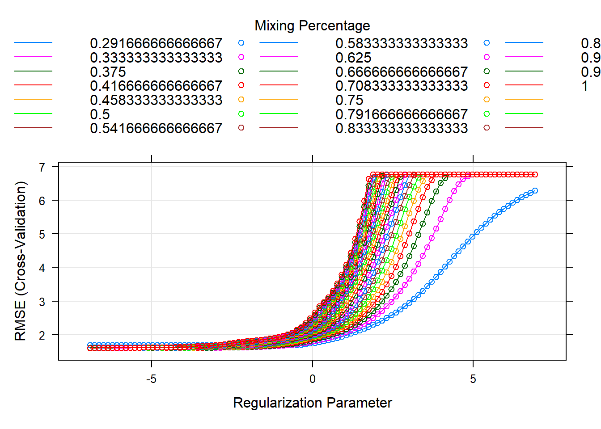
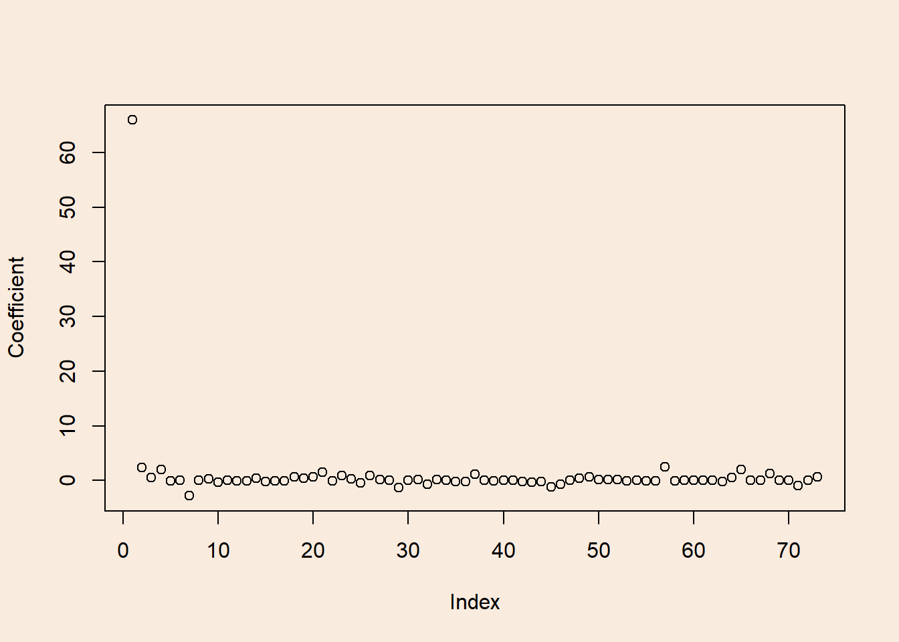
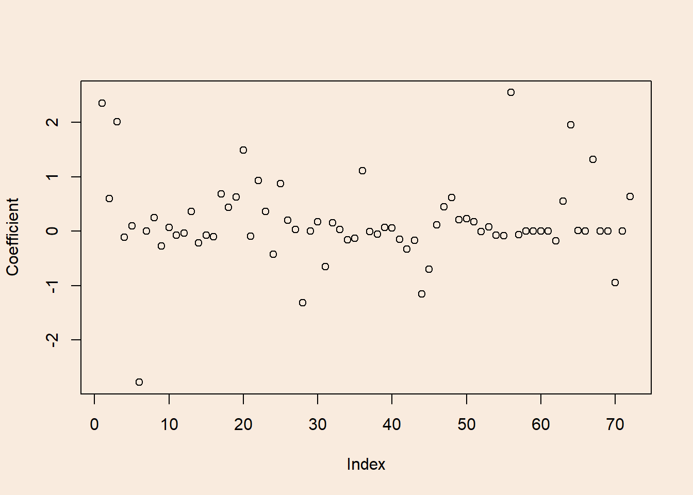
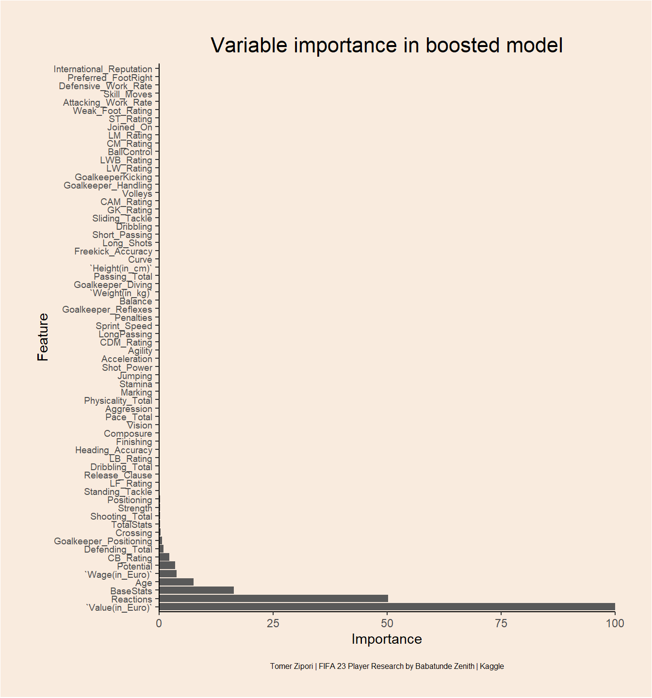

<header class="site-header" aria-label="Main navigation"><a class="wordmark" href="../../">Tomer Zipori.</a><nav class="primary-nav" id="primary-navigation"><a href="../../questions/">Questions</a><a href="../../notes/">Notes</a><a href="../../experiments/">Experiments</a><a href="../../writing/">Writing</a><a href="../../about/">About</a></nav>
<a href="https://github.com/tomerzipori">GitHub</a><a href="../../writing/index.xml">RSS</a>
<button class="menu-toggle" type="button" data-menu-toggle aria-expanded="false" aria-controls="primary-navigation">Menu</button></header>
<main class="site-main"><section class="page-intro">
Article · Data and strange claims
<h1>What makes FIFA 23 players good?</h1>
in bloom06 May 2023
</section><article class="prose real-post"><section id="background-and-analysis-plan" class="level1">
<h1>Background and analysis plan</h1>

The current <a href="https://www.kaggle.com/datasets/babatundezenith/fifa-archive">Data</a> is an upload to <em>Kaggle</em> by Babatunde Zenith, and it includes information about players in the popular <em>FIFA 23</em> video game. Information includes: name, age, nationality, position, various football ratings and contract deals.

The current notebook is an attempt at: 
&nbsp;&nbsp;&nbsp;&nbsp;&nbsp;&nbsp;1. Accurately and efficiently predicting player’s overall rating. 
&nbsp;&nbsp;&nbsp;&nbsp;&nbsp;&nbsp;2. Identifying important variables (features) for this prediction.

Both goals will be achieved using two methods: Elastic-net regression and Decision tree Boosting. Data pre-processing will be done with <code>tidyverse</code>, Model fitting and evaluation will be done with the <code>caret</code> and <code>gbm</code> packages.

</section>
<section id="setup" class="level1">
<h1>Setup</h1>

<pre class="sourceCode r code-with-copy"><code class="sourceCode r">library(tidyverse) # For data-wrangling, pre-processing and plotting with ggplot2
library(caret)     # For model training, tuning and evaluating
library(gbm)       # For fitting Boost models
library(glue)      # Helper package for nice-looking output</code><button title="Copy to Clipboard" class="code-copy-button"><i class="bi"></i></button></pre>

</section>
<section id="loading-data" class="level1">
<h1>Loading data</h1>

<pre class="sourceCode r code-with-copy"><code class="sourceCode r">players &lt;- read_csv("Fifa_23_Players_Data.csv")
glimpse(players)</code><button title="Copy to Clipboard" class="code-copy-button"><i class="bi"></i></button></pre>

<pre><code>Rows: 17,529
Columns: 89
$ `Known As`                    &lt;chr&gt; "L. Messi", "K. Benzema", "R. Lewandowsk…
$ `Full Name`                   &lt;chr&gt; "Lionel Messi", "Karim Benzema", "Robert…
$ Overall                       &lt;dbl&gt; 91, 91, 91, 91, 91, 90, 90, 90, 90, 90, …
$ Potential                     &lt;dbl&gt; 91, 91, 91, 91, 95, 90, 91, 90, 90, 90, …
$ `Value(in Euro)`              &lt;dbl&gt; 54000000, 64000000, 84000000, 107500000,…
$ `Positions Played`            &lt;chr&gt; "RW", "CF,ST", "ST", "CM,CAM", "ST,LW", …
$ `Best Position`               &lt;chr&gt; "CAM", "CF", "ST", "CM", "ST", "RW", "GK…
$ Nationality                   &lt;chr&gt; "Argentina", "France", "Poland", "Belgiu…
$ `Image Link`                  &lt;chr&gt; "https://cdn.sofifa.net/players/158/023/…
$ Age                           &lt;dbl&gt; 35, 34, 33, 31, 23, 30, 30, 36, 37, 30, …
$ `Height(in cm)`               &lt;dbl&gt; 169, 185, 185, 181, 182, 175, 199, 193, …
$ `Weight(in kg)`               &lt;dbl&gt; 67, 81, 81, 70, 73, 71, 96, 93, 83, 92, …
$ TotalStats                    &lt;dbl&gt; 2190, 2147, 2205, 2303, 2177, 2226, 1334…
$ BaseStats                     &lt;dbl&gt; 452, 455, 458, 483, 470, 471, 473, 501, …
$ `Club Name`                   &lt;chr&gt; "Paris Saint-Germain", "Real Madrid CF",…
$ `Wage(in Euro)`               &lt;dbl&gt; 195000, 450000, 420000, 350000, 230000, …
$ `Release Clause`              &lt;dbl&gt; 99900000, 131199999, 172200000, 19890000…
$ `Club Position`               &lt;chr&gt; "RW", "CF", "ST", "CM", "ST", "RW", "GK"…
$ `Contract Until`              &lt;chr&gt; "2023", "2023", "2025", "2025", "2024", …
$ `Club Jersey Number`          &lt;chr&gt; "30", "9", "9", "17", "7", "11", "1", "1…
$ `Joined On`                   &lt;dbl&gt; 2021, 2009, 2022, 2015, 2018, 2017, 2018…
$ `On Loan`                     &lt;chr&gt; "-", "-", "-", "-", "-", "-", "-", "-", …
$ `Preferred Foot`              &lt;chr&gt; "Left", "Right", "Right", "Right", "Righ…
$ `Weak Foot Rating`            &lt;dbl&gt; 4, 4, 4, 5, 4, 3, 3, 4, 4, 3, 5, 5, 5, 3…
$ `Skill Moves`                 &lt;dbl&gt; 4, 4, 4, 4, 5, 4, 1, 1, 5, 2, 3, 5, 4, 2…
$ `International Reputation`    &lt;dbl&gt; 5, 4, 5, 4, 4, 4, 4, 5, 5, 4, 4, 5, 4, 3…
$ `National Team Name`          &lt;chr&gt; "Argentina", "France", "Poland", "Belgiu…
$ `National Team Image Link`    &lt;chr&gt; "https://cdn.sofifa.net/flags/ar.png", "…
$ `National Team Position`      &lt;chr&gt; "RW", "ST", "ST", "RF", "ST", "-", "GK",…
$ `National Team Jersey Number` &lt;chr&gt; "10", "19", "9", "7", "10", "-", "1", "1…
$ `Attacking Work Rate`         &lt;chr&gt; "Low", "Medium", "High", "High", "High",…
$ `Defensive Work Rate`         &lt;chr&gt; "Low", "Medium", "Medium", "High", "Low"…
$ `Pace Total`                  &lt;dbl&gt; 81, 80, 75, 74, 97, 90, 84, 87, 81, 81, …
$ `Shooting Total`              &lt;dbl&gt; 89, 88, 91, 88, 89, 89, 89, 88, 92, 60, …
$ `Passing Total`               &lt;dbl&gt; 90, 83, 79, 93, 80, 82, 75, 91, 78, 71, …
$ `Dribbling Total`             &lt;dbl&gt; 94, 87, 86, 87, 92, 90, 90, 88, 85, 72, …
$ `Defending Total`             &lt;dbl&gt; 34, 39, 44, 64, 36, 45, 46, 56, 34, 91, …
$ `Physicality Total`           &lt;dbl&gt; 64, 78, 83, 77, 76, 75, 89, 91, 75, 86, …
$ Crossing                      &lt;dbl&gt; 84, 75, 71, 94, 78, 80, 14, 15, 80, 53, …
$ Finishing                     &lt;dbl&gt; 90, 92, 94, 85, 93, 93, 14, 13, 93, 52, …
$ `Heading Accuracy`            &lt;dbl&gt; 70, 90, 91, 55, 72, 59, 13, 25, 90, 87, …
$ `Short Passing`               &lt;dbl&gt; 91, 89, 84, 93, 85, 84, 33, 60, 80, 79, …
$ Volleys                       &lt;dbl&gt; 88, 88, 89, 83, 83, 84, 12, 11, 86, 45, …
$ Dribbling                     &lt;dbl&gt; 95, 87, 85, 88, 93, 90, 13, 30, 85, 70, …
$ Curve                         &lt;dbl&gt; 93, 82, 79, 89, 80, 84, 19, 14, 81, 60, …
$ `Freekick Accuracy`           &lt;dbl&gt; 93, 73, 85, 83, 69, 69, 20, 11, 79, 70, …
$ LongPassing                   &lt;dbl&gt; 90, 76, 70, 93, 71, 77, 35, 68, 75, 86, …
$ BallControl                   &lt;dbl&gt; 93, 91, 89, 90, 91, 88, 23, 46, 88, 76, …
$ Acceleration                  &lt;dbl&gt; 87, 79, 76, 76, 97, 89, 42, 54, 79, 68, …
$ `Sprint Speed`                &lt;dbl&gt; 76, 80, 75, 73, 97, 91, 52, 60, 83, 91, …
$ Agility                       &lt;dbl&gt; 91, 78, 77, 76, 93, 90, 63, 51, 77, 61, …
$ Reactions                     &lt;dbl&gt; 92, 92, 93, 91, 93, 93, 84, 87, 94, 89, …
$ Balance                       &lt;dbl&gt; 95, 72, 82, 78, 81, 91, 45, 35, 67, 53, …
$ `Shot Power`                  &lt;dbl&gt; 86, 87, 91, 92, 88, 83, 56, 68, 93, 81, …
$ Jumping                       &lt;dbl&gt; 68, 79, 85, 63, 77, 69, 68, 77, 95, 88, …
$ Stamina                       &lt;dbl&gt; 70, 82, 76, 88, 87, 87, 38, 43, 76, 74, …
$ Strength                      &lt;dbl&gt; 68, 82, 87, 74, 76, 75, 70, 80, 77, 93, …
$ `Long Shots`                  &lt;dbl&gt; 91, 80, 84, 91, 82, 85, 17, 16, 90, 64, …
$ Aggression                    &lt;dbl&gt; 44, 63, 81, 75, 64, 63, 23, 29, 63, 85, …
$ Interceptions                 &lt;dbl&gt; 40, 39, 49, 66, 38, 55, 15, 30, 29, 90, …
$ Positioning                   &lt;dbl&gt; 93, 92, 94, 88, 92, 92, 13, 12, 95, 47, …
$ Vision                        &lt;dbl&gt; 94, 89, 81, 94, 83, 85, 44, 70, 76, 65, …
$ Penalties                     &lt;dbl&gt; 75, 84, 90, 83, 80, 86, 27, 47, 90, 62, …
$ Composure                     &lt;dbl&gt; 96, 90, 88, 89, 88, 92, 66, 70, 95, 90, …
$ Marking                       &lt;dbl&gt; 20, 43, 35, 68, 26, 38, 20, 17, 24, 92, …
$ `Standing Tackle`             &lt;dbl&gt; 35, 24, 42, 65, 34, 43, 18, 10, 32, 92, …
$ `Sliding Tackle`              &lt;dbl&gt; 24, 18, 19, 53, 32, 41, 16, 11, 24, 86, …
$ `Goalkeeper Diving`           &lt;dbl&gt; 6, 13, 15, 15, 13, 14, 84, 87, 7, 13, 8,…
$ `Goalkeeper Handling`         &lt;dbl&gt; 11, 11, 6, 13, 5, 14, 89, 88, 11, 10, 10…
$ GoalkeeperKicking             &lt;dbl&gt; 15, 5, 12, 5, 7, 9, 75, 91, 15, 13, 11, …
$ `Goalkeeper Positioning`      &lt;dbl&gt; 14, 5, 8, 10, 11, 11, 89, 91, 14, 11, 14…
$ `Goalkeeper Reflexes`         &lt;dbl&gt; 8, 7, 10, 13, 6, 14, 90, 88, 11, 11, 11,…
$ `ST Rating`                   &lt;dbl&gt; 90, 91, 91, 86, 92, 89, 34, 43, 90, 74, …
$ `LW Rating`                   &lt;dbl&gt; 90, 87, 85, 88, 90, 88, 29, 40, 86, 68, …
$ `LF Rating`                   &lt;dbl&gt; 91, 89, 88, 87, 90, 88, 31, 43, 88, 70, …
$ `CF Rating`                   &lt;dbl&gt; 91, 89, 88, 87, 90, 88, 31, 43, 88, 70, …
$ `RF Rating`                   &lt;dbl&gt; 91, 89, 88, 87, 90, 88, 31, 43, 88, 70, …
$ `RW Rating`                   &lt;dbl&gt; 90, 87, 85, 88, 90, 88, 29, 40, 86, 68, …
$ `CAM Rating`                  &lt;dbl&gt; 91, 91, 88, 91, 92, 90, 35, 50, 88, 73, …
$ `LM Rating`                   &lt;dbl&gt; 91, 89, 86, 91, 92, 90, 34, 47, 87, 73, …
$ `CM Rating`                   &lt;dbl&gt; 88, 84, 83, 91, 84, 85, 35, 53, 81, 79, …
$ `RM Rating`                   &lt;dbl&gt; 91, 89, 86, 91, 92, 90, 34, 47, 87, 73, …
$ `LWB Rating`                  &lt;dbl&gt; 67, 67, 67, 82, 70, 74, 32, 39, 65, 83, …
$ `CDM Rating`                  &lt;dbl&gt; 66, 67, 69, 82, 66, 71, 34, 46, 62, 88, …
$ `RWB Rating`                  &lt;dbl&gt; 67, 67, 67, 82, 70, 74, 32, 39, 65, 83, …
$ `LB Rating`                   &lt;dbl&gt; 62, 63, 64, 78, 66, 70, 32, 38, 61, 85, …
$ `CB Rating`                   &lt;dbl&gt; 53, 58, 63, 72, 57, 61, 32, 37, 56, 90, …
$ `RB Rating`                   &lt;dbl&gt; 62, 63, 64, 78, 66, 70, 32, 38, 61, 85, …
$ `GK Rating`                   &lt;dbl&gt; 22, 21, 22, 24, 21, 25, 90, 90, 23, 23, …</code></pre>

Quite a lot of features. Most of them are numeric which is good.

</section>
<section id="pre-processing" class="level1">
<h1>Pre-processing</h1>
<section id="re-naming-columns" class="level2">
<h2 class="anchored" data-anchor-id="re-naming-columns">Re-naming columns</h2>

Replacing spaces with underscores for ease.

<pre class="sourceCode r code-with-copy"><code class="sourceCode r">names(players) &lt;- str_replace_all(names(players), pattern = " ", replacement = "_")</code><button title="Copy to Clipboard" class="code-copy-button"><i class="bi"></i></button></pre>

</section>
<section id="non-numeric-variables" class="level2">
<h2 class="anchored" data-anchor-id="non-numeric-variables">non-numeric variables</h2>

First we’ll look at potential garbage variables.

<pre class="sourceCode r code-with-copy"><code class="sourceCode r">names(select(players, where(is.character)))</code><button title="Copy to Clipboard" class="code-copy-button"><i class="bi"></i></button></pre>

<pre><code> [1] "Known_As"                    "Full_Name"
 [3] "Positions_Played"            "Best_Position"
 [5] "Nationality"                 "Image_Link"
 [7] "Club_Name"                   "Club_Position"
 [9] "Contract_Until"              "Club_Jersey_Number"
[11] "On_Loan"                     "Preferred_Foot"
[13] "National_Team_Name"          "National_Team_Image_Link"
[15] "National_Team_Position"      "National_Team_Jersey_Number"
[17] "Attacking_Work_Rate"         "Defensive_Work_Rate"        </code></pre>

Almost all garbage data. Since I’ve noted that <em>Work Rate</em> variables are ordered (low-medium-high) We’ll re-code them:

<pre class="sourceCode r code-with-copy"><code class="sourceCode r">players &lt;- players %&gt;%
  mutate(Attacking_Work_Rate = case_when(Attacking_Work_Rate == "Low" ~ 1,
                                         Attacking_Work_Rate == "Medium" ~ 2,
                                         Attacking_Work_Rate == "High" ~ 3),
         Defensive_Work_Rate = case_when(Defensive_Work_Rate == "Low" ~ 1,
                                         Defensive_Work_Rate == "Medium" ~ 2,
                                         Defensive_Work_Rate == "High" ~ 3)) %&gt;%
  select(-Known_As, -Full_Name, -Positions_Played, -Nationality, -Image_Link, -Club_Name, -Contract_Until, -Club_Jersey_Number, -National_Team_Name, -National_Team_Image_Link, -National_Team_Jersey_Number, -On_Loan) %&gt;% # getting rid of garbage variables
  mutate(across(where(is.character), ~na_if(., "-"))) # replacing all "-" with NA</code><button title="Copy to Clipboard" class="code-copy-button"><i class="bi"></i></button></pre>

</section>
<section id="searching-for-variables-with-large-number-of-nas" class="level2">
<h2 class="anchored" data-anchor-id="searching-for-variables-with-large-number-of-nas">Searching for variables with large number of NA’s</h2>

<pre class="sourceCode r code-with-copy"><code class="sourceCode r">colSums(is.na(players))</code><button title="Copy to Clipboard" class="code-copy-button"><i class="bi"></i></button></pre>

<pre><code>                 Overall                Potential           Value(in_Euro)
                       0                        0                        0
           Best_Position                      Age            Height(in_cm)
                       0                        0                        0
           Weight(in_kg)               TotalStats                BaseStats
                       0                        0                        0
           Wage(in_Euro)           Release_Clause            Club_Position
                       0                        0                       86
               Joined_On           Preferred_Foot         Weak_Foot_Rating
                       0                        0                        0
             Skill_Moves International_Reputation   National_Team_Position
                       0                        0                    16746
     Attacking_Work_Rate      Defensive_Work_Rate               Pace_Total
                       0                        0                        0
          Shooting_Total            Passing_Total          Dribbling_Total
                       0                        0                        0
         Defending_Total        Physicality_Total                 Crossing
                       0                        0                        0
               Finishing         Heading_Accuracy            Short_Passing
                       0                        0                        0
                 Volleys                Dribbling                    Curve
                       0                        0                        0
       Freekick_Accuracy              LongPassing              BallControl
                       0                        0                        0
            Acceleration             Sprint_Speed                  Agility
                       0                        0                        0
               Reactions                  Balance               Shot_Power
                       0                        0                        0
                 Jumping                  Stamina                 Strength
                       0                        0                        0
              Long_Shots               Aggression            Interceptions
                       0                        0                        0
             Positioning                   Vision                Penalties
                       0                        0                        0
               Composure                  Marking          Standing_Tackle
                       0                        0                        0
          Sliding_Tackle        Goalkeeper_Diving      Goalkeeper_Handling
                       0                        0                        0
       GoalkeeperKicking   Goalkeeper_Positioning      Goalkeeper_Reflexes
                       0                        0                        0
               ST_Rating                LW_Rating                LF_Rating
                       0                        0                        0
               CF_Rating                RF_Rating                RW_Rating
                       0                        0                        0
              CAM_Rating                LM_Rating                CM_Rating
                       0                        0                        0
               RM_Rating               LWB_Rating               CDM_Rating
                       0                        0                        0
              RWB_Rating                LB_Rating                CB_Rating
                       0                        0                        0
               RB_Rating                GK_Rating
                       0                        0 </code></pre>

National team position seems sparse, we’ll have to get rid of club_position as well for the model fitting. We’ll also get rid of <em>best_position</em> because it creates so much dummy vars. I’ll analyzed it in another day…

<pre class="sourceCode r code-with-copy"><code class="sourceCode r">players &lt;- select(players, -National_Team_Position, -Club_Position, -Best_Position)</code><button title="Copy to Clipboard" class="code-copy-button"><i class="bi"></i></button></pre>

</section>
</section>
<section id="feature-selection" class="level1">
<h1>Feature selection</h1>

We’ll first use elastic net regression to try and predict overall rating from the rest of the data, and also find which variables are most important.

<section id="data-splitting" class="level2">
<h2 class="anchored" data-anchor-id="data-splitting">Data splitting</h2>

<pre class="sourceCode r code-with-copy"><code class="sourceCode r">set.seed(14)
train_id &lt;- createDataPartition(y = players$Overall, p = 0.7, list = F)

players_train &lt;- players[train_id,]
players_test &lt;- players[-train_id,]</code><button title="Copy to Clipboard" class="code-copy-button"><i class="bi"></i></button></pre>

</section>
</section>
<section id="elastic-net" class="level1">
<h1>Elastic net</h1>
<section id="tuning-grid-for-hyper-parameters" class="level2">
<h2 class="anchored" data-anchor-id="tuning-grid-for-hyper-parameters">Tuning grid for hyper-parameters</h2>

<pre class="sourceCode r code-with-copy"><code class="sourceCode r">tg &lt;- expand.grid(alpha = c(seq(0, 1, length.out = 25)),
                  lambda = c(2 ^ seq(10, -10, length = 100)))</code><button title="Copy to Clipboard" class="code-copy-button"><i class="bi"></i></button></pre>

Setting a relatively large range of hyper-parameters because elastic-net regression is not super expansive computationally.

</section>
<section id="training" class="level2">
<h2 class="anchored" data-anchor-id="training">Training</h2>

<pre class="sourceCode r code-with-copy"><code class="sourceCode r">elastic_reg &lt;- train(Overall ~ ., 
                    data = players_train,
                    method = "glmnet",
                    preProcess = c("center", "scale"), # for better interpatation of coefficients
                    tuneGrid = tg,
                    trControl =  trainControl(method = "cv", number = 10)) # 10-fold Cross-Validation</code><button title="Copy to Clipboard" class="code-copy-button"><i class="bi"></i></button></pre>

</section>
<section id="best-hyper-parameters" class="level2">
<h2 class="anchored" data-anchor-id="best-hyper-parameters">Best hyper-parameters</h2>

<pre class="sourceCode r code-with-copy"><code class="sourceCode r">elastic_reg$bestTune</code><button title="Copy to Clipboard" class="code-copy-button"><i class="bi"></i></button></pre>

<pre><code>     alpha       lambda
1501 0.625 0.0009765625</code></pre>

</section>
<section id="traincv-error" class="level2">
<h2 class="anchored" data-anchor-id="traincv-error">Train/CV error</h2>

<pre class="sourceCode r code-with-copy"><code class="sourceCode r">par(bg = '#F9EBDE')
plot(elastic_reg, xTrans = log, digits = 3)</code><button title="Copy to Clipboard" class="code-copy-button"><i class="bi"></i></button></pre>

<figure class="figure">

</figure>

<pre class="sourceCode r code-with-copy"><code class="sourceCode r">elastic_reg$results[elastic_reg$results$RMSE == min(elastic_reg$results$RMSE, na.rm = T),]</code><button title="Copy to Clipboard" class="code-copy-button"><i class="bi"></i></button></pre>

<pre><code>     alpha       lambda     RMSE  Rsquared     MAE     RMSESD  RsquaredSD
1501 0.625 0.0009765625 1.601089 0.9440492 1.24766 0.04469899 0.003446449
          MAESD
1501 0.02690937</code></pre>

All mixes of \(\alpha\) and \(\lambda\) hyper-parameters converge in the end.

</section>
<section id="model-coefficients" class="level2">
<h2 class="anchored" data-anchor-id="model-coefficients">Model coefficients</h2>

<pre class="sourceCode r code-with-copy"><code class="sourceCode r">par(bg = '#F9EBDE')

elasnet_coeffs &lt;- coef(elastic_reg$finalModel, s = elastic_reg$bestTune$lambda)
plot(elasnet_coeffs, ylab = "Coefficient")</code><button title="Copy to Clipboard" class="code-copy-button"><i class="bi"></i></button></pre>

<figure class="figure">

</figure>

<pre class="sourceCode r code-with-copy"><code class="sourceCode r">round(elasnet_coeffs, 4)</code><button title="Copy to Clipboard" class="code-copy-button"><i class="bi"></i></button></pre>

<pre><code>73 x 1 sparse Matrix of class "dgCMatrix"
                              s1
(Intercept)              65.9420
Potential                 2.3510
`Value(in_Euro)`          0.6037
Age                       2.0174
`Height(in_cm)`          -0.1111
`Weight(in_kg)`           0.0979
TotalStats               -2.7794
BaseStats                 0.0004
`Wage(in_Euro)`           0.2468
Release_Clause           -0.2689
Joined_On                 0.0710
Preferred_FootRight      -0.0694
Weak_Foot_Rating         -0.0397
Skill_Moves               0.3644
International_Reputation -0.2143
Attacking_Work_Rate      -0.0729
Defensive_Work_Rate      -0.1001
Pace_Total                0.6887
Shooting_Total            0.4371
Passing_Total             0.6242
Dribbling_Total           1.4907
Defending_Total          -0.0937
Physicality_Total         0.9278
Crossing                  0.3602
Finishing                -0.4256
Heading_Accuracy          0.8768
Short_Passing             0.2001
Volleys                   0.0255
Dribbling                -1.3137
Curve                     0.0000
Freekick_Accuracy         0.1731
LongPassing              -0.6509
BallControl               0.1516
Acceleration              0.0289
Sprint_Speed             -0.1612
Agility                  -0.1264
Reactions                 1.1084
Balance                  -0.0032
Shot_Power               -0.0565
Jumping                   0.0664
Stamina                   0.0582
Strength                 -0.1455
Long_Shots               -0.3293
Aggression               -0.1703
Positioning              -1.1545
Vision                   -0.7001
Penalties                 0.1108
Composure                 0.4431
Marking                   0.6215
Standing_Tackle           0.2082
Sliding_Tackle            0.2331
Goalkeeper_Diving         0.1745
Goalkeeper_Handling      -0.0091
GoalkeeperKicking         0.0767
Goalkeeper_Positioning   -0.0696
Goalkeeper_Reflexes      -0.0828
ST_Rating                 2.5495
LW_Rating                -0.0648
LF_Rating                 0.0000
CF_Rating                 0.0000
RF_Rating                 0.0000
RW_Rating                 .
CAM_Rating               -0.1751
LM_Rating                 0.5492
CM_Rating                 1.9575
RM_Rating                 0.0129
LWB_Rating                .
CDM_Rating                1.3227
RWB_Rating                .
LB_Rating                -0.0021
CB_Rating                -0.9501
RB_Rating                 .
GK_Rating                 0.6368</code></pre>

The intercept is quite large. Let’s look at the variables in a more informative scale.

<pre class="sourceCode r code-with-copy"><code class="sourceCode r">par(bg = '#F9EBDE')

plot(elasnet_coeffs[-1,], ylab = "Coefficient")</code><button title="Copy to Clipboard" class="code-copy-button"><i class="bi"></i></button></pre>

<figure class="figure">

</figure>

</section>
<section id="test-error" class="level2">
<h2 class="anchored" data-anchor-id="test-error">Test error</h2>

<pre class="sourceCode r code-with-copy"><code class="sourceCode r">elasticreg_pred &lt;- predict(elastic_reg, newdata = players_test) # calculating model's prediction for test set</code><button title="Copy to Clipboard" class="code-copy-button"><i class="bi"></i></button></pre>

<strong>Test error and effect size</strong> 
\(RMSE=1.60955711701293\) 
\(R^2=0.944839845538989\)

Very nice!

</section>
</section>
<section id="boosting" class="level1">
<h1>Boosting</h1>
<section id="training-control" class="level2">
<h2 class="anchored" data-anchor-id="training-control">Training control</h2>

We’ll use adaptive cross-validation in order to make the hyper-parameter search more efficient. 
For further explanation on implementation in <code>R</code> <a href="https://topepo.github.io/caret/adaptive-resampling.html">see</a>. For further reading on theory <a href="https://arxiv.org/abs/1405.6974">see</a>.

<pre class="sourceCode r code-with-copy"><code class="sourceCode r">tr &lt;- trainControl(method = "adaptive_cv",
                   number = 10, repeats = 10,
                   adaptive = list(min = 5, alpha = 0.05, 
                                   method = "BT", complete = TRUE),
                   search = "random")</code><button title="Copy to Clipboard" class="code-copy-button"><i class="bi"></i></button></pre>

</section>
<section id="training-1" class="level2">
<h2 class="anchored" data-anchor-id="training-1">Training</h2>

<pre class="sourceCode r code-with-copy"><code class="sourceCode r">set.seed(14)
boost_model &lt;- train(Overall ~ ., 
                   data = players_train,
                   method = "gbm",
                   trControl = tr, # No explicit tuning grid is needed
                   verbose = T)</code><button title="Copy to Clipboard" class="code-copy-button"><i class="bi"></i></button></pre>

</section>
<section id="traincv-error-1" class="level2">
<h2 class="anchored" data-anchor-id="traincv-error-1">Train/CV error</h2>

Getting the results of the best tuning parameters found.

<pre class="sourceCode r code-with-copy"><code class="sourceCode r">boost_model$results[boost_model$results$RMSE == min(boost_model$results$RMSE, na.rm = T),5:10]</code><button title="Copy to Clipboard" class="code-copy-button"><i class="bi"></i></button></pre>

<pre><code>       RMSE  Rsquared       MAE      RMSESD   RsquaredSD       MAESD
2 0.7146858 0.9893686 0.5457707 0.005980442 0.0002966158 0.002603466</code></pre>

Seems quite optimized, but is it overfitted?

</section>
<section id="test-error-1" class="level2">
<h2 class="anchored" data-anchor-id="test-error-1">Test error</h2>

<pre class="sourceCode r code-with-copy"><code class="sourceCode r">boost_pred &lt;- predict(boost_model, players_test)</code><button title="Copy to Clipboard" class="code-copy-button"><i class="bi"></i></button></pre>

<strong>Test error and effect size</strong> 
\(RMSE=0.700272523649518\) 
\(R^2=0.989645490170188\)

Very Very nice!

</section>
<section id="variable-importance" class="level2">
<h2 class="anchored" data-anchor-id="variable-importance">Variable importance</h2>

<pre class="sourceCode r code-with-copy"><code class="sourceCode r">varimp &lt;- caret::varImp(boost_model, scale = T)

varimp</code><button title="Copy to Clipboard" class="code-copy-button"><i class="bi"></i></button></pre>

<pre><code>gbm variable importance

  only 20 most important variables shown (out of 72)

                        Overall
`Value(in_Euro)`       100.0000
Reactions               50.2939
BaseStats               16.4047
Age                      7.5742
`Wage(in_Euro)`          3.8700
Potential                3.6002
CB_Rating                2.3274
Defending_Total          1.0533
Goalkeeper_Positioning   0.6619
Crossing                 0.3162
TotalStats               0.2916
Shooting_Total           0.2559
Strength                 0.2359
Positioning              0.2113
Standing_Tackle          0.1991
LF_Rating                0.1927
Release_Clause           0.1814
Dribbling_Total          0.1650
LB_Rating                0.1578
Heading_Accuracy         0.1497</code></pre>

<section id="plotting-variable-importance" class="level3">
<h3 class="anchored" data-anchor-id="plotting-variable-importance">Plotting variable importance</h3>

Show the plot’s code

<pre class="sourceCode r code-with-copy"><code class="sourceCode r"># data preparation
varimp$importance %&gt;%
  rownames_to_column(var = "Feature") %&gt;%
  dplyr::rename(Importance = Overall) %&gt;%
  filter(Importance != 0) %&gt;% # Only features that have an above 0 importance
  
  # Plotting
  ggplot(aes(x = reorder(Feature, -Importance), y = Importance)) +
  geom_bar(stat = "identity") +
  coord_flip(ylim = c(0, 100)) +
  scale_y_continuous(limits = c(0,100), expand = c(0, 0)) +
  labs(x = "Feature", y = "Importance", title = "Variable importance in boosted model", caption = "Tomer Zipori | FIFA 23 Player Research by Babatunde Zenith | Kaggle") +
  theme_classic() +
  theme(axis.text.y = element_text(size = 7),
        plot.title = element_text(size = 16, hjust = 0.5),
        plot.margin = unit(c(1,1,1,1), "cm"),
        plot.caption = element_text(size = 6, hjust = 0.5, vjust = -5),
        plot.background = element_rect(fill = "#F9EBDE"),
        panel.background = element_rect(fill = "#F9EBDE"))</code><button title="Copy to Clipboard" class="code-copy-button"><i class="bi"></i></button></pre>

<figure class="figure">

</figure>

Player value is the strongest predictor by far, with a few interesting ones right behind it (CB_rating?).

</section>
</section>
</section>
<section id="conclusion" class="level1">
<h1>Conclusion</h1>

Both methods supplied outstanding results with over 94% and 99% explained variance in rating. Not so surprisingly Player’s value is strongly linked with their overall FIFA rating. A few notable findings are the importance of <em>Reactions</em>, <em>CB_rating</em> and <em>Defending_total</em>. Overall, Defensive ability seems to be quite an important predictor of Player’s rating.

</section></article></main>
<footer class="site-footer">
© 2026 Tomer Zipori <a href="../../writing/">All writing</a>

Ask the database what it thinks.
<nav class="footer-links"><a href="https://github.com/tomerzipori">GitHub</a><a href="../../writing/index.xml">RSS</a></nav></footer>
