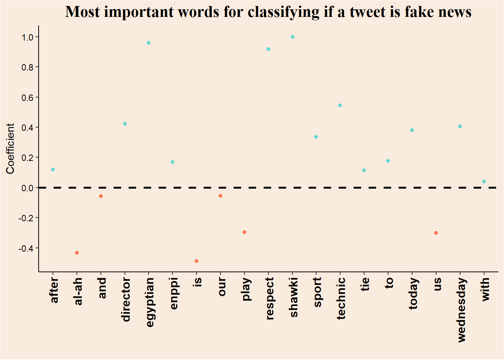



<main class="site-main"><section class="page-intro">
Article · Models and meaning
<h1>Real Vs. Fake news in football</h1>
Published12 May 2023
</section><article class="prose real-post">
As part of my data-science courses this fall semester, I have started also to get into <em>Natural Language Processing</em> (NLP, but of the good kind). This is the first time I have ever tried it, so let’s see how it went.

Brief overview of the post: 
&nbsp;&nbsp;&nbsp;&nbsp;&nbsp;&nbsp;1. Basic preprocessing and creation of <em>Data Feature Matrix</em> (DFM), using packages <code>stringr</code> and <code>quanteda</code>. 
&nbsp;&nbsp;&nbsp;&nbsp;&nbsp;&nbsp;2. Classification with Naive-Bayes method. 
&nbsp;&nbsp;&nbsp;&nbsp;&nbsp;&nbsp;3. Classification with Logistic regression, and feature importance plot.

<section id="background" class="level1">
<h1>Background</h1>

This dataset is the “Fake News football” dataset from uploaded to <a href="https://www.kaggle.com/datasets/shawkyelgendy/fake-news-football">Kaggle</a> by Shawky El-Gendy. It contains ~42,000 tweets about the Egyptian football league, some of them are fake new, and some are true.

The work in this notebook is highly influenced by (<a href="#ref-welbers2017" role="doc-biblioref">Welbers, Van Atteveldt, and Benoit 2017</a>).

</section>
<section id="setup" class="level1">
<h1>Setup</h1>

<pre class="sourceCode r code-with-copy"><code class="sourceCode r">library(tidyverse)           # data loading, data preparation and stringr
library(quanteda)            # text preprocessing and DFM creation
library(quanteda.textmodels) # machine learning models
library(glue)                # that's a secret</code><button title="Copy to Clipboard" class="code-copy-button"><i class="bi"></i></button></pre>

</section>
<section id="loading-data" class="level1">
<h1>Loading data</h1>

<pre class="sourceCode r code-with-copy"><code class="sourceCode r">real &lt;- read_csv("real.csv", show_col_types = F)
fake &lt;- read_csv("fake.csv", show_col_types = F)</code><button title="Copy to Clipboard" class="code-copy-button"><i class="bi"></i></button></pre>

<section id="adding-labels" class="level2">
<h2 class="anchored" data-anchor-id="adding-labels">Adding labels</h2>

<pre class="sourceCode r code-with-copy"><code class="sourceCode r">real$label &lt;- "real"
fake$label &lt;- "fake"</code><button title="Copy to Clipboard" class="code-copy-button"><i class="bi"></i></button></pre>

</section>
<section id="combining-data-frames" class="level2">
<h2 class="anchored" data-anchor-id="combining-data-frames">Combining data frames</h2>

<pre class="sourceCode r code-with-copy"><code class="sourceCode r">tweets &lt;- rbind(real, fake) |&gt;
  drop_na() |&gt; # dropping NA rows
  mutate(tweet = str_trim(tweet) |&gt; str_squish()) # removing white-spaces in the start and beginning of tweet, and between words</code><button title="Copy to Clipboard" class="code-copy-button"><i class="bi"></i></button></pre>

</section>
</section>
<section id="text-preprocessing" class="level1">
<h1>Text preprocessing</h1>

Creating a <code>corpus</code> object, which is basically a named character vector that also holds other variables such as the tweet’s label. These are called <code>docvars</code>.

<pre class="sourceCode r code-with-copy"><code class="sourceCode r">corp &lt;- corpus(tweets, text_field = "tweet")

head(corp)</code><button title="Copy to Clipboard" class="code-copy-button"><i class="bi"></i></button></pre>

<pre><code>Corpus consisting of 6 documents and 1 docvar.
text1 :
"sun downs technical director: al-ahly respected us and playe..."

text2 :
"shawky gharib after the tie with enppi: our goal is to retur..."

text3 :
"egyptian sports news today, wednesday 1/25/2023, which is ma..."

text4 :
"the main referees committee of the egyptian football associa..."

text5 :
"haji bari, the striker of the future team, is undergoing a f..."

text6 :
"zamalek is preparing for a strong match against the arab con..."</code></pre>

<section id="creating-dfms-cleaning-text" class="level2">
<h2 class="anchored" data-anchor-id="creating-dfms-cleaning-text">Creating DFMs &amp; cleaning text</h2>

Creating a count-based DFM (frequency of each word in each document). Before creating the DFM I employ 3 steps of normalization: 
&nbsp;&nbsp;&nbsp;&nbsp;&nbsp;&nbsp;1. Removing special characters and expressions (punctuation, urls…). 
&nbsp;&nbsp;&nbsp;&nbsp;&nbsp;&nbsp;2. Converting words to their stem-form (the word <em>example</em> converts to <em>exampl</em>). This step should decrease &nbsp;&nbsp;&nbsp;&nbsp;&nbsp;&nbsp;the number of unique tokens, so that our DFM would be less sparse. 
&nbsp;&nbsp;&nbsp;&nbsp;&nbsp;&nbsp;3. Converting every character to lower-case letters.

<pre class="sourceCode r code-with-copy"><code class="sourceCode r">data_feature_mat &lt;- corp |&gt;
  tokens(remove_punct = T, remove_numbers = T, remove_url = T, remove_separators = T, remove_symbols = T) |&gt;
  tokens_wordstem() |&gt;
  dfm(tolower = T)

head(data_feature_mat)</code><button title="Copy to Clipboard" class="code-copy-button"><i class="bi"></i></button></pre>

<pre><code>Document-feature matrix of: 6 documents, 18,869 features (99.89% sparse) and 1 docvar.
       features
docs    sun down technic director al-ah respect us and play to
  text1   1    1       1        1     1       1  1   1    1  1
  text2   0    0       0        0     0       0  0   0    0  2
  text3   0    0       1        1     0       0  0   0    0  0
  text4   0    0       0        0     0       0  0   1    0  0
  text5   0    0       0        0     0       0  0   0    0  1
  text6   0    0       0        0     0       0  0   0    0  0
[ reached max_nfeat ... 18,859 more features ]</code></pre>

</section>
</section>
<section id="machine-learning" class="level1">
<h1>Machine Learning</h1>
<section id="base-rate" class="level3">
<h3 class="anchored" data-anchor-id="base-rate">Base-rate</h3>

In classification tasks, it is important to check the initial base-rate of the different classes. Failing to notice a skewed sample will result in false interpretations of performance metrics.

<blockquote class="blockquote">

<em>Imagine that a certain medical condition affects 1% of the population. A test that systematically gives negative results will have 99% accuracy!</em>

</blockquote>

We will calculate the base-rate in the following way: 
\[
\frac{N_{real}}{N_{real}+N_{fake}}\
\]

<pre class="sourceCode r code-with-copy"><code class="sourceCode r">table(docvars(data_feature_mat, 'label'))['real']</code><button title="Copy to Clipboard" class="code-copy-button"><i class="bi"></i></button></pre>

<pre><code> real
21869 </code></pre>

<pre class="sourceCode r code-with-copy"><code class="sourceCode r">table(docvars(data_feature_mat, 'label'))['fake']</code><button title="Copy to Clipboard" class="code-copy-button"><i class="bi"></i></button></pre>

<pre><code> fake
19991 </code></pre>

The base rate is \(0.522\).

</section>
<section id="train-test-split" class="level3">
<h3 class="anchored" data-anchor-id="train-test-split">Train-test split</h3>

Usually it is advised that the Train-test split would occur before the creation of the DFM. That is because some methods of calculation are proportional and depends on other documents. Because we are employing a count-based DFM, the values in each cell of the matrix are independent of other documents. Therefore it is not necessary to split before creating the DFM’s.

<pre class="sourceCode r code-with-copy"><code class="sourceCode r">set.seed(14)

train_dfm &lt;- dfm_sample(data_feature_mat, size = 0.8 * nrow(data_feature_mat)) # large sample, we can use 80-20 train-test split

test_dfm &lt;- data_feature_mat[setdiff(docnames(data_feature_mat), docnames(train_dfm)),]</code><button title="Copy to Clipboard" class="code-copy-button"><i class="bi"></i></button></pre>

</section>
<section id="naive-bayes-classifier" class="level2">
<h2 class="anchored" data-anchor-id="naive-bayes-classifier">Naive-Bayes classifier</h2>

A Naive-Bayes classifier predicts the class (in this case of a document) in the following way: 

<ol type="1">
<li>
The likelihood of each token to appear in documents of each class is calculated from the training data. For example, if the word <em>manager</em> appeared in \(11\)% of the documents in the first class, and in \(2\)% of the documents in the second class, the likelihood of it in each class is: 
\[
\displaylines{p(manager\ |\ class\ 1)=0.11\\p(manager\ |\ class\ 2)=0.02}
\]
</li>
<li>
The prior probability of each document to be classified to each class is also learned from the training data, and it is the base-rate frequencies of the two classes. 

</li>
<li>
For each document in the test set, the likelihood of it given it is from each of the classes is calculated by multiplying the likelihoods of the tokens appearing in it. So if a document is for example the sentence <em>I like turtles</em>, then the likelihood of it to belong class 1 is: 
\[
\displaylines{p(I\ |\ class\ 1)\cdotp(like\ |\ class\ 1)\cdotp(turtles\ |\ class\ 1)}
\] 
More formally, if a document belong to a certain class \(k\), then it’s likelihood of being comprised of a set of tokens \(t\) is: 
\[
\prod_{i=1}^{n}p(t_i\ |\ class\ k)
\]
</li>
<li>
According to Bayes theorem, the probability of the document to belong to class \(k\) - the posterior probability - is proportional to the product of the likelihood of it’s tokens given this class and the prior probability of any document to belong to this class: 
\[
p(class\ k\ |\ t) \propto p(t\ |\ class\ k)\cdotp(class\ k)
\]
</li>
<li>
Because the Naive-Bayes classifier is comparing between classes, the standardizing term is not needed. The class that has the largest product of prior and likelihood is the class the document will be classified to.
</li>
</ol>
</section>
<section id="fitting-the-model" class="level2">
<h2 class="anchored" data-anchor-id="fitting-the-model">Fitting the model</h2>

<pre class="sourceCode r code-with-copy"><code class="sourceCode r">nb_model &lt;- textmodel_nb(train_dfm, y = docvars(train_dfm, "label"))</code><button title="Copy to Clipboard" class="code-copy-button"><i class="bi"></i></button></pre>

</section>
<section id="test-performance" class="level2">
<h2 class="anchored" data-anchor-id="test-performance">Test performance</h2>

<pre class="sourceCode r code-with-copy"><code class="sourceCode r">pred_nb &lt;- predict(nb_model, newdata = test_dfm)

(conmat_nb &lt;- table(pred_nb, docvars(test_dfm, "label")))</code><button title="Copy to Clipboard" class="code-copy-button"><i class="bi"></i></button></pre>

<pre><code>
pred_nb fake real
   fake 3893  380
   real  143 3956</code></pre>

Seems nice, let’s look at some metrics.

Confusion matrix

<pre class="sourceCode r code-with-copy"><code class="sourceCode r">caret::confusionMatrix(conmat_nb, mode = "everything", positive = "real")</code><button title="Copy to Clipboard" class="code-copy-button"><i class="bi"></i></button></pre>

<pre><code>Confusion Matrix and Statistics

pred_nb fake real
   fake 3893  380
   real  143 3956

               Accuracy : 0.9375
                 95% CI : (0.9321, 0.9426)
    No Information Rate : 0.5179
    P-Value [Acc &gt; NIR] : &lt; 2.2e-16

                  Kappa : 0.8752

 Mcnemar's Test P-Value : &lt; 2.2e-16

            Sensitivity : 0.9124
            Specificity : 0.9646
         Pos Pred Value : 0.9651
         Neg Pred Value : 0.9111
              Precision : 0.9651
                 Recall : 0.9124
                     F1 : 0.9380
             Prevalence : 0.5179
         Detection Rate : 0.4725
   Detection Prevalence : 0.4896
      Balanced Accuracy : 0.9385

       'Positive' Class : real
                                          </code></pre>

Nice results!

</section>
<section id="logistic-regression" class="level2">
<h2 class="anchored" data-anchor-id="logistic-regression">Logistic regression</h2>

The nice thing about the <code>textmodel_lr</code> method from the <code>quanteda.textmodels</code> package is that it does the Cross-Validation for us!

<pre class="sourceCode r code-with-copy"><code class="sourceCode r">lr_model &lt;- textmodel_lr(x = train_dfm, y = docvars(train_dfm, "label"))</code><button title="Copy to Clipboard" class="code-copy-button"><i class="bi"></i></button></pre>

</section>
<section id="test-performance-1" class="level2">
<h2 class="anchored" data-anchor-id="test-performance-1">Test performance</h2>

<pre class="sourceCode r code-with-copy"><code class="sourceCode r">pred_lr &lt;- predict(lr_model, newdata = test_dfm)

(conmat_lr &lt;- table(pred_lr, docvars(test_dfm, "label")))</code><button title="Copy to Clipboard" class="code-copy-button"><i class="bi"></i></button></pre>

<pre><code>
pred_lr fake real
   fake 3795  188
   real  241 4148</code></pre>

Also seems nice.

Confusion matrix

<pre class="sourceCode r code-with-copy"><code class="sourceCode r">caret::confusionMatrix(conmat_lr, mode = "everything", positive = "real")</code><button title="Copy to Clipboard" class="code-copy-button"><i class="bi"></i></button></pre>

<pre><code>Confusion Matrix and Statistics

pred_lr fake real
   fake 3795  188
   real  241 4148

               Accuracy : 0.9488
                 95% CI : (0.9438, 0.9534)
    No Information Rate : 0.5179
    P-Value [Acc &gt; NIR] : &lt; 2e-16

                  Kappa : 0.8973

 Mcnemar's Test P-Value : 0.01205

            Sensitivity : 0.9566
            Specificity : 0.9403
         Pos Pred Value : 0.9451
         Neg Pred Value : 0.9528
              Precision : 0.9451
                 Recall : 0.9566
                     F1 : 0.9508
             Prevalence : 0.5179
         Detection Rate : 0.4955
   Detection Prevalence : 0.5242
      Balanced Accuracy : 0.9485

       'Positive' Class : real
                                          </code></pre>

Slight improvement…

</section>
<section id="plot-important-words-for-classification" class="level2">
<h2 class="anchored" data-anchor-id="plot-important-words-for-classification">Plot important words for classification</h2>

Code

<pre class="sourceCode r code-with-copy"><code class="sourceCode r">lr_summary &lt;- summary(lr_model) # summarizing the model

coefs &lt;- data.frame(lr_summary$estimated.feature.scores) # extracting coefficients

col_vec &lt;- c("#fc7753", "#e3e3e3", "#66d7d1", "black")

coefs |&gt;
  
  # preparing df for plot
  rownames_to_column(var = "Token") |&gt;
  rename(Coefficient = real) |&gt;
  filter(Coefficient != 0 &amp; Token != "(Intercept)") |&gt;
  mutate(bigger_then_0 = Coefficient &gt; 0) |&gt;
  
  # ggplotting
  ggplot(aes(x = Token, y = Coefficient, color = bigger_then_0)) +
  geom_point() +
  scale_color_manual(values = c(col_vec[1], col_vec[3])) +
  scale_y_continuous(n.breaks = 10) +
  labs(title = "Most important words for classifying if a tweet is fake news",
       x = "") +
  theme_classic() +
  geom_hline(yintercept = 0, color = "black", linetype = 2, linewidth = 1, show.legend = F) +
  theme(axis.line = element_line(color = col_vec[4]),
        axis.title = element_text(color = col_vec[4]),
        axis.text = element_text(color = col_vec[4]),
        axis.text.x = element_text(angle = 90, vjust = 0.5, hjust = 1, size = 12, face = "bold"),
        legend.position = "none",
        plot.title = element_text(size = 16, color = col_vec[4], hjust = .5, family = "serif", face = "bold"),
        plot.background = element_rect(fill = "#F9EBDE"),
        panel.background = element_rect(fill = "#F9EBDE"))</code><button title="Copy to Clipboard" class="code-copy-button"><i class="bi"></i></button></pre>

<figure class="figure">

</figure>

</section>
</section>
<section id="conclusion" class="level1">
<h1>Conclusion</h1>

I think that for a first attempt at implementing NLP, the current notebook came out nice. I have learned a lot not only about NLP, but also on Naive-Bayes classifiers which is nice.

</section>

<section class="quarto-appendix-contents" role="doc-bibliography" id="quarto-bibliography"><h2 class="anchored quarto-appendix-heading">References</h2>

Welbers, Kasper, Wouter Van Atteveldt, and Kenneth Benoit. 2017. “Text Analysis in r.” <em>Communication Methods and Measures</em> 11 (4): 245–65. <a href="https://doi.org/10.1080/19312458.2017.1387238">https://doi.org/10.1080/19312458.2017.1387238</a>.

</section>
</article>



</main>


