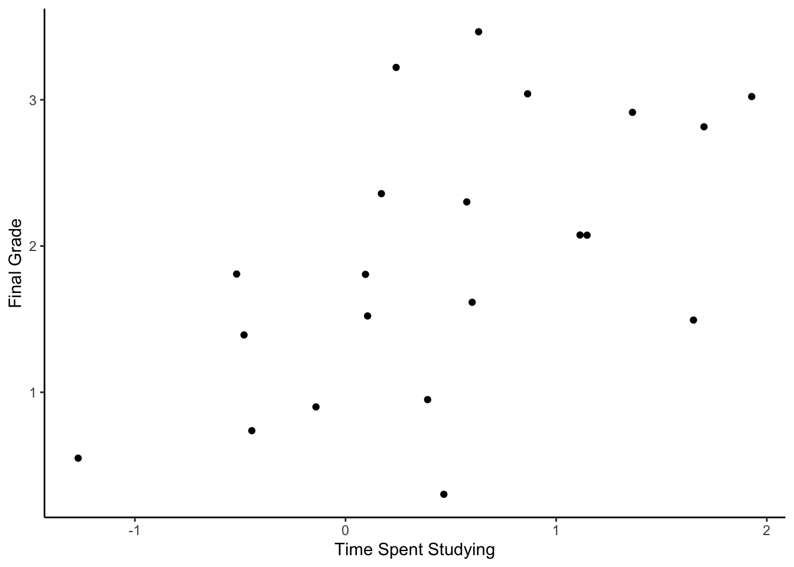
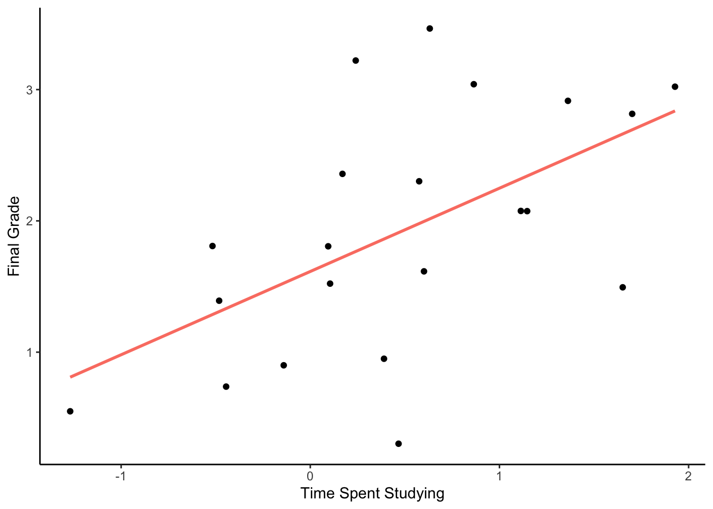
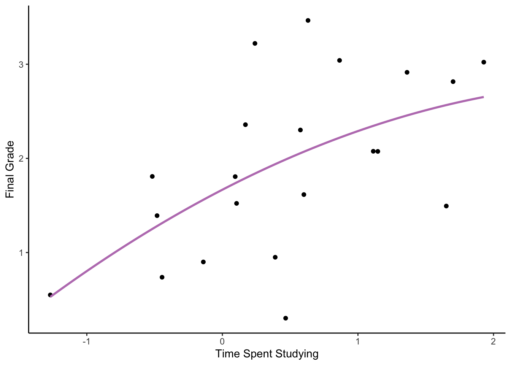
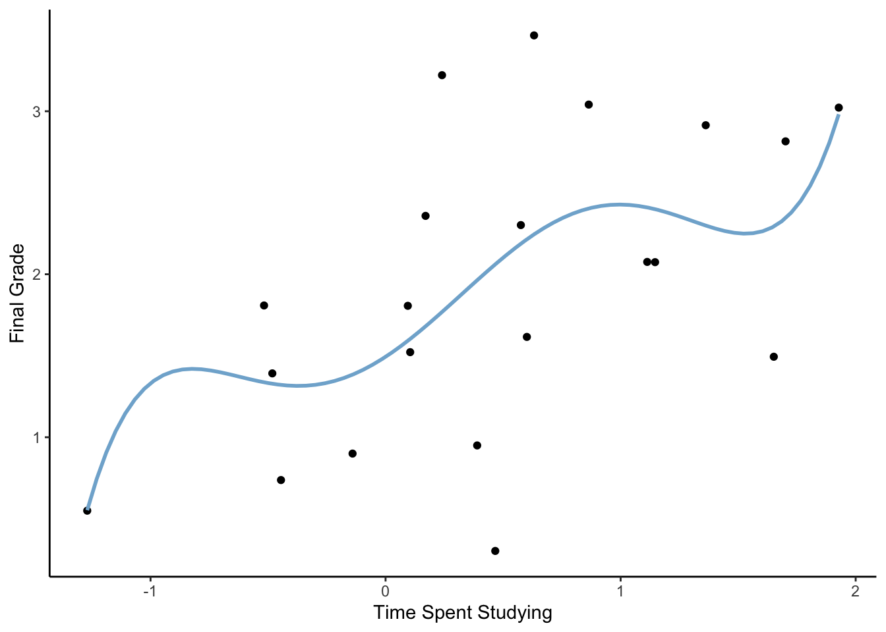
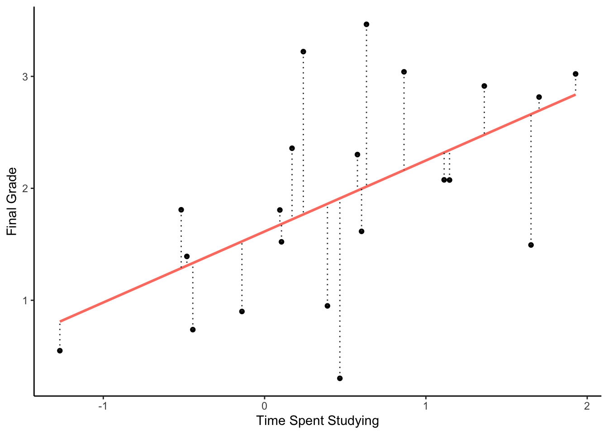
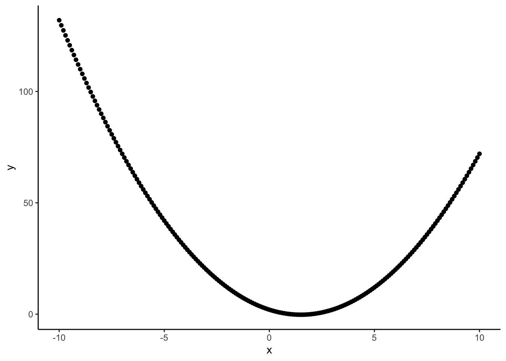
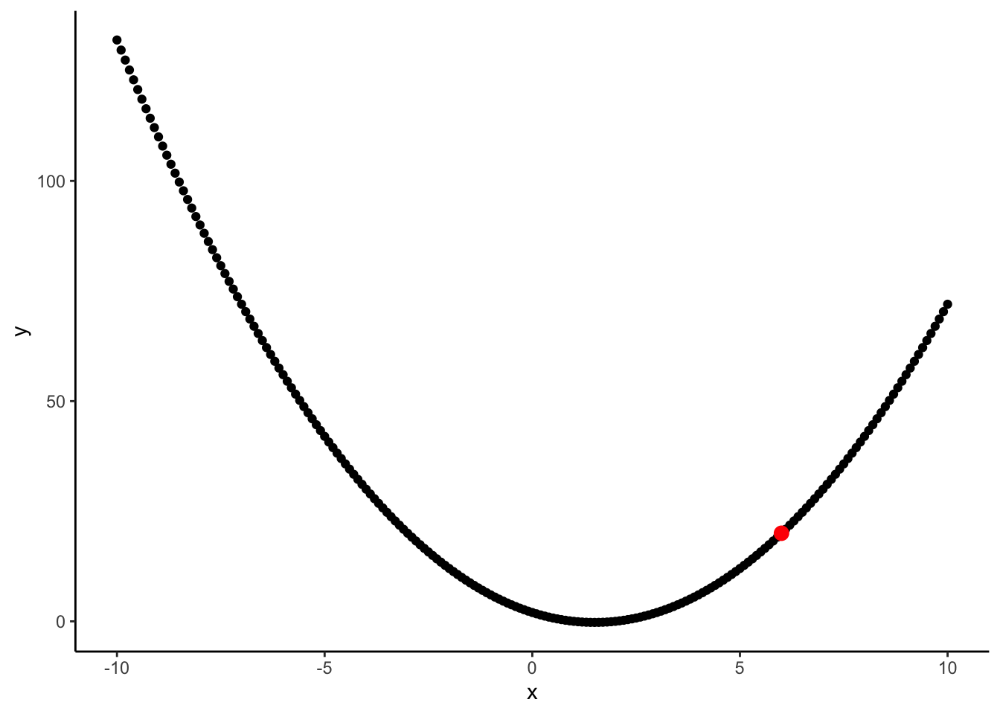
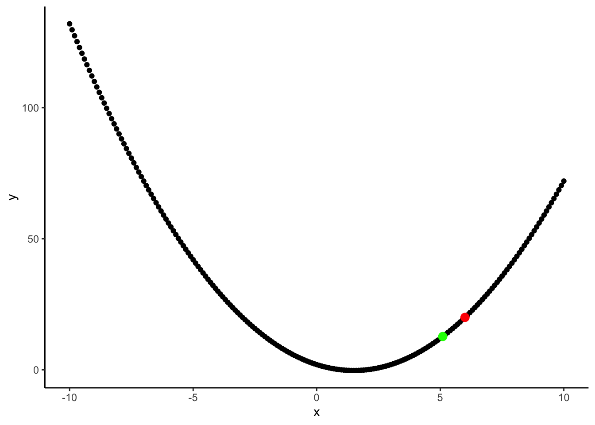
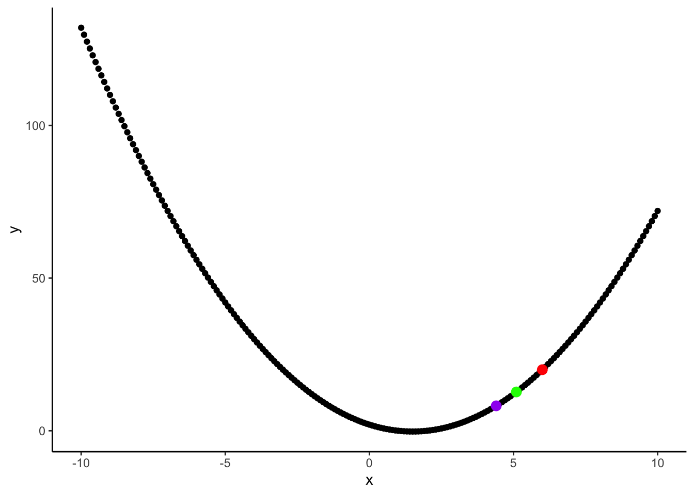
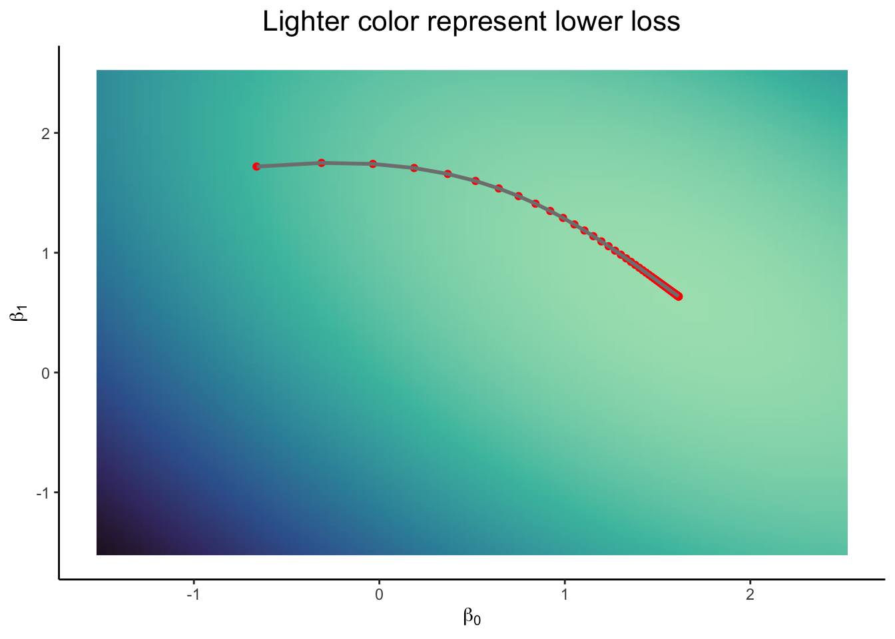



<main class="site-main"><section class="page-intro">
Article · Models and meaning
<h1>What’s Artificial Intelligence all about?</h1>
Published14 Feb 2025
</section><article class="prose real-post"><section id="setup" class="level1">
<h1>Setup</h1>

<pre class="sourceCode r code-with-copy"><code class="sourceCode r">library(tidyverse) # As always
library(MASS)      # Sampling from a multivariate distributions
library(plotly)    # For 3D plots</code><button title="Copy to Clipboard" class="code-copy-button"><i class="bi"></i></button></pre>

OK, but what is AI <em>actually</em> about? Over the past two summers, I taught a statistics and research methods course to psychology students. Generally speaking, these students tend to be a little intimidated by this field, and as always, I tried over the summer to both empower them and spark an interest in them in the beauty and ‘coolness’ of statistics.

One idea they liked was when I told them: <em>If you understand linear regression, you understand Chat GPT</em>. While this is obviously a simplification, I managed to convince them it is not far from the truth. If simple linear modeling is about finding the best two parameters (a slope and an intercept) to approximate a function, AI is about finding the best millions to billions of parameters to approximate a function. In this blog post I will explain one of the basic and most important concepts of modern AI - <strong>Gradient Descent</strong> using simple (as possible) terms and some R code.

</section>
<section id="what-is-a-function" class="level1">
<h1>What is a function?</h1>

nothing too interesting

<pre class="sourceCode r code-with-copy"><code class="sourceCode r">set.seed(14)

nice_colors &lt;- c("#8DD3C7", "#FFFFB3", "#BEBADA", "#FB8072", "#80B1D3", "#FDB462", "#B3DE69", "#FCCDE5", "#D9D9D9", "#BC80BD", "#CCEBC5", "#FFED6F")

d &lt;- data.frame(mvrnorm(21, mu = c(0, 1.4), Sigma = matrix(c(1, 0.4, 0.4, 1), 2)))

ggplot(d, aes(X1, X2)) +
  geom_point() +
  labs(x = "Time Spent Studying", y = "Final Grade") +
  theme_classic()</code><button title="Copy to Clipboard" class="code-copy-button"><i class="bi"></i></button></pre>

<figure class="figure">

</figure>

What is the relationship between the variables <em>Time Spent Studying</em> and <em>Final Grade</em>?

The mission of every statistical model is to provide the best function to estimate this relationship. The function can be linear:

<figure class="figure">

</figure>

It can also be quadratic:

<figure class="figure">

</figure>

And even a fifth degree polynomial:

<figure class="figure">

</figure>

Which is the best? In order to answer this question, we need to define what we want our model to maximize (or minimize). Usually, two main things are considered when evaluating our fitted lines: 1. Distance from truth, or how close the line (predictions) is to the points. 2. Complexity, or how complex is the function.

Together, these two components create the <strong>Loss</strong> that will always look conceptually like that: 
\[
Loss=distance-complexity
\]

For the sake of simplicity (no pun intended), and because both simple linear regression and deep neural networks share this feature, we will ignore the complexity component of the Loss function. So what is the distance between the line and the points for the linear function?

<figure class="figure">

</figure>

Each gray dotted line represents the difference between the actual outcome (Final Grade) and the model’s prediction based on Time Spent Studying. In a more formal way we say that each line is:

\[
y_i-\hat{y_i}
\]

Where: 
\(y_i\) is the real outcome of point \(i\) 
\(\hat{y_i}\) is the predicted outcome of point \(i\)

And the total loss can be the mean of these lines:

\[
\frac{1}{N} \sum_{i=1}^{N}(y_i-\hat{y_i})
\]

BUT, this definition is problematic as I will show in the next chapter.

<section id="optimal-minimum-loss-intro-to-loss-functions" class="level2">
<h2 class="anchored" data-anchor-id="optimal-minimum-loss-intro-to-loss-functions">Optimal = Minimum loss (intro to loss functions)</h2>

Now we can calculate the loss for every model we fit, therefore the loss is actually a function of the model and is called the <strong>Loss Function</strong>.

<i class="callout-icon"></i>

Note

Models can differ in two main ways: in their structure (for example: a linear function and a 5-th degree polynomial), or in the values of their parameters (for example: these two linear functions: \(y=2x-4\), \(y=3x+5\)). With the model structure usually chosen a-priori (or through a separate experiment), we will focus on the loss as a function of the parameters’ values.

So our task is to find the set of parameters \(\beta\) that minimize the loss function. Let’s formalize it for the linear model case: Given a linear model: \(\hat{y}=\beta_0+\beta_1x\), our goal is to find the minimum of: 
\[
loss(\beta_0,\beta_1)=\frac{1}{N} \sum_{i=1}^{N}(y_i-\beta_0-\beta_1x_i)
\]

But, there is the catch - this function does not have a minimum point! This is because the lines we saw before can be as negative as we want, just make \(\beta_0\) and \(\beta_1\) negative enough. We can also notice that this function is linear with respect to \(\beta_0\) and \(\beta1\), therefore it has no minimum or maximum points.

In order to solve this, we simply define the loss function to be the mean <strong>Square</strong> distance from the line - also known as the Variance.

\[
loss(\beta_0,\beta_1)=\frac{1}{N} \sum_{i=1}^{N}(y_i-\hat{y_i})^2=\frac{1}{N} \sum_{i=1}^{N}(y_i-\beta_0-\beta_1x_i)^2
\]

</section>
</section>
<section id="finding-a-functions-minimum-point" class="level1">
<h1>Finding a function’s minimum point</h1>

How does this function looks like?

<pre class="sourceCode r code-with-copy"><code class="sourceCode r">parameter_values &lt;- expand_grid(beta0 = seq(-1.5, 2.5, 0.05),
                                beta1 = seq(-1.5, 2.5, 0.05)) |&gt;
  mutate(id = factor(c(1:n())))

df &lt;- parameter_values |&gt;
  expand_grid(d) |&gt;
  select(id, beta0, beta1, x = X1, y = X2) |&gt;
  mutate(y_pred = beta0 + beta1*x) |&gt;
  mutate(loss = (y - y_pred)^2) |&gt;
  group_by(id) |&gt;
  reframe(beta0 = beta0,
          beta1 = beta1,
          mse = mean(loss)) |&gt;
  distinct()</code><button title="Copy to Clipboard" class="code-copy-button"><i class="bi"></i></button></pre>

<pre class="sourceCode r code-with-copy"><code class="sourceCode r">plot_ly(df, x = ~beta0, y = ~beta1, z = ~mse, type = "scatter3d", mode = "markers")</code><button title="Copy to Clipboard" class="code-copy-button"><i class="bi"></i></button></pre>

The original notebook included an interactive 3D plot here.

What is the set of parameters that produced the minimal loss?

<pre class="sourceCode r code-with-copy"><code class="sourceCode r">insight::print_html(df[df$mse == min(df$mse),])</code><button title="Copy to Clipboard" class="code-copy-button"><i class="bi"></i></button></pre>

<table class="gt_table caption-top table table-sm table-striped small" data-quarto-postprocess="true" data-quarto-disable-processing="false" data-quarto-bootstrap="false">
<thead>
<tr class="header gt_col_headings">
<th id="id" class="gt_col_heading gt_columns_bottom_border gt_left" data-quarto-table-cell-role="th" scope="col">id</th>
<th id="beta0" class="gt_col_heading gt_columns_bottom_border gt_center" data-quarto-table-cell-role="th" scope="col">beta0</th>
<th id="beta1" class="gt_col_heading gt_columns_bottom_border gt_center" data-quarto-table-cell-role="th" scope="col">beta1</th>
<th id="mse" class="gt_col_heading gt_columns_bottom_border gt_center" data-quarto-table-cell-role="th" scope="col">mse</th>
</tr>
</thead>
<tbody class="gt_table_body">
<tr class="odd">
<td class="gt_row gt_left" headers="id">5066</td>
<td class="gt_row gt_center" headers="beta0">1.60</td>
<td class="gt_row gt_center" headers="beta1">0.65</td>
<td class="gt_row gt_center" headers="mse">0.57</td>
</tr>
</tbody><tfoot class="gt_sourcenotes">
<tr class="even">
<td colspan="4" class="gt_sourcenote"></td>
</tr>
</tfoot>

</table>

We can see it in the graph as the lowest point:

The original notebook included an interactive 3D plot here.

Now let’s find the minimum point using a more rigorous way.

<section id="derivatives" class="level2">
<h2 class="anchored" data-anchor-id="derivatives">Derivatives</h2>

The derivative of a function (with respect to some variable \(x\)) at some point is <strong>the slope of the tangent line to the function at this point</strong>, In other words, how much the function “goes up (or down)” at this point.

Consider this simple function:

<pre class="sourceCode r code-with-copy"><code class="sourceCode r">f &lt;- function(x) {
  x^2 - 3*x + 2
}</code><button title="Copy to Clipboard" class="code-copy-button"><i class="bi"></i></button></pre>

It’s graph looks like this:

<pre class="sourceCode r code-with-copy"><code class="sourceCode r">x &lt;- seq(-10, 10, 0.1)
y &lt;- f(x)

ggplot(data.frame(x = x, y = y), aes(x, y)) +
  geom_point() +
  theme_classic()</code><button title="Copy to Clipboard" class="code-copy-button"><i class="bi"></i></button></pre>

<figure class="figure">

</figure>

What is the derivative of the function at the point \(x=6\)?

<pre class="sourceCode r code-with-copy"><code class="sourceCode r">df &lt;- data.frame(x = x, y = y)

ggplot(df, aes(x, y)) +
  geom_point() +
  geom_point(data = df[df$x == 6,], aes(x, y), color = "red", size = 3) +
  theme_classic()</code><button title="Copy to Clipboard" class="code-copy-button"><i class="bi"></i></button></pre>

<figure class="figure">

</figure>

The function goes up at this point, therefore the derivative is positive. But exactly <strong>How</strong> positive? Or in other words, if we move a little bit to the right of the red point, by how much does the function increase?

<pre class="sourceCode r code-with-copy"><code class="sourceCode r">f6 &lt;- f(6) # the value of the function at x = 6
h &lt;- 0.0001 # "a little bit"
fh &lt;- f(6 + h)

(fh - f6) / h # standardizing by the amount we increased</code><button title="Copy to Clipboard" class="code-copy-button"><i class="bi"></i></button></pre>

<pre><code>[1] 9.0001</code></pre>

The slope of the function at \(x=6\) is \(9\).

What is the derivative of the function at \(x=-5\)?

<pre class="sourceCode r code-with-copy"><code class="sourceCode r">(f(-5 + h) - f(-5)) / h</code><button title="Copy to Clipboard" class="code-copy-button"><i class="bi"></i></button></pre>

<pre><code>[1] -12.9999</code></pre>

As expected and as we can see in the graph, this derivative is negative.

Why do we care? imagine that we stand on the point \(x=6\) and we want to “go up”, in what direction we should advance? If the function is increasing at this point - The derivative is positive - then we want to go right (increase \(X\)). But, if the function is decreasing at this point - The derivative is negative - then we want to go left (decrease \(X\)). Notice that in both scenarios we want to go <strong>In the direction of the derivative</strong>.

So, what if we stand on the point \(x=6\) and we want to “go down”? Simple, just go <strong>In the opposite direction of the derivative</strong>! Let’s see how that works:

Again, we stand on \(x=6\):

<figure class="figure">

</figure>

Calculating the derivative:

<pre class="sourceCode r code-with-copy"><code class="sourceCode r">x0 &lt;- 6
fx0 &lt;- f(x0) # the value of the function at x = 6
h &lt;- 0.0001 # "a little bit"
fh &lt;- f(x0 + h)

(fh - fx0) / h # standardizing by the amount we increased</code><button title="Copy to Clipboard" class="code-copy-button"><i class="bi"></i></button></pre>

<pre><code>[1] 9.0001</code></pre>

Stepping in the <em>Opposite</em> direction:

<pre class="sourceCode r code-with-copy"><code class="sourceCode r">step_size &lt;- 0.1 # controlling the size of our step
x1 &lt;- x0 + -9*step_size
x1</code><button title="Copy to Clipboard" class="code-copy-button"><i class="bi"></i></button></pre>

<pre><code>[1] 5.1</code></pre>

<figure class="figure">

</figure>

Again!

calculating the derivative:

<pre class="sourceCode r code-with-copy"><code class="sourceCode r">fx1 &lt;- f(x1) # the value of the function at x = 5.1
h &lt;- 0.0001 # "a little bit"
fh &lt;- f(x1 + h)

(fh - fx1) / h # standardizing by the amount we increased</code><button title="Copy to Clipboard" class="code-copy-button"><i class="bi"></i></button></pre>

<pre><code>[1] 7.2001</code></pre>

Stepping in the opposite direction:

<pre class="sourceCode r code-with-copy"><code class="sourceCode r">step_size &lt;- 0.1 # controlling the size of our step
x2 &lt;- x1 + -7.2*step_size
x2</code><button title="Copy to Clipboard" class="code-copy-button"><i class="bi"></i></button></pre>

<pre><code>[1] 4.38</code></pre>

Where we landed?

<figure class="figure">

</figure>

And this is <em>Stochastic Gradient Descent</em> (SGD) - Descending down the gradient (derivative) in a loop (in a stochastic manner).

What about multivariate functions? for example: \(f(x_1, x_2)=3x_1-4x_2+x_1x_2-5\). In this case we can calculate the derivative of each variable with respect to the outcome, also called the partial derivatives: \[
\frac{\partial y}{\partial x_1}, \frac{\partial y}{\partial x_2}
\]

For example, let’s calculate the partial derivative of \(x_1\) with respect to \(y\) in the point \(x_1=-2, x_2=3\):

<pre class="sourceCode r code-with-copy"><code class="sourceCode r">g &lt;- function(x1, x2) {
  return(3*x1 - 4*x2 + x1*x2 - 5)
}

g0 &lt;- g(-2, 3)
g0</code><button title="Copy to Clipboard" class="code-copy-button"><i class="bi"></i></button></pre>

<pre><code>[1] -29</code></pre>

What happens when we increase \(x_1\) by a little?

<pre class="sourceCode r code-with-copy"><code class="sourceCode r">h &lt;- 0.0001 # a little
gh &lt;- g(-2 + h, 3) # notice how x2 remains constant

(gh - g0) / h</code><button title="Copy to Clipboard" class="code-copy-button"><i class="bi"></i></button></pre>

<pre><code>[1] 6</code></pre>

The partial derivative of \(x_1\) at the point \(x_1=-2, x_2=3\) is \(6\). Now we just need to calculate the partial derivative of \(x_2\) at the same point and descend the gradient!

</section>
<section id="simple-linear-regression" class="level2">
<h2 class="anchored" data-anchor-id="simple-linear-regression">Simple Linear Regression</h2>

Returning to the case of a simple linear regression, we see that the whole thing is just about some function with two parameters that we need to minimize.

\[
loss(\beta_0,\beta_1)=\frac{1}{N} \sum_{i=1}^{N}(y_i-\beta_0-\beta_1x_i)^2
\]

Let’s estimate the partial derivatives of \(\beta_0\) and \(\beta_1\) with respect to the loss at the point \(\beta_0=2, \beta_1=0.5\):

<i class="callout-icon"></i>

Note

The need to calculate the derivative of the loss function justifies it being the mean of <em>Square</em>, as opposed to Absolute, errors as they easier to differentiate.

<pre class="sourceCode r code-with-copy"><code class="sourceCode r">beta0 &lt;- 2
beta1 &lt;- 0.5

loss0 &lt;- mean((d$X2 - beta0 - beta1*d$X1)^2)
loss0</code><button title="Copy to Clipboard" class="code-copy-button"><i class="bi"></i></button></pre>

<pre><code>[1] 0.6821639</code></pre>

Calculating partial derivatives:

<pre class="sourceCode r code-with-copy"><code class="sourceCode r"># Partial derivative of beta0
loss1 &lt;- mean((d$X2 - (beta0 + 0.001) - beta1*d$X1)^2)

beta0_grad &lt;- (loss1 - loss0) / 0.001

# Partial derivative of beta1
loss1 &lt;- mean((d$X2 - beta0 - (beta1 + 0.001)*d$X1)^2)

beta1_grad &lt;- (loss1 - loss0) / 0.001</code><button title="Copy to Clipboard" class="code-copy-button"><i class="bi"></i></button></pre>

Taking a step:

<pre class="sourceCode r code-with-copy"><code class="sourceCode r">step_size &lt;- 0.1

beta0 &lt;- beta0 - step_size*beta0_grad
beta1 &lt;- beta1 - step_size*beta1_grad</code><button title="Copy to Clipboard" class="code-copy-button"><i class="bi"></i></button></pre>

Calculating the loss again:

<pre class="sourceCode r code-with-copy"><code class="sourceCode r">mean((d$X2 - beta0 - beta1*d$X1)^2)</code><button title="Copy to Clipboard" class="code-copy-button"><i class="bi"></i></button></pre>

<pre><code>[1] 0.6442667</code></pre>

The loss went down!

Automating the process in a loop:

<pre class="sourceCode r code-with-copy"><code class="sourceCode r">set.seed(14)

X &lt;- d$X1
Y &lt;- d$X2

# Hyper Parameters
learning_rate &lt;- 0.1 # formerly known as step_size
h &lt;- 0.001           # small change in parameter for calculating derivatives
epochs &lt;- 80         # Number of iterations

# Initialing random values for parameters
beta0 &lt;- rnorm(1)
beta1 &lt;- rnorm(1)

for (i in c(1:epochs)) {
  
  # Forward Pass (calculating model predictions)
  Y_hat &lt;- beta0 + beta1*X
  
  # Calculating Loss
  loss &lt;- mean((Y - Y_hat)^2)
  
  # Printing loss every 10th iteration
  if (i %% 5 == 0) {
    print(glue::glue("Epoch {i}: Loss: {loss}"))
  }
  
  # Calculating Gradients
  beta0_grad &lt;- (mean((Y - (beta0 + h) - beta1*X)^2) - loss) / h
  beta1_grad &lt;- (mean((Y - beta0 - (beta1 + h)*X)^2) - loss) / h
  
  # Updating Parameters
  beta0 &lt;- beta0 - learning_rate*beta0_grad
  beta1 &lt;- beta1 - learning_rate*beta1_grad
}</code><button title="Copy to Clipboard" class="code-copy-button"><i class="bi"></i></button></pre>

<pre><code>Epoch 5: Loss: 1.80038967350815
Epoch 10: Loss: 1.01512495422098
Epoch 15: Loss: 0.74136306380543
Epoch 20: Loss: 0.635632474184838
Epoch 25: Loss: 0.594395955672709
Epoch 30: Loss: 0.578298619591311
Epoch 35: Loss: 0.572014177360529
Epoch 40: Loss: 0.569560667340541
Epoch 45: Loss: 0.568602778731536
Epoch 50: Loss: 0.568228797188623
Epoch 55: Loss: 0.568082782199662
Epoch 60: Loss: 0.568025770526887
Epoch 65: Loss: 0.568003508715428
Epoch 70: Loss: 0.567994814993631
Epoch 75: Loss: 0.5679914192996
Epoch 80: Loss: 0.567990092591508</code></pre>

What are the final parameters?

<pre class="sourceCode r code-with-copy"><code class="sourceCode r">print(beta0)</code><button title="Copy to Clipboard" class="code-copy-button"><i class="bi"></i></button></pre>

<pre><code>[1] 1.61333</code></pre>

<pre class="sourceCode r code-with-copy"><code class="sourceCode r">print(beta1)</code><button title="Copy to Clipboard" class="code-copy-button"><i class="bi"></i></button></pre>

<pre><code>[1] 0.6348897</code></pre>

What are the “real” parameters?

<pre class="sourceCode r code-with-copy"><code class="sourceCode r">coef(lm(Y ~ X))</code><button title="Copy to Clipboard" class="code-copy-button"><i class="bi"></i></button></pre>

<pre><code>(Intercept)           X
  1.6145082   0.6342556 </code></pre>

Almost the same.

</section>
<section id="visualizing-our-journey" class="level2">
<h2 class="anchored" data-anchor-id="visualizing-our-journey">Visualizing Our Journey</h2>

We started at the left most point and made our way down the loss function.

<figure class="figure">

</figure>

</section>
</section>
<section id="conclusion" class="level1">
<h1>Conclusion</h1>

In the current post we went over the basic idea underlying all of AI. Every part of the process built here was further developed and improved, most important the algorithms used to descend the gradient, but also other things, for example: the specific way of initializing the parameters and adaptive learning rates.

I hope this post was interesting, and like my Psychology students, you fill like you understand AI a little bit more after it. I hope to post more in the future about other things related to AI, and maybe LLM’s, inspired by my latest deep dive into them.

</section></article>



</main>


