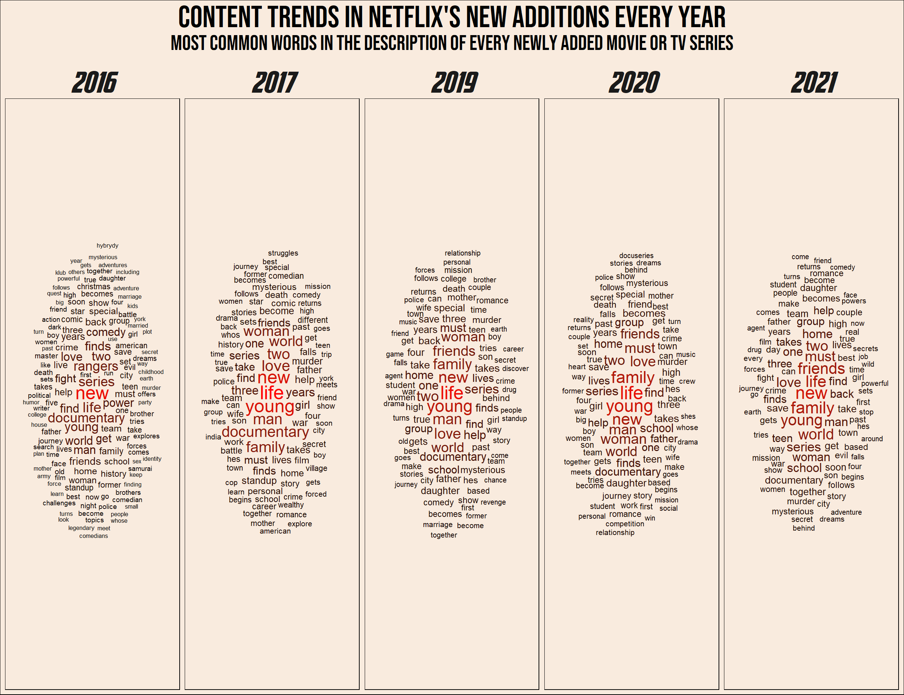
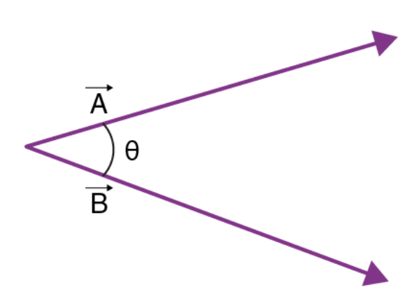
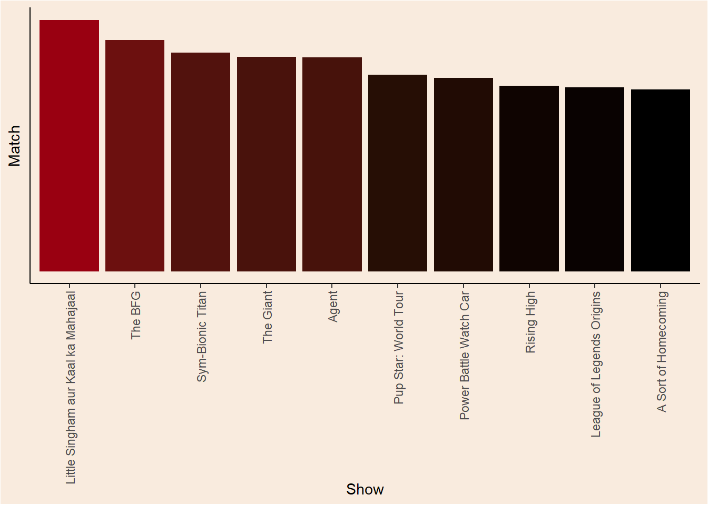



<main class="site-main"><section class="page-intro">
Article · Models and meaning
<h1>Netflix trends</h1>
Published13 Jun 2023
</section><article class="prose real-post">
This post will be dedicated yet again to some experimentation with text analysis. I will be using mostly basic and classic NLP tools like word counting and DFM’s (Document-Feature matrix). I hope that in the next NLP post I will be using some more advanced methods like transformers (go BERT!).

I will be using the popular <em>Netflix</em> <a href="https://www.kaggle.com/datasets/shivamb/netflix-shows">dataset</a> from Kaggle. It contains data of movies and TV shows added to Netflix’s streaming service since 2008.

It’s going to be a relatively short post, the first part will include some nice visualization (word clouds), and in the second part I will try and build a mini show-recommendation function.

<section id="setup" class="level1">
<h1>Setup</h1>

<pre class="sourceCode r code-with-copy"><code class="sourceCode r">library(tidyverse)
library(extrafont)
library(lubridate)
library(ggwordcloud)
library(quanteda)
library(quanteda.textplots)
library(quanteda.textstats)</code><button title="Copy to Clipboard" class="code-copy-button"><i class="bi"></i></button></pre>

</section>
<section id="data-loading" class="level1">
<h1>Data loading</h1>

<pre class="sourceCode r code-with-copy"><code class="sourceCode r">data &lt;- read_csv("netflix_titles.csv", show_col_types = F)

head(data)</code><button title="Copy to Clipboard" class="code-copy-button"><i class="bi"></i></button></pre>

<pre><code># A tibble: 6 × 12
  show_id type    title    director cast  country date_added release_year rating
  &lt;chr&gt;   &lt;chr&gt;   &lt;chr&gt;    &lt;chr&gt;    &lt;chr&gt; &lt;chr&gt;   &lt;chr&gt;             &lt;dbl&gt; &lt;chr&gt;
1 s1      Movie   Dick Jo… Kirsten… &lt;NA&gt;  United… September…         2020 PG-13
2 s2      TV Show Blood &amp;… &lt;NA&gt;     Ama … South … September…         2021 TV-MA
3 s3      TV Show Ganglan… Julien … Sami… &lt;NA&gt;    September…         2021 TV-MA
4 s4      TV Show Jailbir… &lt;NA&gt;     &lt;NA&gt;  &lt;NA&gt;    September…         2021 TV-MA
5 s5      TV Show Kota Fa… &lt;NA&gt;     Mayu… India   September…         2021 TV-MA
6 s6      TV Show Midnigh… Mike Fl… Kate… &lt;NA&gt;    September…         2021 TV-MA
# ℹ 3 more variables: duration &lt;chr&gt;, listed_in &lt;chr&gt;, description &lt;chr&gt;</code></pre>

Let’s look at one of the more interesting fields in here:

<pre class="sourceCode r code-with-copy"><code class="sourceCode r">head(data$description, 3)</code><button title="Copy to Clipboard" class="code-copy-button"><i class="bi"></i></button></pre>

<pre><code>[1] "As her father nears the end of his life, filmmaker Kirsten Johnson stages his death in inventive and comical ways to help them both face the inevitable."
[2] "After crossing paths at a party, a Cape Town teen sets out to prove whether a private-school swimming star is her sister who was abducted at birth."
[3] "To protect his family from a powerful drug lord, skilled thief Mehdi and his expert team of robbers are pulled into a violent and deadly turf war."      </code></pre>

We get to have the description of every TV show or movie added. This has potential…

</section>
<section id="preprocessing" class="level1">
<h1>Preprocessing</h1>

This part is sort of boring, but I’m creating a <em>Date</em> column in <code>lubridate</code> format. Didn’t know that <code>R</code> has built in object for this.

<pre class="sourceCode r code-with-copy"><code class="sourceCode r">months_names &lt;- data.frame(name = month.name,
                           month = seq(1,12,1))

data_clean &lt;- data |&gt;
  mutate(month_added = word(date_added, 1),
         day_added = str_remove_all(word(date_added, 2), ","),
         year_added = word(date_added, 3)) |&gt;
  left_join(months_names, by = join_by(month_added == name)) |&gt;
  mutate(date_added = paste(day_added, month, year_added, sep = ".")) |&gt;
  select(-month_added, -day_added, -month) |&gt;
  mutate(date_added = dmy(date_added)) |&gt;
  mutate(date_added_ym = zoo::as.yearmon(date_added))</code><button title="Copy to Clipboard" class="code-copy-button"><i class="bi"></i></button></pre>

<section id="text-analysis-of-show-description" class="level2">
<h2 class="anchored" data-anchor-id="text-analysis-of-show-description">Text analysis of show description</h2>

Here I’m creating the DFM. It is basically a huge matrix with each document (show description) being a row, and each unique word being a column. Values represent the frequency of each word in each document.

<pre class="sourceCode r code-with-copy"><code class="sourceCode r">data_clean_dfm &lt;- data_clean |&gt;
  mutate(description = str_remove_all(description, pattern = "[[:punct:]]")) |&gt;
  corpus(text_field = "description") |&gt;
  tokens(remove_separators = T) |&gt;
  tokens_remove(stopwords()) |&gt;
  dfm()

data_clean_dfm</code><button title="Copy to Clipboard" class="code-copy-button"><i class="bi"></i></button></pre>

<pre><code>Document-feature matrix of: 8,807 documents, 20,824 features (99.93% sparse) and 13 docvars.
       features
docs    father nears end life filmmaker kirsten johnson stages death inventive
  text1      1     1   1    1         1       1       1      1     1         1
  text2      0     0   0    0         0       0       0      0     0         0
  text3      0     0   0    0         0       0       0      0     0         0
  text4      0     0   0    0         0       0       0      0     0         0
  text5      0     0   0    1         0       0       0      0     0         0
  text6      0     0   0    0         0       0       0      0     0         0
[ reached max_ndoc ... 8,801 more documents, reached max_nfeat ... 20,814 more features ]</code></pre>

For example: The word ‘father’ appear once in the first document, and doesn’t appear in documents 2 to 6.

</section>
</section>
<section id="content-trends-in-netflixs-new-additions" class="level1">
<h1>Content trends in Netflix’s new additions</h1>

Although it is pretty basic, the DFM allows us to check many things. For example: Did Netflix’s new content changed over the years? I thought it would be interesting to see the most frequent words in the descriptions of items added in each year.

As you can see, I have added a relative frequency column to the data. This is to control for the different number of items added in each year.

<pre class="sourceCode r code-with-copy"><code class="sourceCode r">plot_data &lt;- data_clean_dfm |&gt;
  textstat_frequency(groups = year_added) |&gt;
  filter(rank %in% c(1:100) &amp; group %in% c("2016", "2017", "2017", "2019", "2020", "2021")) |&gt;
  group_by(group) |&gt;
  mutate(r_frequency = 100*frequency/sum(frequency)) |&gt;
  ungroup()

cloud1 &lt;- plot_data |&gt;
  ggplot(aes(label = feature, size = r_frequency, color = r_frequency)) +
  scale_size_area(max_size = 7) +
  geom_text_wordcloud(seed = 14, ) +
  scale_color_gradient(low = "#000000", high = "#ff0000") +
  facet_wrap(~group, nrow = 1) +
  labs(title = "Content trends in Netflix's new additions every year",
       subtitle = "Most common words in the description of every newly added Movie or TV series") +
  theme_minimal() +
  theme(strip.text.x = element_text(size = 30, family = "Avengeance Heroic Avenger"),
        plot.title = element_text(size = 32, family = "Bebas Neue", hjust = 0.5),
        plot.subtitle = element_text(size = 22, family = "Bebas Neue", hjust = 0.5),
        plot.background = element_rect(fill = "#F9EBDE"),
        panel.background = element_rect(fill = "#F9EBDE"))</code><button title="Copy to Clipboard" class="code-copy-button"><i class="bi"></i></button></pre>

<pre class="sourceCode r code-with-copy"><code class="sourceCode r">cloud1</code><button title="Copy to Clipboard" class="code-copy-button"><i class="bi"></i></button></pre>

<figure class="figure">

</figure>

</section>
<section id="recommendation-generator" class="level1">
<h1>Recommendation generator</h1>

The Algorithm. Everyone online for the past 10 years are talking about the algorithm. ‘The algorithm’ is the method every app or website uses to predict our taste in videos/products/TV shows/twitts or Facebook posts.

In this part I try to create my own mini ‘algorithm’, But first, a short explanation on vector representation and similarity between texts.

<section id="tf-idf-term-frequency---inverse-document-frequency" class="level2">
<h2 class="anchored" data-anchor-id="tf-idf-term-frequency---inverse-document-frequency">TF-IDF (Term Frequency - Inverse Document Frequency)</h2>
<section id="tf---term-frequency" class="level3">
<h3 class="anchored" data-anchor-id="tf---term-frequency">TF - Term Frequency</h3>

Up until now I have used the most basic DFM - the count DFM. It basically counts the number of times each word appear in the document, and is sometimes also called ‘Bag of Words’. 
One problem that arises in our inner statistician is that longer documents contain more words! therefore, different term frequencies can be hard to compare. The simple solution is to calculate <em>Proportional frequency</em> in the following way: 
\[
term \ frequency= \frac{N \ times \ a \ word \ appear \ in \ the \ document}{Total \ number \ of \ words \ in \ the \ document}
\]

This gives us the <strong>Term frequency</strong> part of the tf-idf method.

</section>
<section id="inverse-document-frequency" class="level3">
<h3 class="anchored" data-anchor-id="inverse-document-frequency">Inverse Document Frequency</h3>

So we have the term frequency of every token (word). We can start and make show recommendations, right? Another problem that still exist is that some words could be prevalent in <strong>every</strong> document. For example, if the word ‘Life’ appears in a large number of descriptions, it is not so useful in identifying someones taste in TV shows and movies. If, on the other hand, the word ‘Father’ appear only in a small number of descriptions, it will be a lot more helpful to us. Therefore, we want to represent term <em>Uniqueness</em>. How can we do that?

For each token (word) the Inverse-Document-Frequency is calculated: 
\[
idf=log( \frac{Total \ number \ of \ documents}{N \ documents \ containing \ the \ term})
\]

This number is getting close to zero the more documents containing the word, and is getting larger the less documents contain it (and the more documents we have).

To get the final tf-idf value for every term, we simply multiply the Term-Frequency with the Inverse-Document-Frequency: 
\[
tfidf(word)=tf(word) \cdot idf(word)
\]

In creating the tf-idf DFM, I have also converted every word to lower case and to it’s stem.

<pre class="sourceCode r code-with-copy"><code class="sourceCode r">netflix_tf_idf &lt;- data_clean_dfm |&gt;
  dfm_tolower() |&gt;
  dfm_wordstem() |&gt;
  dfm_tfidf()</code><button title="Copy to Clipboard" class="code-copy-button"><i class="bi"></i></button></pre>

</section>
</section>
<section id="cosine-similarity" class="level2">
<h2 class="anchored" data-anchor-id="cosine-similarity">Cosine Similarity</h2>

Now that we have the DFM, we have a vector representation of every description of every show. Every word in our dataset is a dimension and it’s tf-idf in each document is the vector component. For example, the vector representation of the description of “Attack on Titan” is:

<pre class="sourceCode r code-with-copy"><code class="sourceCode r">dfm_subset(netflix_tf_idf, subset = title == "Attack on Titan")</code><button title="Copy to Clipboard" class="code-copy-button"><i class="bi"></i></button></pre>

<pre><code>Document-feature matrix of: 1 document, 15,097 features (99.90% sparse) and 13 docvars.
         features
docs      father near end life filmmak kirsten johnson stage death invent
  text779      0    0   0    0       0       0       0     0     0      0
[ reached max_nfeat ... 15,087 more features ]</code></pre>

Naturally these vector are mostly zeros…

But now that we have vectors we can do all the cool things that we can do with vectors! For example, we can recommend TV shows and movies based on how their vector representations are <em>similar</em> to a previously watched show. But how to calculate the similarity of two vectors?

If we return to Physics class, we can think of vectors as arrows with length and direction.

<figure class="figure">

<figcaption>Two vectors</figcaption>
</figure>

It is natural to think of the similarity between two vectors as the degree to which they point in the same direction. In other words, the angle between two vectors. It is possible to calculate the <em>cosine</em> between two vectors the following way: 
\[
cos \theta= \frac{ \vec{a} \cdot \vec{b}}{|\vec{a}| \cdot |\vec{b}|}
\]

Without turning this into a real Physics class, in the numerator is the dot-product of the vectors, and in the denominator is the product of lengths of the vectors. For example, the cosine between the vectors \(\vec{a}=(1,1)\) and \(\vec{b}=(-4,3)\) is: 
\[
cos \theta= \frac{1 \cdot (-4)+1 \cdot (3)}{ \sqrt{1^2+1^2} \cdot \sqrt{(-4)^2+3^2}}=\frac{-1}{5 \sqrt{2}}
\]

But what is the angle between ~15,000 dimensions vectors?! fortunately, this calculation remains the same in any dimension.

What is the relation between the angle and it’s cosine? without digging too deep, the larger the angle, the smaller the cosine. So the larger the cosine, the greater the similarity.

<i class="callout-icon"></i>

Note

Nice insight: the cosine similarity is nothing but the un-standardized pearson correlation coefficient! Let \(x\) and \(y\) be vectors of Z scores. The correlation coefficient is: 
\[
r_{xy}= \frac{\sum_{i=1}^{N}{x_i \cdot y_i}}{N}
\] While the cosine of the angle between them is: 
\[
cos \theta= \frac{\vec{x} \cdot \vec{y}}{|\vec{x}| \cdot |\vec{y}|}
\] The length of a vector of Z scores is \(\sqrt{N}\), therefore the denominator is always: \(\sqrt{N} \cdot \sqrt{N}=N\). 
The nominator is the dot product of the vectors, which is exactly the sum of the by-component products. Finally we get: 
\[
r_{xy}=cos \ \theta_{xy}
\]

<section id="functions" class="level3">
<h3 class="anchored" data-anchor-id="functions">Functions</h3>

The main idea of the recommendation generator is simple. If you liked a TV show or a movie, you will probably like shows with similar description. Not any similarity, cosine similarity!

<pre class="sourceCode r code-with-copy"><code class="sourceCode r">get_recommendation &lt;- function(show, liked = T) {
  library(dplyr)
  library(quanteda)
  
  features &lt;- netflix_tf_idf@docvars
  show_id &lt;- features$docname_[tolower(features$title) %in% tolower(show)]
  show_id &lt;- as.integer(str_remove_all(show_id, pattern = "text"))
  
  simil_mat &lt;- textstat_simil(netflix_tf_idf[show_id,], netflix_tf_idf, method = "cosine")
  
  if (liked) {
  simil_df &lt;- data.frame(shows = simil_mat@Dimnames[[2]],
                      simil = simil_mat@x) |&gt;
  arrange(-simil) |&gt;
  inner_join(select(netflix_tf_idf@docvars, docname_, title),
             by = join_by(shows == docname_)) |&gt;
    select(-shows, match = simil) |&gt;
    mutate(match = (match-min(match))/(max(match)-min(match))) |&gt;
    head(11)
  }
  if (!liked){
    simil_df &lt;- data.frame(shows = simil_mat@Dimnames[[2]],
                      simil = simil_mat@x) |&gt;
  arrange(simil) |&gt;
  inner_join(select(netflix_tf_idf@docvars, docname_, title),
             by = join_by(shows == docname_)) |&gt;
    select(-shows, match = simil) |&gt;
    mutate(match = 1-(match-min(match))/(max(match)-min(match))) |&gt;
    head(11)
  }
  
  return(simil_df[-1,])
}

get_recommendation_plot &lt;- function(show) {
  library(ggplot2)
  
  plot_df &lt;- get_recommendation(show)
  
  ggplot(plot_df, aes(reorder(title, -match, identity), match, fill = match)) +
  geom_col() +
  labs(x = "Show", y = "Match") +
  scale_fill_gradient(low = "#000000", high = "#990011FF") +
  theme_classic() +
  theme(axis.text.y = element_blank(),
        axis.ticks.y = element_blank(),
        axis.text.x = element_text(angle = 90, vjust = 0.5, hjust = 1),
        legend.position = "none",
        plot.background = element_rect(fill = "#F9EBDE"),
        panel.background = element_rect(fill = "#F9EBDE"))
}</code><button title="Copy to Clipboard" class="code-copy-button"><i class="bi"></i></button></pre>

</section>
<section id="getting-show-recommendations" class="level3">
<h3 class="anchored" data-anchor-id="getting-show-recommendations">Getting show recommendations</h3>

Let’s use an example. Maybe I watched “Attack on Titan”, what are the top 10 recommended shows for me?

<pre class="sourceCode r code-with-copy"><code class="sourceCode r">watched &lt;- "Attack on Titan"

get_recommendation(watched)</code><button title="Copy to Clipboard" class="code-copy-button"><i class="bi"></i></button></pre>

<pre><code>       match                               title
2  0.1570728 Little Singham aur Kaal ka Mahajaal
3  0.1444591                             The BFG
4  0.1367644                    Sym-Bionic Titan
5  0.1339566                           The Giant
6  0.1335654                               Agent
7  0.1227649                Pup Star: World Tour
8  0.1207346              Power Battle Watch Car
9  0.1159523                         Rising High
10 0.1149643           League of Legends Origins
11 0.1136349                A Sort of Homecoming</code></pre>

What if I did not like a show? no problem, you will be recommended shows and movies that are not similar.

<pre class="sourceCode r code-with-copy"><code class="sourceCode r">get_recommendation("I Am Sam", liked = FALSE)</code><button title="Copy to Clipboard" class="code-copy-button"><i class="bi"></i></button></pre>

<pre><code>   match                               title
2      1                           Ganglands
3      1               Jailbirds New Orleans
4      1                        Kota Factory
5      1    My Little Pony: A New Generation
6      1                             Sankofa
7      1       The Great British Baking Show
8      1                        The Starling
9      1 Vendetta: Truth, Lies and The Mafia
10     1                    Bangkok Breaking
11     1    Confessions of an Invisible Girl</code></pre>

<section id="in-a-plot" class="level4">
<h4 class="anchored" data-anchor-id="in-a-plot">In a plot</h4>

<pre class="sourceCode r code-with-copy"><code class="sourceCode r">get_recommendation_plot(watched)</code><button title="Copy to Clipboard" class="code-copy-button"><i class="bi"></i></button></pre>

<figure class="figure">

</figure>

</section>
</section>
<section id="interactive-app" class="level3">
<h3 class="anchored" data-anchor-id="interactive-app">Interactive app</h3>

Play around with show recommendations. and see other visualizations of the current data in this <a href="https://tomerzipori.shinyapps.io/Netflix/">shiny app</a>.

<section id="shiny-live" class="level4">
<h4 class="anchored" data-anchor-id="shiny-live">Shiny-Live</h4>

<em>Update</em> from 11/3/24 - Apparently there is a new way of embedding shiny apps into quarto documents. The current app might not load for you as <code>shinylive</code> still struggles with heavy calculations…

<pre class="shinylive-r" data-engine="r"><code>#| standalone: true
#| code-fold: true
#| cache: false
library(shiny)

ui &lt;- fluidPage(
  titlePanel("Test app"),
  sidebarLayout(
    sidebarPanel(
      selectInput(inputId = "watched_recommendation",
                  label = "I watched...",
                  choices = data_clean$title,
                  selected = data_clean$title[14])
    ),
    mainPanel(
      plotOutput('plot1', height = "350px")
    )
  )
)

server &lt;- function(input, output) {
  show_watched &lt;- reactive({input$watched_recommendation})

  output$plot1 &lt;- renderPlot({
  get_recommendation_plot(show_watched())
  })
}

shinyApp(ui, server)</code></pre>

If my app doesn’t load for you, comfort yourself with this demo app from <em>Posit</em>:

<pre class="shinylive-r" data-engine="r"><code>#| standalone: true
#| viewerHeight: 650
#| cache: false
library(shiny)

vars &lt;- setdiff(names(iris), "Species")

ui &lt;- pageWithSidebar(
  headerPanel('Iris k-means clustering'),
  sidebarPanel(
    selectInput('xcol', 'X Variable', vars),
    selectInput('ycol', 'Y Variable', vars, selected = vars[[2]]),
    numericInput('clusters', 'Cluster count', 3, min = 1, max = 9)
  ),
  mainPanel(
    plotOutput('plot1')
  )
)

server &lt;- function(input, output, session) {

  # Combine the selected variables into a new data frame
  selectedData &lt;- reactive({
    iris[, c(input$xcol, input$ycol)]
  })

  clusters &lt;- reactive({
    kmeans(selectedData(), input$clusters)
  })

  output$plot1 &lt;- renderPlot({
    palette(c("#E41A1C", "#377EB8", "#4DAF4A", "#984EA3",
      "#FF7F00", "#FFFF33", "#A65628", "#F781BF", "#999999"))

    par(mar = c(5.1, 4.1, 0, 1))
    plot(selectedData(),
         col = clusters()$cluster,
         pch = 20, cex = 3)
    points(clusters()$centers, pch = 4, cex = 4, lwd = 4)
  })

}

shinyApp(ui, server)</code></pre>
</section>
</section>
</section>
</section>
<section id="conclusion" class="level1">
<h1>Conclusion</h1>

This post is an extra step for me in the NLP domain. As always I try to explain the theory behind the interesting parts of the process. For example, I remember when I discovered the connection between the correlation coefficient and the angle between vectors, it was really eye opening! 

The recommendation functions could be vastly improved with some more modern NLP methods (Transformers!). I hope that in the near future I will have the time to post about that to.

</section></article>



</main>


