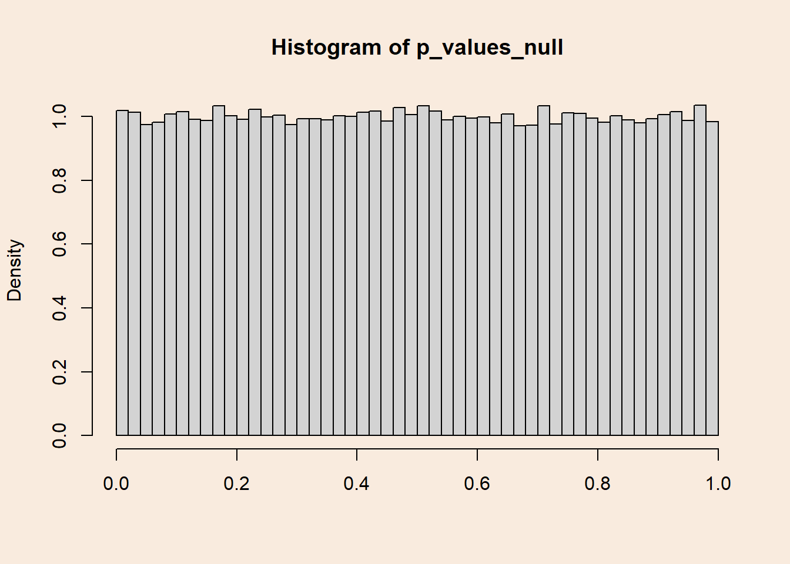
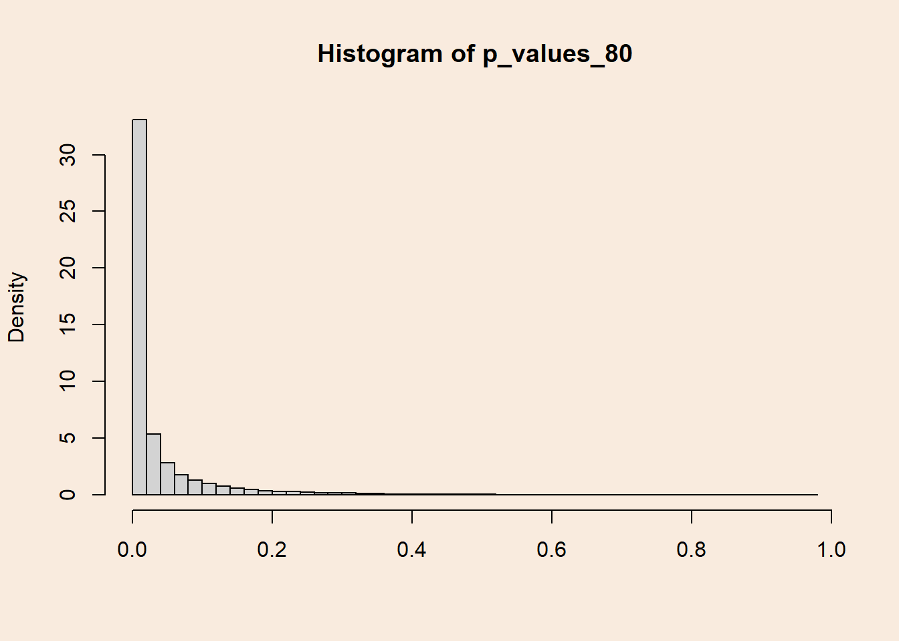
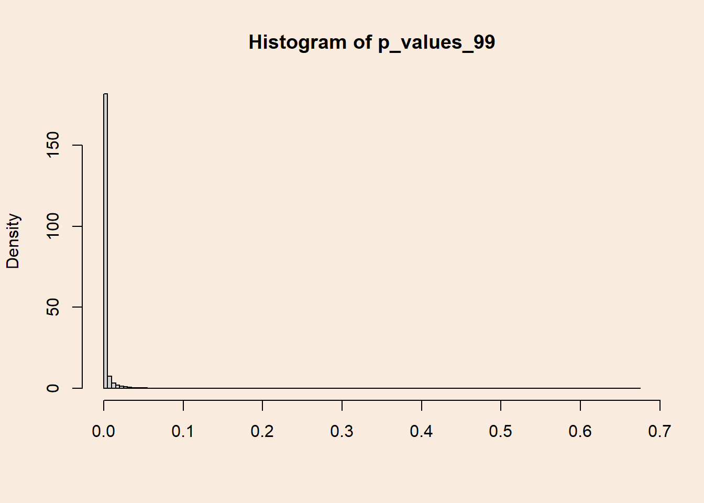
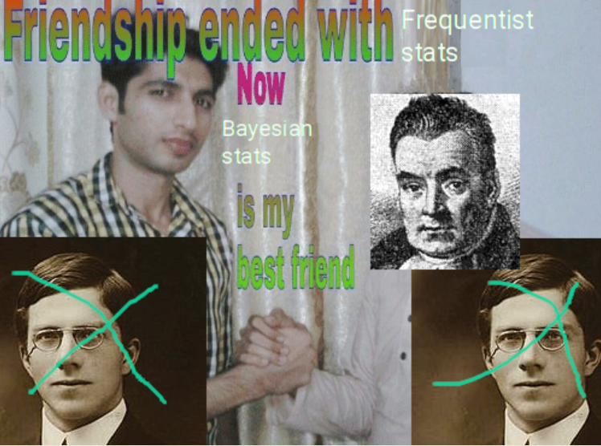
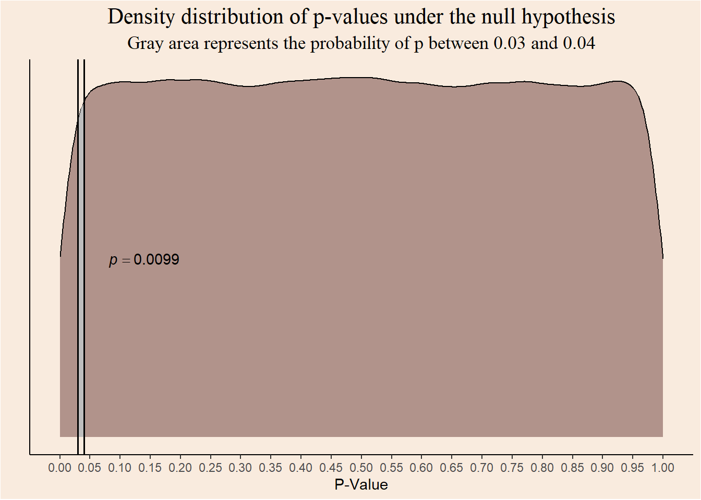
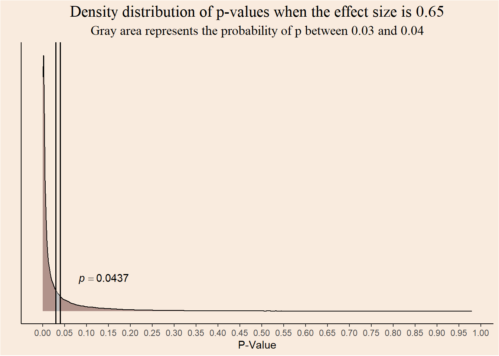
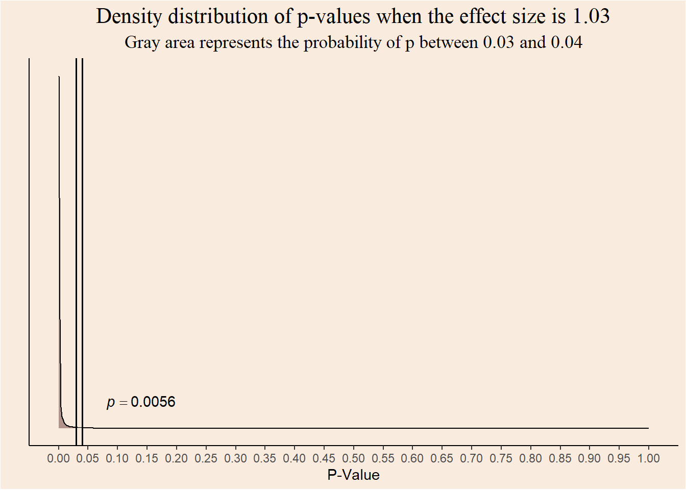
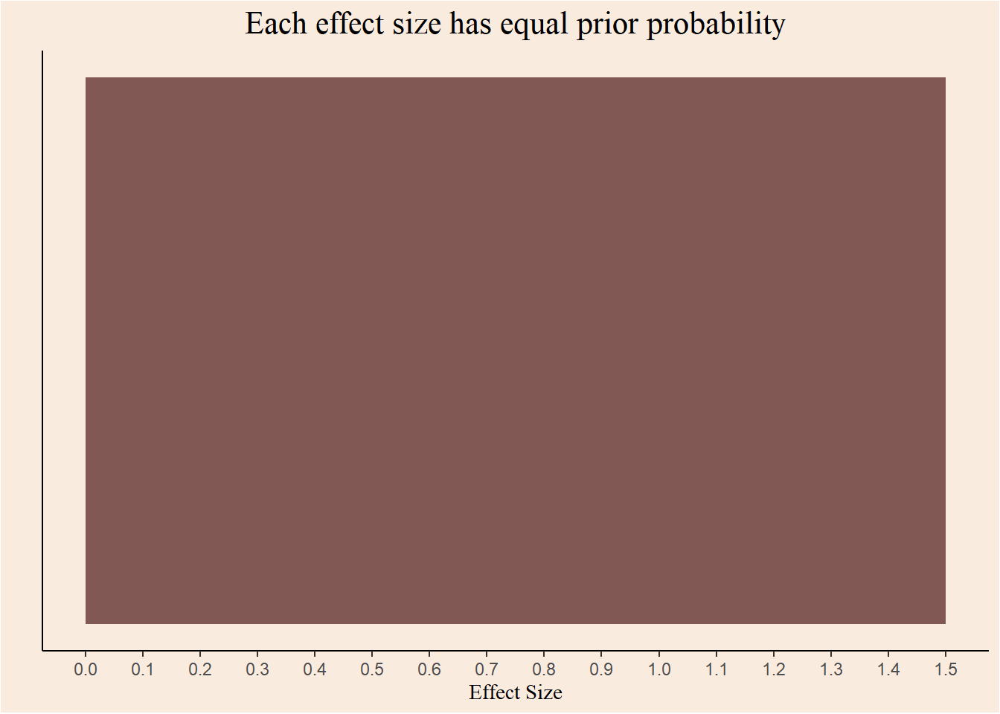
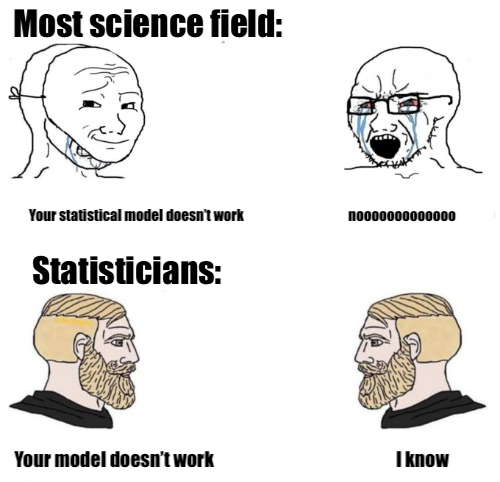

<header class="site-header" aria-label="Main navigation"><a class="wordmark" href="../../">Tomer Zipori.</a><nav class="primary-nav" id="primary-navigation"><a href="../../questions/">Questions</a><a href="../../notes/">Notes</a><a href="../../experiments/">Experiments</a><a href="../../writing/">Writing</a><a href="../../about/">About</a></nav>
<a href="https://github.com/tomerzipori">GitHub</a><a href="../../writing/index.xml">RSS</a>
<button class="menu-toggle" type="button" data-menu-toggle aria-expanded="false" aria-controls="primary-navigation">Menu</button></header>
<main class="site-main"><section class="page-intro">
Article · Evidence and belief
<h1>Rejecting the null hypothesis or not?</h1>
in bloom04 Sep 2023
</section><article class="prose real-post">
In the current post I try to explain what appears to be a paradox: given identical data, different schools of statistics disagree about the appropriate conclusion.

Traditionally, there are two ways to interpret Probability: 
1. Probability is the relative frequency of events at infinity - the Frequentist school. 
2. Probability represents the degree of beliefs - The Bayesian school.

Classic hypothesis testing in the social sciences usually follows the Frequentist school, the probability of errors is calculated as the relative frequency of extreme data under the relevant hypotheses.

<section id="distribution-of-p-values-when-the-null-hypothesis-is-true" class="level1">
<h1>Distribution of p-values when the null hypothesis is true</h1>

An example for Frequentist logic in hypothesis testing is the probability of type I errors, also known as \(\alpha\): rejecting the null hypothesis when it is true.

The famous (and notorious?) 5% convention, refers to the relative frequency of significant tests when the null is true.

Let’s take infinite (140,000) samples of \(n=30\) from populations with equal means, and compare each of them with a t-test:

<pre class="sourceCode r code-with-copy"><code class="sourceCode r">n &lt;- 30
mu0 &lt;- 0
sd0 &lt;- 1
mu1 &lt;- 0

p_values_null &lt;- rep(NULL, 140000)

for (i in c(1:140000)) {
  group1 &lt;- rnorm(n, mu0, sd0)
  group2 &lt;- rnorm(n, mu1, sd0)
  
  test &lt;- t.test(group1, group2, alternative = "less")
  
  p_values_null[i] &lt;- test$p.value
}</code><button title="Copy to Clipboard" class="code-copy-button"><i class="bi"></i></button></pre>

How many tests were significant?

<pre class="sourceCode r code-with-copy"><code class="sourceCode r">length(p_values_null[p_values_null &lt; .05])/length(p_values_null)</code><button title="Copy to Clipboard" class="code-copy-button"><i class="bi"></i></button></pre>

<pre><code>[1] 0.05020714</code></pre>

What if we defined \(\alpha=0.067\)?

<pre class="sourceCode r code-with-copy"><code class="sourceCode r">length(p_values_null[p_values_null &lt; .067])/length(p_values_null)</code><button title="Copy to Clipboard" class="code-copy-button"><i class="bi"></i></button></pre>

<pre><code>[1] 0.06699286</code></pre>

Putting it in different words, the probability of getting p-values under a certain threshold equals to that threshold. or, <strong>When population means are equal, p-values are distributed uniformly.</strong>

<pre class="sourceCode r code-with-copy"><code class="sourceCode r">par(bg = '#F9EBDE')

hist(p_values_null, breaks = 50, xlab = NULL, freq = F)</code><button title="Copy to Clipboard" class="code-copy-button"><i class="bi"></i></button></pre>

<figure class="figure">

</figure>

</section>
<section id="distribution-of-p-values-when-the-null-hypothesis-is-false" class="level1">
<h1>Distribution of p-values when the null hypothesis is false</h1>

What happens when population means are <em>not</em> equal? The probability of detecting an existing effect (e.g.&nbsp;getting a significant result) is called <em>Power</em>. Naturally, statistical Power is larger for larger differences between populations means.

Lets simulate yet again infinite (140,000) t-tests, this time between samples from populations with difference of means of 0.65.

<section id="distribution-of-p-values-with-80-power" class="level2">
<h2 class="anchored" data-anchor-id="distribution-of-p-values-with-80-power">Distribution of p-values with 80% power</h2>

<pre class="sourceCode r code-with-copy"><code class="sourceCode r">n &lt;- 30
mu0 &lt;- 0
sd0 &lt;- 1
mu1 &lt;- 0.65

p_values_80 &lt;- rep(NULL, 140000)

for (i in c(1:140000)) {
  group1 &lt;- rnorm(n, mu0, sd0)
  group2 &lt;- rnorm(n, mu1, sd0)
  
  test &lt;- t.test(group1, group2, alternative = "less")
  
  p_values_80[i] &lt;- test$p.value
}</code><button title="Copy to Clipboard" class="code-copy-button"><i class="bi"></i></button></pre>

What is the probability of getting a significant result?

<pre class="sourceCode r code-with-copy"><code class="sourceCode r">length(p_values_80[p_values_80 &lt; .05])/length(p_values_80)</code><button title="Copy to Clipboard" class="code-copy-button"><i class="bi"></i></button></pre>

<pre><code>[1] 0.80015</code></pre>

How does the distribution of p-values look when there is 80% Power (probability of 0.8 of getting a significant result)?

<pre class="sourceCode r code-with-copy"><code class="sourceCode r">par(bg = '#F9EBDE')

hist(p_values_80, breaks = 50, xlab = NULL, freq = F)</code><button title="Copy to Clipboard" class="code-copy-button"><i class="bi"></i></button></pre>

<figure class="figure">

</figure>

Smaller p-values are more probable, and the uniform distribution from before “gets skewed”.

</section>
</section>
<section id="distribution-of-p-values-with-99-power" class="level1">
<h1>Distribution of p-values with 99% power</h1>

Increasing the difference between population means causes the p-values distribution to get more and more skewed.

<pre class="sourceCode r code-with-copy"><code class="sourceCode r">n &lt;- 30
mu0 &lt;- 0
sd0 &lt;- 1
mu1 &lt;- 1.0376218

p_values_99 &lt;- rep(NULL, 140000)

for (i in c(1:140000)) {
  group1 &lt;- rnorm(n, mu0, sd0)
  group2 &lt;- rnorm(n, mu1, sd0)
  
  test &lt;- t.test(group1, group2, alternative = "less")
  
  p_values_99[i] &lt;- test$p.value
}

length(p_values_99[p_values_99 &lt; .05])/length(p_values_99)</code><button title="Copy to Clipboard" class="code-copy-button"><i class="bi"></i></button></pre>

<pre><code>[1] 0.9899</code></pre>

And the distribution of p-values:

<pre class="sourceCode r code-with-copy"><code class="sourceCode r">par(bg = '#F9EBDE')

hist(p_values_99, breaks = 100, freq = F, xlab = NULL)</code><button title="Copy to Clipboard" class="code-copy-button"><i class="bi"></i></button></pre>

<figure class="figure">

</figure>

</section>
<section id="reversing-the-conditionality" class="level1">
<h1>Reversing the conditionality</h1>

<figure class="figure">

<figcaption>All about the Bayes</figcaption>
</figure>

As we said before, p-values represent the probability of getting certain data when the null hypothesis is true. What if we looked at it from the other side? What is the probability that the null hypothesis is true, given a certain p-value?

In the Frequentist school, this question seems weird: what is the relative frequency at infinity of the null hypothesis being true? That is, out of infinite worlds, in how many of them the null is true?

Switching our perspective to be Bayesian, assigning probabilities to hypotheses becomes less weird. That is because Bayesians see probability as a measure of confidence in some statement/model/possible world.

As it’s name suggests, the Bayesian interpretation of probability is rooted in the Bayes theorem for conditional probabilities:

\[
p(A/B)= \frac {p(A) \cdot p(B/A)}{p(B)}
\]

Confidence in \(A\) given the occurrence of \(B\) is proportional to the product of the prior confidence in \(A\) and the conditional probability of \(A\) on \(B\) - also called the <strong>Likelihood</strong> of \(A\).

<i class="callout-icon"></i>

Important

Bayes’ theorem is <strong>not</strong> a matter of interpretation. it can be derived from the basic probability axioms. It is linked with the interpretation of probability as a measure of confidence in statements because it defines the procedure of belief updating.

Re-phrasing the theorem, it is possible to formulate the posterior probability of a hypothesis given some observed data:

\[
p(hypothesis/data)= \frac {p(hypothesis) \cdot p(data/hypothesis)}{p(data)}
\]

Another possibility of conceptualize the Bayes mindset is seeing the posterior probability of the hypothesis as an <em>update</em> to the prior probability of it.

Bayes theorem also enable the comparison of two hypotheses using the ratio between the posteriors:/ \[
\frac{p(hypothesis \, 1/data)}{p(hypothesis \, 2/data)}= \frac {\frac {p(hypothesis \, 1) \cdot p(data/hypothesis \, 1)}{p(data)}}{\frac {p(hypothesis \, 2) \cdot p(data/hypothesis \, 2)}{p(data)}}
\]

Cancelling the annoying denominator yields the following: \[
\frac {p(hypothesis \, 1) \cdot p(data/hypothesis \, 1)}{p(hypothesis \, 2) \cdot p(data/hypothesis \, 2)}
\]

The ratio of posterior probabilities equals to the product of the prior ratio and the likelihood ratio. When this value is bigger then 1, it can considered as evidence in favor of Hypothesis 1.

</section>
<section id="posterior-probability-of-hypotheses-given-p-values" class="level1">
<h1>Posterior probability of hypotheses given p-values</h1>

Using Bayes theorem, it is now possible to construct a posterior probability for each of the original hypotheses, given an observed p-value.

<section id="likelihood" class="level2">
<h2 class="anchored" data-anchor-id="likelihood">Likelihood</h2>

What is the probability of p-values given each hypothesis? we actually answered this question earlier when we visualized the density distributions of p-values.

For example, the probability of observing a p-value between 0.03 and 0.04 given the null hypothesis is:

<pre class="sourceCode r code-with-copy"><code class="sourceCode r">data.frame("p" = p_values_null) |&gt;
ggplot(aes(x = p)) +
  geom_density(alpha = .6, fill = "#815854") +
  geom_area(aes(x = stage(p, after_stat = oob_censor(x, c(0.03, 0.04)))), stat = "density", fill = "gray") +
  annotate("text", x = 0.14, y = 0.5, label = "italic(p) == 0.0099",
  parse = TRUE) +
  geom_vline(xintercept = 0.03, color = "black", linewidth = 0.7) +
  geom_vline(xintercept = 0.04, color = "black", linewidth = 0.7) +
  scale_x_continuous(breaks = seq(0, 1, 0.05)) +
  theme_classic() +
  labs(y = "", x = "P-Value", title = "Density distribution of p-values under the null hypothesis",
       subtitle = "Gray area represents the probability of p between 0.03 and 0.04") +
  theme(axis.text.y = element_blank(),
        axis.ticks.y = element_blank(),
        plot.title = element_text(family = "serif", size = 16, hjust = 0.5),
        plot.subtitle = element_text(family = "serif", size = 13, hjust = 0.5),
        plot.background = element_rect(fill = "#F9EBDE"),
        panel.background = element_rect(fill = "#F9EBDE"))</code><button title="Copy to Clipboard" class="code-copy-button"><i class="bi"></i></button></pre>

<figure class="figure">

</figure>

The probability of observing the same range of p-values when the effect size is \(0.65\) is:

<pre class="sourceCode r code-with-copy"><code class="sourceCode r">data.frame("p" = p_values_80) |&gt;
ggplot(aes(x = p)) +
  geom_density(alpha = .6, fill = "#815854") +
  geom_area(aes(x = stage(p, after_stat = oob_censor(x, c(0.03, 0.04)))), stat = "density", fill = "gray") +
  annotate("text", x = 0.14, y = 8, label = "italic(p) == 0.0437",
  parse = TRUE) +
  geom_vline(xintercept = 0.03, color = "black", linewidth = 0.7) +
  geom_vline(xintercept = 0.04, color = "black", linewidth = 0.7) +
  scale_x_continuous(breaks = seq(0, 1, 0.05)) +
  theme_classic() +
  labs(y = "", x = "P-Value", title = "Density distribution of p-values when the effect size is 0.65",
       subtitle = "Gray area represents the probability of p between 0.03 and 0.04") +
  theme(axis.text.y = element_blank(),
        axis.ticks.y = element_blank(),
        plot.title = element_text(family = "serif", size = 16, hjust = 0.5),
        plot.subtitle = element_text(family = "serif", size = 13, hjust = 0.5),
        plot.background = element_rect(fill = "#F9EBDE"),
        panel.background = element_rect(fill = "#F9EBDE"))</code><button title="Copy to Clipboard" class="code-copy-button"><i class="bi"></i></button></pre>

<figure class="figure">

</figure>

And for effect size of \(1.03\)?

<pre class="sourceCode r code-with-copy"><code class="sourceCode r">data.frame("p" = p_values_99) |&gt;
ggplot(aes(x = p)) +
  geom_density(alpha = .6, fill = "#815854") +
  geom_area(aes(x = stage(p, after_stat = oob_censor(x, c(0.03, 0.04)))), stat = "density", fill = "gray") +
  annotate("text", x = 0.14, y = 376, label = "italic(p) == 0.0056",
  parse = TRUE) +
  geom_vline(xintercept = 0.03, color = "black", linewidth = 0.7) +
  geom_vline(xintercept = 0.04, color = "black", linewidth = 0.7) +
  scale_x_continuous(breaks = seq(0, 1, 0.05), limits = c(0, 1)) +
  theme_classic() +
  labs(y = "", x = "P-Value", title = "Density distribution of p-values when the effect size is 1.03",
       subtitle = "Gray area represents the probability of p between 0.03 and 0.04") +
  theme(axis.text.y = element_blank(),
        axis.ticks.y = element_blank(),
        plot.title = element_text(family = "serif", size = 16, hjust = 0.5),
        plot.subtitle = element_text(family = "serif", size = 13, hjust = 0.5),
        plot.background = element_rect(fill = "#F9EBDE"),
        panel.background = element_rect(fill = "#F9EBDE"))</code><button title="Copy to Clipboard" class="code-copy-button"><i class="bi"></i></button></pre>

<figure class="figure">

</figure>

The probability of getting a p-value in the range of \([0.03,0.04]\) is lower for greater effect sizes.

</section>
</section>
<section id="prior" class="level1">
<h1>Prior</h1>

Explicitly incorporating prior knowledge into statistical modelling is a great strength of Bayesian analysis. But, in order to keep things simple, I will stay agnostic and assign each hypothesis an equal prior probability. This is known as a <em>Flat prior</em>. 

<pre class="sourceCode r code-with-copy"><code class="sourceCode r">ggplot(data.frame(x = c(0, 1.5)), aes(x)) +
  stat_function(fun = dunif, geom = "area", args = list(min = 0, max = 1.5), fill = "#815854") +
  scale_x_continuous(breaks = seq(0, 1.5, 0.1)) +
  labs(x = "Effect Size", y = "", title = "Each effect size has equal prior probability") +
  theme_classic() +
  theme(axis.text.y = element_blank(),
        axis.ticks.y = element_blank(),
        plot.title = element_text(family = "serif", size = 16, hjust = 0.5),
        axis.title.x = element_text(family = "serif", size = 11),
        plot.background = element_rect(fill = "#F9EBDE"),
        panel.background = element_rect(fill = "#F9EBDE"))</code><button title="Copy to Clipboard" class="code-copy-button"><i class="bi"></i></button></pre>

<figure class="figure">

</figure>

In this case the prior ratio cancels out and posterior ratio is equal to the likelihood ratio.

</section>
<section id="rejecting-the-null" class="level1">
<h1>Rejecting the null?</h1>

Given p-value between 0.03 and 0.04, should we reject the null hypothesis or not?

As good Frequentists, we should see all p-values under the pre-defined alpha of 0.05 as evidence against the null hypothesis.

<strong>But</strong>, as good Bayesian we should ask ourselves, Given \(0.03 \le p \le 0.04\), what is more probable? effect size of \(0\) or \(1.03\)?

Defining the the flat prior:

<pre class="sourceCode r code-with-copy"><code class="sourceCode r">prior_null &lt;- 0.5
prior_1.03 &lt;- 1 - prior_null</code><button title="Copy to Clipboard" class="code-copy-button"><i class="bi"></i></button></pre>

Defining the likelihood of p-values in the given range, under each hypothesis:

<pre class="sourceCode r code-with-copy"><code class="sourceCode r">likelihood_null &lt;- length(p_values_null[p_values_null &gt;= 0.03 &amp; p_values_null &lt;= 0.04])/length(p_values_null)

likelihood_1.03 &lt;- length(p_values_99[p_values_99 &gt;= 0.03 &amp; p_values_99 &lt;= 0.04])/length(p_values_99)</code><button title="Copy to Clipboard" class="code-copy-button"><i class="bi"></i></button></pre>

What is the posterior ratio?

<pre class="sourceCode r code-with-copy"><code class="sourceCode r">(posterior_ratio &lt;- (prior_null * likelihood_null)/(prior_1.03 * likelihood_1.03))</code><button title="Copy to Clipboard" class="code-copy-button"><i class="bi"></i></button></pre>

<pre><code>[1] 1.771684</code></pre>

Given a p-value between 0.03 and 0.04, an effect size of \(0\) is 1.77 more probable then effect size of \(1.03\)!

</section>
<section id="so-what-is-the-answer" class="level1">
<h1>So, what is the answer???</h1>

What is the solution to this paradox? who is right? is statistical hypothesis testing is broken?

The source of the current disagreement is the interpretation of probability. Frequentists insist that hypotheses are True or False. There is no place for degrees of confidence in statements. Bayesians assign probability to hypotheses and statements themselves.

Whether you find yourself in the first camp, or in the second camp, remember:

<blockquote class="blockquote">

All models are wrong (George Box)

</blockquote>

This is our superpower!

<figure class="figure">

<figcaption>Meme-form</figcaption>
</figure>

</section></article></main>
<footer class="site-footer">
© 2026 Tomer Zipori <a href="../../writing/">All writing</a>

The p-value is not the whole story.
<nav class="footer-links"><a href="https://github.com/tomerzipori">GitHub</a><a href="../../writing/index.xml">RSS</a></nav></footer>
