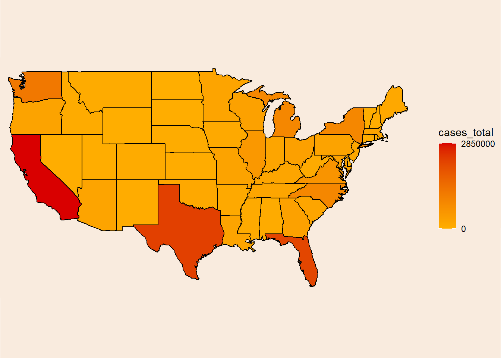
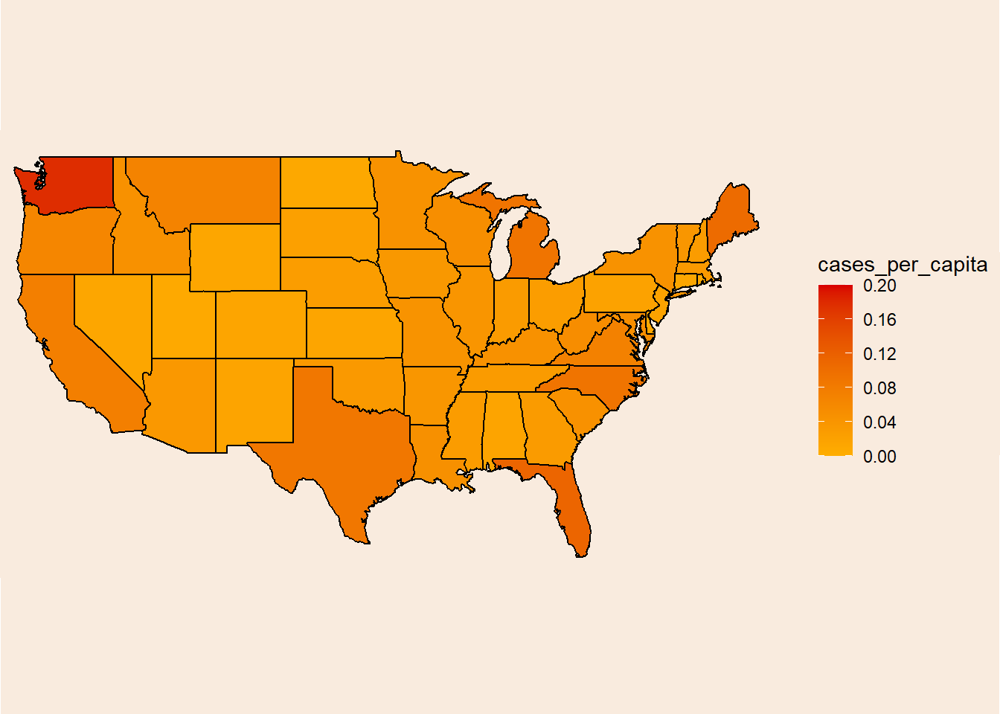
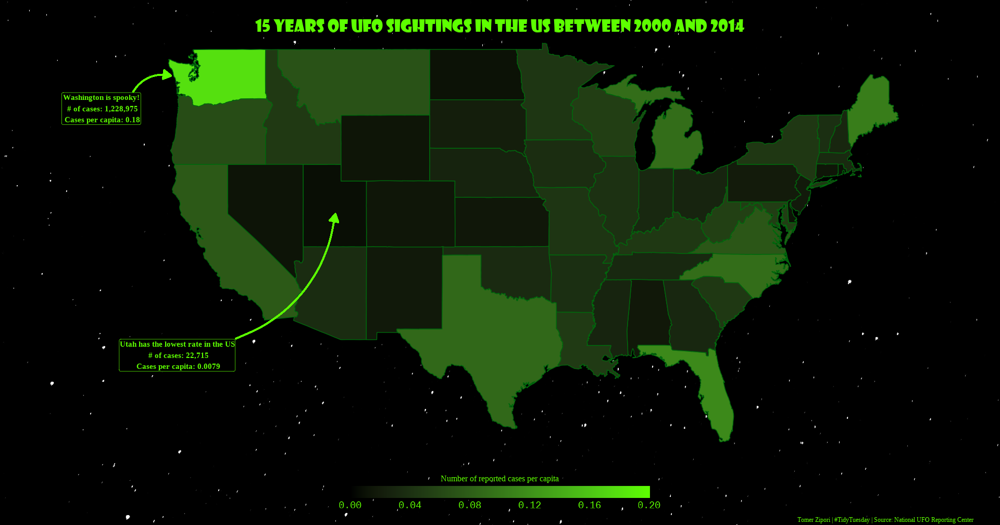

<header class="site-header" aria-label="Main navigation"><a class="wordmark" href="../../">Tomer Zipori.</a><nav class="primary-nav" id="primary-navigation"><a href="../../questions/">Questions</a><a href="../../notes/">Notes</a><a href="../../experiments/">Experiments</a><a href="../../writing/">Writing</a><a href="../../about/">About</a></nav>
<a href="https://github.com/tomerzipori">GitHub</a><a href="../../writing/index.xml">RSS</a>
<button class="menu-toggle" type="button" data-menu-toggle aria-expanded="false" aria-controls="primary-navigation">Menu</button></header>
<main class="site-main"><section class="page-intro">
Article · Data and strange claims
<h1>Who is the leading US state in UFO reports? probably not what you thought</h1>
in bloom16 Apr 2023
</section><article class="prose real-post"><section id="background" class="level1">
<h1>Background</h1>

As I told in another post, I’ve recently enrolled to a course about Data-Viz (and maybe some NLP later-on, stay tuned). One of the assignments in the course was to make some <code>TidyTuesday</code> contribution and present it in class. Although this is not what I’ve presented in class, this was made shortly after and I think it came out quite nice :)

</section>
<section id="the-data" class="level1">
<h1>The Data</h1>
<section id="from-the-github-repo" class="level5">
<h5 class="anchored" data-anchor-id="from-the-github-repo">From the Github <a href="https://github.com/tomerzipori/tidytuesday/tree/master/data/2019/2019-06-25">repo</a>:</h5>

<em>This data includes &gt;80,000 recorded UFO “sightings” around the world, including the UFO shape,</em> <em>lat/long and state/country of where the sighting occurred, duration of the “event” and the</em> <em>data_time when it occurred.</em>

<em>Data comes originally from <a href="http://www.nuforc.org/">NUFORC</a>, was cleaned and uploaded to Github by <a href="https://github.com/planetsig/ufo-reports">Sigmond Axel</a>, and some exploratory plots were created by <a href="https://www.kaggle.com/jonathanbouchet/e-t-phone-home-but-mostly-after-8-00pm">Jonathan Bouchet</a> a few years back.</em>

Let’s start!

</section>
</section>
<section id="setup" class="level1">
<h1>Setup</h1>

<pre class="sourceCode r code-with-copy"><code class="sourceCode r">library(tidyverse)    # for data wrangling and pre-processing
library(readxl)
library(tidytuesdayR) # for easy data loading
library(maps)         # map data
library(lubridate)    # makes dealing with date format much easier
library(jpeg)
library(ggimage)
library(showtext)     # fonts</code><button title="Copy to Clipboard" class="code-copy-button"><i class="bi"></i></button></pre>

</section>
<section id="loading-data" class="level1">
<h1>Loading data</h1>
<section id="initial-pre-processing" class="level2">
<h2 class="anchored" data-anchor-id="initial-pre-processing">Initial pre-processing</h2>

<pre class="sourceCode r code-with-copy"><code class="sourceCode r">ufo_sightings &lt;- readr::read_csv("https://raw.githubusercontent.com/rfordatascience/tidytuesday/master/data/2019/2019-06-25/ufo_sightings.csv")

usa &lt;- map_data("state") # US map

state_codes &lt;- read_csv("state_code.csv") %&gt;% # converting from state name to 2-letter code and back
  select(state, code) %&gt;%
  mutate(state = tolower(state), code = tolower(code))

uspop &lt;- read_excel("uspop.xlsx", col_names = c("region", "pop_2010", "pop_2011", "pop_2012", "pop_2013", "pop_2014")) %&gt;% # info about state population
  mutate(region = tolower(str_remove(region, "."))) %&gt;%
  rowwise() %&gt;%
  mutate(mean_pop = mean(c(pop_2010, pop_2011, pop_2012, pop_2013, pop_2014))) %&gt;%
  ungroup() %&gt;%
  select(region, mean_pop)</code><button title="Copy to Clipboard" class="code-copy-button"><i class="bi"></i></button></pre>

US population info taken from the <a href="https://www.census.gov/data/datasets/time-series/demo/popest/2010s-state-total.html#par_textimage_1873399417">United States Census Bureau</a>.

</section>
<section id="glimpsing-at-the-data" class="level2">
<h2 class="anchored" data-anchor-id="glimpsing-at-the-data">Glimpsing at the data</h2>

<pre class="sourceCode r code-with-copy"><code class="sourceCode r">glimpse(ufo_sightings)</code><button title="Copy to Clipboard" class="code-copy-button"><i class="bi"></i></button></pre>

<pre><code>Rows: 80,332
Columns: 11
$ date_time                  &lt;chr&gt; "10/10/1949 20:30", "10/10/1949 21:00", "10…
$ city_area                  &lt;chr&gt; "san marcos", "lackland afb", "chester (uk/…
$ state                      &lt;chr&gt; "tx", "tx", NA, "tx", "hi", "tn", NA, "ct",…
$ country                    &lt;chr&gt; "us", NA, "gb", "us", "us", "us", "gb", "us…
$ ufo_shape                  &lt;chr&gt; "cylinder", "light", "circle", "circle", "l…
$ encounter_length           &lt;dbl&gt; 2700, 7200, 20, 20, 900, 300, 180, 1200, 18…
$ described_encounter_length &lt;chr&gt; "45 minutes", "1-2 hrs", "20 seconds", "1/2…
$ description                &lt;chr&gt; "This event took place in early fall around…
$ date_documented            &lt;chr&gt; "4/27/2004", "12/16/2005", "1/21/2008", "1/…
$ latitude                   &lt;dbl&gt; 29.88306, 29.38421, 53.20000, 28.97833, 21.…
$ longitude                  &lt;dbl&gt; -97.941111, -98.581082, -2.916667, -96.6458…</code></pre>

</section>
<section id="defining-functions" class="level2">
<h2 class="anchored" data-anchor-id="defining-functions">Defining functions</h2>

Some helper function will help us later, mainly to work with dates. 
<code>convert_to_date</code> takes a vector of character formatted dates and converts it to lubridate’s <em>date</em> format. <code>floor_decade</code> takes a vector of dates and converts it to a vector of decades.

<pre class="sourceCode r code-with-copy"><code class="sourceCode r">convert_to_date &lt;- function(x) { 
  sub_string &lt;- str_sub(x, 1, 10)
  d &lt;- mdy(sub_string)
  return(as.numeric(d))
}
floor_decade &lt;- function(x){
  return(lubridate::year(x) - lubridate::year(x) %% 10)
  }</code><button title="Copy to Clipboard" class="code-copy-button"><i class="bi"></i></button></pre>

<section id="converting-the-dates" class="level3">
<h3 class="anchored" data-anchor-id="converting-the-dates">Converting the dates</h3>

<pre class="sourceCode r code-with-copy"><code class="sourceCode r">ufo_sightings &lt;- ufo_sightings %&gt;%
  mutate(date = as_date(purrr::map_dbl(date_time, ~convert_to_date(.)))) # Convert to 'Date' format. Run only once, its slow af</code><button title="Copy to Clipboard" class="code-copy-button"><i class="bi"></i></button></pre>

</section>
</section>
<section id="globals" class="level2">
<h2 class="anchored" data-anchor-id="globals">Globals</h2>

Here I’m loading some images and fonts that will be of use later to beautify the plot.

<pre class="sourceCode r code-with-copy"><code class="sourceCode r">nightsky_img &lt;- "nightsky2.jpg"

#font_files() %&gt;% tibble() %&gt;% filter(str_detect(family, "Showcard Gothic"))
font_add(family = "Showcard Gothic", regular = "SHOWG.TTF")
showtext_auto()</code><button title="Copy to Clipboard" class="code-copy-button"><i class="bi"></i></button></pre>

</section>
<section id="data-pre-processing" class="level2">
<h2 class="anchored" data-anchor-id="data-pre-processing">Data pre-processing</h2>

Preparing the data for plotting: &nbsp;&nbsp;&nbsp;&nbsp;&nbsp;&nbsp;1. Leaving only reports from the US. 
&nbsp;&nbsp;&nbsp;&nbsp;&nbsp;&nbsp;2. Leaving only reports for <em>continental</em> US. 
&nbsp;&nbsp;&nbsp;&nbsp;&nbsp;&nbsp;3. Selecting the relevant variables. 
&nbsp;&nbsp;&nbsp;&nbsp;&nbsp;&nbsp;4. Calculating decades.

<pre class="sourceCode r code-with-copy"><code class="sourceCode r">ufo &lt;- ufo_sightings %&gt;%
  filter(country == "us") %&gt;% # Leaving only sightings in US
  filter(!(state %in% c("ak", "pr", "hi"))) %&gt;% # Only mainland US
  select(date, code = state, description, encounter_length, latitude, longitude) %&gt;%
  left_join(state_codes, by = "code") %&gt;%
  mutate(decade = as.factor(purrr::map_dbl(date, ~floor_decade(.)))) %&gt;% # Create decade variable
  drop_na(decade)</code><button title="Copy to Clipboard" class="code-copy-button"><i class="bi"></i></button></pre>

After some experimenting I’ve decided to make a heat map to visualize the number of UFO reports per state. But first, some more data processing. I first counted the number of cases per state (<em>by_state</em>), and then combined it with the USA map data frame (<em>by_state2</em>).

<pre class="sourceCode r code-with-copy"><code class="sourceCode r">by_state &lt;- ufo %&gt;%
    group_by(state, decade, .drop = F) %&gt;%
    summarise(cases = n(),
              .groups = "drop")
  
by_state2 &lt;- left_join(usa, by_state, by = c("region" = "state"), multiple = "all") %&gt;%
  filter(decade %in% c(2000, 2010)) %&gt;%
    left_join(uspop, by = "region")</code><button title="Copy to Clipboard" class="code-copy-button"><i class="bi"></i></button></pre>

Now I need to summarize the number of cases per state.

<pre class="sourceCode r code-with-copy"><code class="sourceCode r">cases_per_state &lt;- by_state2 %&gt;%
  group_by(region) %&gt;%
  summarise(cases = sum(cases), .groups = "drop")</code><button title="Copy to Clipboard" class="code-copy-button"><i class="bi"></i></button></pre>

And finally merge it back together with the geographic data.

<pre class="sourceCode r code-with-copy"><code class="sourceCode r">by_state2 &lt;- left_join(by_state2, select(cases_per_state, region, cases_total = cases), by = "region")</code><button title="Copy to Clipboard" class="code-copy-button"><i class="bi"></i></button></pre>

</section>
<section id="heatmap-1" class="level2">
<h2 class="anchored" data-anchor-id="heatmap-1">Heatmap 1</h2>

And now for the heat map… <em>drum roll</em>

<pre class="sourceCode r code-with-copy"><code class="sourceCode r">heatmap &lt;- ggplot(by_state2, aes(x = long, y = lat, fill = cases_total, group = group)) +
  geom_polygon(color = "black", show.legend = T) +
  scale_fill_gradient(low = "#ffae00", high = "#d90000", limits = c(0, 2864832), breaks = c(0, 2850000)) +
  coord_fixed(1.3, clip = "off") +
  theme_classic() +
  theme(axis.title = element_blank(),
        axis.text = element_blank(),
        axis.ticks = element_blank(),
        axis.line = element_blank(),
        plot.background = element_rect(fill = "#F9EBDE"),
        panel.background = element_rect(fill = "#F9EBDE"),
        legend.background = element_rect(fill = "#F9EBDE"),
        plot.margin = unit(c(-11,-0.5,-11,-0.5), units = "cm"),
        legend.margin = margin(0, 20, 0, 0))

heatmap</code><button title="Copy to Clipboard" class="code-copy-button"><i class="bi"></i></button></pre>

<figure class="figure">

</figure>

Looking at these results, I thought that of course California, Texas and Florida have the most reports, they also have the most people! 
A <em>per capita</em> measure will probably be more informative.

Calculating reports per capita.

<pre class="sourceCode r code-with-copy"><code class="sourceCode r">cases_per_capita &lt;- by_state2 %&gt;%
  group_by(region) %&gt;%
  summarise(cases = sum(cases), .groups = "drop") %&gt;%
  left_join(uspop, by = "region") %&gt;%
  mutate(cases_per_capita = cases/mean_pop)</code><button title="Copy to Clipboard" class="code-copy-button"><i class="bi"></i></button></pre>

Merging again with the geographical data.

<pre class="sourceCode r code-with-copy"><code class="sourceCode r">by_state2 &lt;- left_join(by_state2, select(cases_per_capita, region, cases_per_capita, cases_total = cases), by = "region")</code><button title="Copy to Clipboard" class="code-copy-button"><i class="bi"></i></button></pre>

</section>
<section id="heatmap-2" class="level2">
<h2 class="anchored" data-anchor-id="heatmap-2">Heatmap 2</h2>

<pre class="sourceCode r code-with-copy"><code class="sourceCode r">heatmap2 &lt;- ggplot(by_state2, aes(x = long, y = lat, fill = cases_per_capita, group = group)) +
  geom_polygon(color = "black", show.legend = T) +
  scale_fill_gradient(low = "#ffae00", high = "#d90000", limits = c(0, 0.2), breaks = seq(0, 0.2, length.out = 6)) +
  coord_fixed(1.3, clip = "off") +
  theme_classic() +
  theme(axis.title = element_blank(),
        axis.text = element_blank(),
        axis.ticks = element_blank(),
        axis.line = element_blank(),
        plot.background = element_rect(fill = "#F9EBDE"),
        panel.background = element_rect(fill = "#F9EBDE"),
        legend.background = element_rect(fill = "#F9EBDE"),
        plot.margin = unit(c(-11,-0.5,-11,-0.5), units = "cm"),
        legend.margin = margin(0, 20, 0, 0))

heatmap2</code><button title="Copy to Clipboard" class="code-copy-button"><i class="bi"></i></button></pre>

<figure class="figure">

</figure>

Nice!

</section>
<section id="heatmap3" class="level2">
<h2 class="anchored" data-anchor-id="heatmap3">Heatmap3</h2>

Let’s add some aesthetics because why not (I’ve only spent 6 hours on Google researching color theory and ggplot2’s internal logic). Unfold the code chunk if you are interested in seeing the monstrosity.

Code

<pre class="sourceCode r code-with-copy"><code class="sourceCode r">heatmap3 &lt;- ggplot(by_state2, aes(x = long, y = lat, fill = cases_per_capita, group = group)) +
  geom_polygon(color = "#00670c", show.legend = T) +
  scale_fill_gradient(low = "black", high = "#5dff00", limits = c(0, 0.2), breaks = seq(0, 0.2, length.out = 6), guide = guide_colorbar("Number of reported cases per capita", 
                                                                               title.position = "top",
                                                                               title.theme = element_text(color = "#5dff00", family = "serif"),
                                                                               title.hjust = 0.5,
                                                                               barwidth = 30,
                                                                               ticks.colour = NA)) +
  labs(title = "15 years of UFO sightings in the US between 2000 and 2014",
       caption = "Tomer Zipori | #TidyTuesday | Source: National UFO Reporting Center") +
  coord_fixed(1.3, clip = "off") +
  theme_minimal() +
  annotate("label", x = -130, y = 45.4, label = "Washington is spooky!\n # of cases: 1,228,975\n Cases per capita: 0.18",
           color = "#5dff00", fill = "black", family = "serif", fontface = "bold") +
  geom_curve(aes(x = -127.5, y = 46.4, xend = -124.48, yend = 47.4), color = "#5dff00", linewidth = 1, curvature = -0.35,
             arrow = arrow(type = "closed", length = unit(0.02, "npc"))) +
  annotate("label", x = -124, y = 30.4, label = "Utah has the lowest rate in the US\n # of cases: 22,715\n Cases per capita: 0.0079",
           color = "#5dff00", fill = "black", family = "serif", fontface = "bold") +
  geom_curve(aes(x = -119.4, y = 31.4, xend = -111.5, yend = 39), color = "#5dff00", linewidth = 1, curvature = 0.3,
             arrow = arrow(type = "closed", length = unit(0.02, "npc"))) +
  theme(plot.title = element_text(size = 24, vjust = -4, hjust = 0.5, color = "#5dff00", family = "Showcard Gothic"),
        plot.caption = element_text(color = "#5dff00", hjust = 1.05, family = "serif", size = 9),
        axis.title.x = element_blank(),
        axis.title.y = element_blank(),
        axis.text.x = element_blank(),
        axis.text.y = element_blank(),
        panel.grid = element_blank(),
        legend.position = "bottom", legend.box = "horizontal", legend.text = element_text(color = "#5dff00", family = "mono", size = 14))

heatmap3 &lt;- ggbackground(heatmap3, nightsky_img)</code><button title="Copy to Clipboard" class="code-copy-button"><i class="bi"></i></button></pre>

<figure class="figure">

</figure>

</section>
</section>
<section id="conclusion" class="level1">
<h1>Conclusion</h1>

Washington is spooky! I really don’t know why Washington is leading in this measure. Like most people I’ve expected to find Nevada or Utah (which is last!) in the first place. Having said that, UFO stands for “<strong>Unidentified</strong> foreign object”, maybe the people of Nevada know what they are seeing in the sky lol.

</section></article></main>
<footer class="site-footer">
© 2026 Tomer Zipori <a href="../../writing/">All writing</a>

One strange claim, two denominators.
<nav class="footer-links"><a href="https://github.com/tomerzipori">GitHub</a><a href="../../writing/index.xml">RSS</a></nav></footer>
